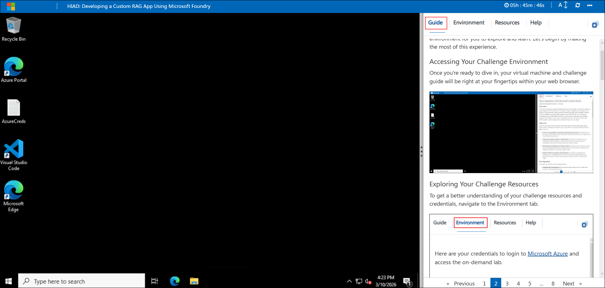
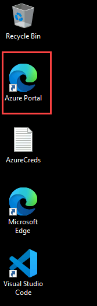
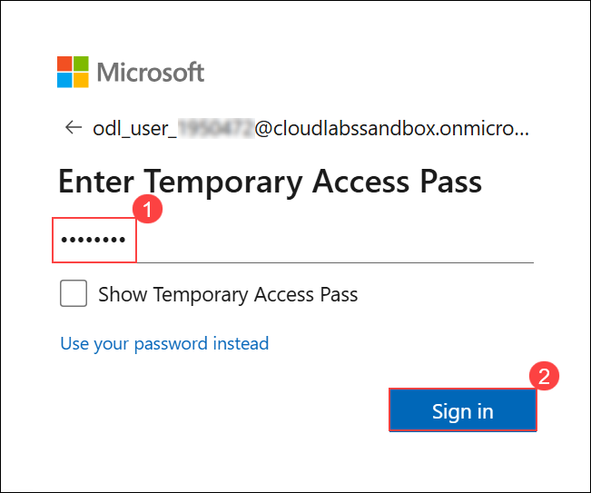

## Getting Started with Challenge

Welcome to Hack in a Day: Build Custom RAG Assistant with Microsoft Foundry challenge! We've prepared a seamless environment for you to explore and learn. Let's begin by making the most of this experience.

### Accessing Your Challenge Environment

Once you're ready to dive in, your virtual machine and challenge guide will be right at your fingertips within your web browser.

### Exploring Your Challenge Resources

To get a better understanding of your challenge resources and credentials, navigate to the Environment tab.

### Utilizing the Split Window Feature

For convenience, you can open the challenge guide in a separate window by selecting the Split Window button from the Top right corner

### Managing Your Virtual Machine

Feel free to start, stop, or restart your virtual machine as needed from the Resources tab. Your experience is in your hands!

## Let's Get Started with Microsoft Foundry and VS Code

1. In the JumpVM, click on **Azure Portal** shortcut of Microsoft Edge browser which is created on desktop.

   

1. On the **Sign into Microsoft** tab, you will see the login screen. Enter the provided **Email**, and click **Next** to proceed.

   - Email: <inject key="AzureAdUserEmail"></inject>

     

1. Now, enter the following **Temporary Access Pass** and click on **Sign in**.

   - Temporary Access Pass: <inject key="AzureAdUserPassword"></inject>

     

     >**Note:** If you see the Action Required dialog box, then select Ask Later option.
     
1. If you see the pop-up **Stay Signed in?**, click No.

   

Now, click on the **Next** from lower right corner to move on next page.

## Happy Hacking!!