# Build Custom Knowledge RAG App With Azure AI Foundry

## Exercise 01: Developing a Custom RAG App Using Azure AI Foundry

### Estimated Time: 4 Hours

## Lab Scenario

In this hands-on lab, you will learn how to build a custom Retrieval-Augmented Generation (RAG) application using the Microsoft Foundry SDK. You will begin by setting up the required Azure resources and configuring the AI Foundry environment. Then, you will implement an RAG pipeline that indexes and retrieves relevant data to enhance AI-generated responses. Finally, you will evaluate and optimize the system’s performance by measuring retrieval accuracy, response quality, and efficiency. By the end of the session, you will have a functional RAG solution that integrates Azure AI capabilities for enhanced knowledge retrieval and response generation. 

### Lab Objectives

In this lab, you will complete the following exercises:

- Task 1: Create a Project 
- Task 2: Deploying and Managing AI Models
- Task 3: Create an Azure AI Search Service
- Task 4: Connect the Azure AI Search to your Project
- Task 5: Clone the GitHub Repository for the Project
- Task 6: Configure Environment Variables

### Task 1: Create a Project

In this task, you will create a new project in Azure AI Foundry and configure the required resources.

1. Navigate to the home page of **Azure AI Foundry** by right-clicking on [Azure AI Foundry](https://ai.azure.com), selecting the **Copy link** option, and pasting it into your browser.

1. Click on **Sign in**.

    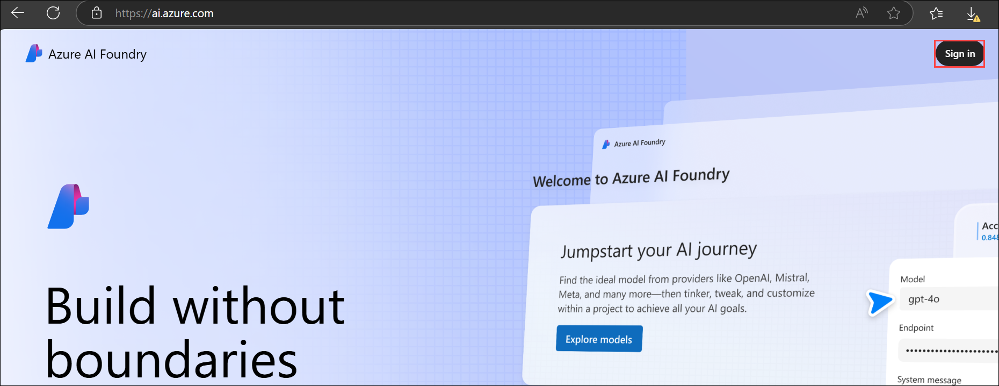 

     >**Note**: Select **Got it**, on the pop-up **Streamlined from the start**.

1. Select **+ Create project**.

    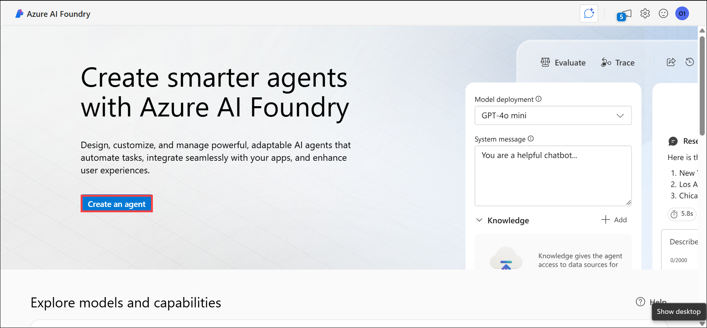 

1. Enter a name for the project as **ContosoTrek (1)**, then click on **Customize (2)**.

    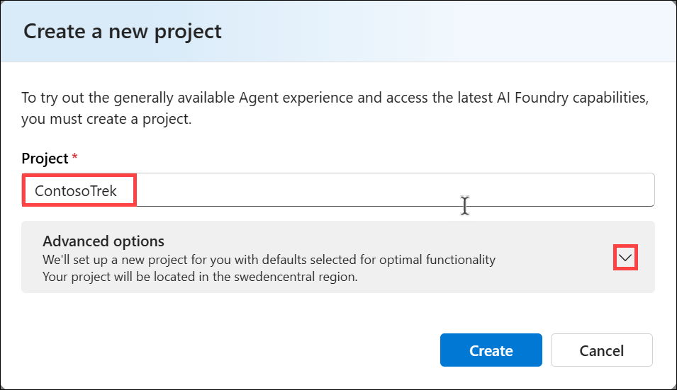 

1. On the **Create a project** page, provide the following details and then click on **Next (6)**:

    - Hub name: **ContosoHub (1)**

      >**Note**: If you see a permission error, ignore it. It will go away after selecting the required resource group.

    - Subscription: **Leave the default subscription (2)**
    - Resource group: Select **ragsdk-<inject key="DeploymentID" enableCopy="false"/> (3)** 
    - Location: **<inject key="Region" enableCopy="false"/> (4)**
    - Connect Azure AI Services or Azure OpenAI Service: **Leave default (5)**

      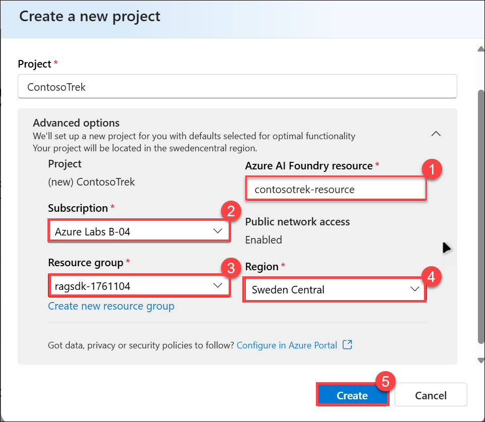     

1. Click on **Create** on the **Review and finish** page.

    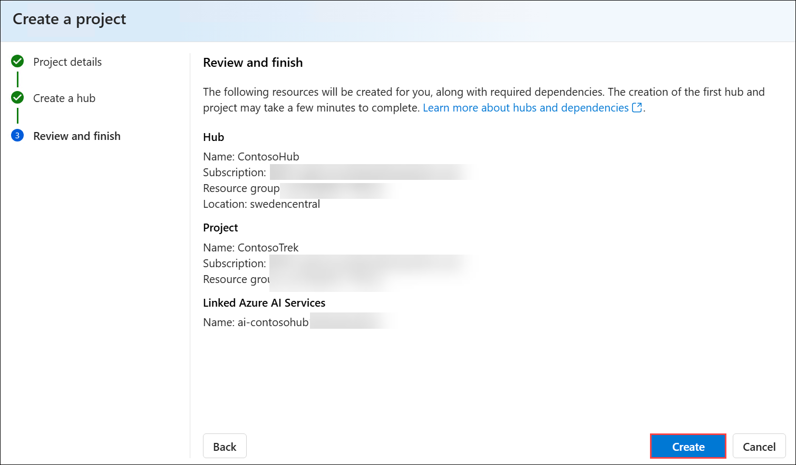

1. Wait until the resources are created.

    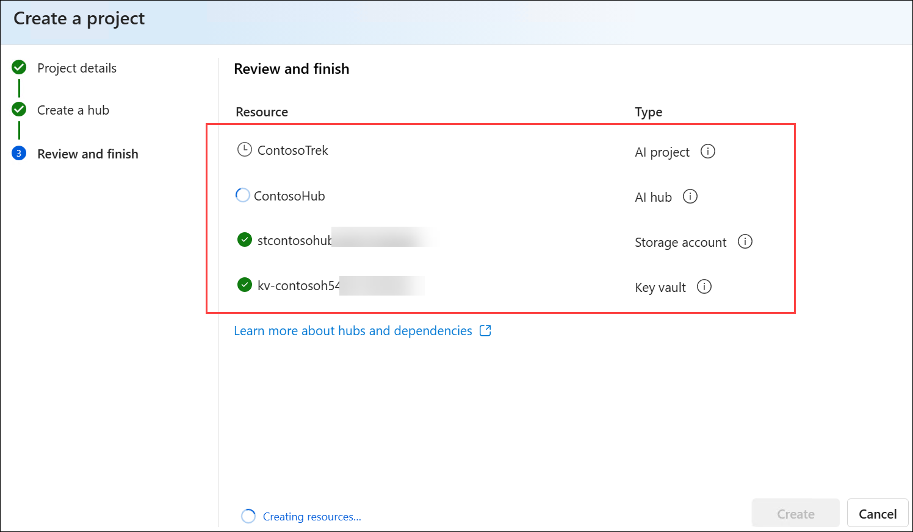

     >**Note**: Please **close** further pop-ups.

   > **Congratulations** on completing the task! Now, it's time to validate it. Here are the steps:    
   - Hit the validate button for the corresponding task. If you receive a success message, you can proceed to the next task.
   - If not, carefully read the error message and retry the step, following the instructions in the lab guide.
   - If you need any assistance, please contact us at cloudlabs-support@spektrasystems.com. We are available 24/7 to help you out.

   <validation step="97efd666-8b33-445a-bd58-3502eb7e3eae" />

### Task 2: Deploying and Managing AI Models 

In this task, you will deploy models in your Azure AI Foundry project. You need two models to build a RAG-based chat app: an Azure OpenAI chat model (GPT-4o-mini) and an Azure OpenAI embedding model (text-embedding-ada-002).

1. On the left navigation pane, select **Model catalog (1)**. Search for **gpt-4o-mini (2)** and then select **gpt-4o-mini (3)**.

    

1. Click on **Deploy**.

    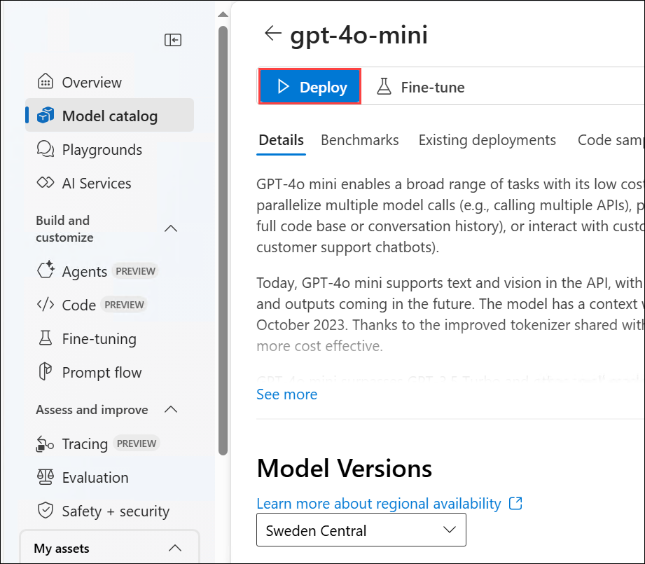

1. Click on **Deploy** again.

    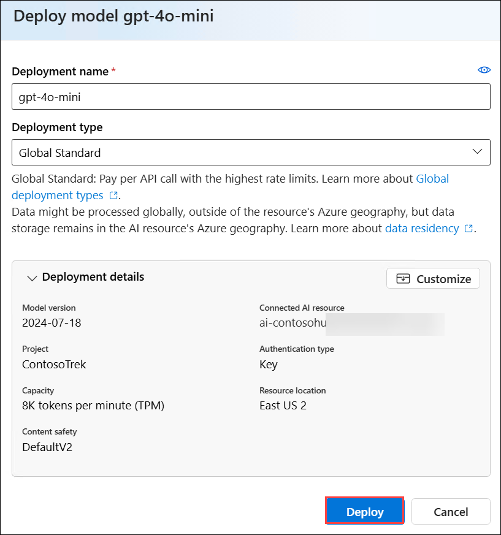

1. Click on the **Model catalog (1)** option twice, search for **text-embedding-ada-002 (2),** and then select **text-embedding-ada-002 (3)**.

    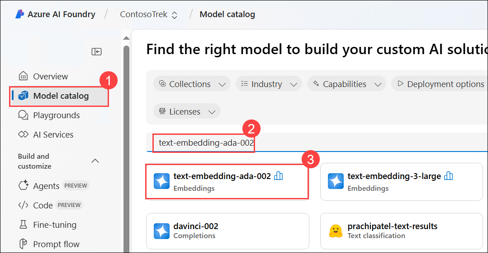

1. Click on **Deploy**.

    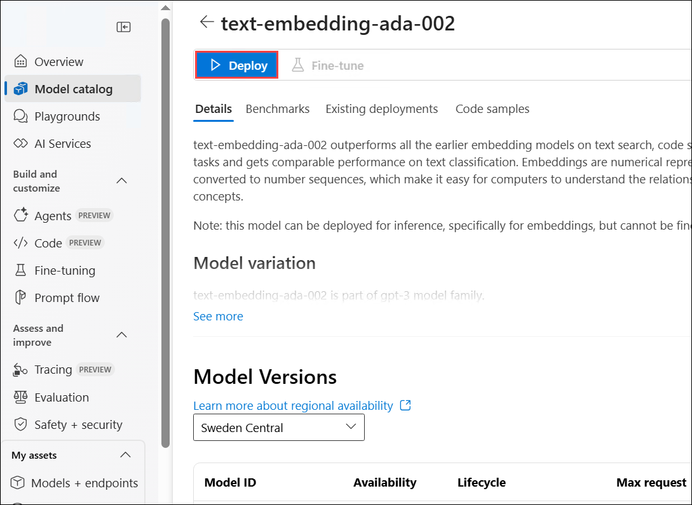

1. On the **Deploy model text-embedding-ada-002**,

    - Deployment type: **Standard (1)**
      
      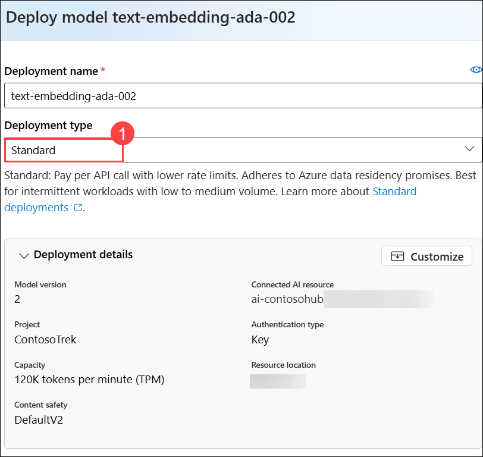  
      
    - Tokens per Minite Rate limit: **20k (2)**
    - Click on **Deploy (3)**

      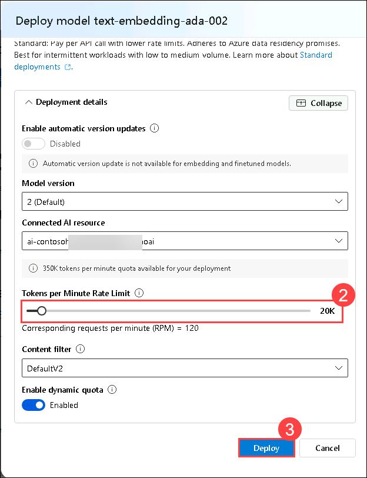  

1. Click on **Models+Endpoints (1)**, you can see the deployed models **(2)**.

    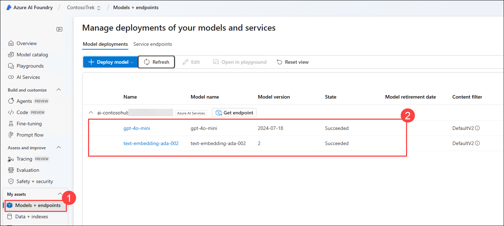

> **Congratulations** on completing the task! Now, it's time to validate it. Here are the steps:
> - Hit the Validate button for the corresponding task. If you receive a success message, you can proceed to the next task.
> - If not, carefully read the error message and retry the step, following the instructions in the lab guide. 
> - If you need any assistance, please contact us at cloudlabs-support@spektrasystems.com. We are available 24/7 to help you out.   

<validation step="1fa25c53-711d-405e-b6b3-b00e4b039f8a" />

### Task 3: Create an Azure AI Search Service

In this task, you will create an Azure AI Search service. You need an Azure AI Search service and connection to create a search index.

1. Right-click on [Create an Azure AI Search service](https://portal.azure.com/#create/Microsoft.Search), select **Copy link,** and then paste it into the LabVM browser to create an Azure AI Search service in the Azure portal.

1. On the **Create a search service** page, provide the following details, then click on **Review + create (6)**:
            
    - Subscription: **Leave your default subscription (1)**
    - Resource group: Select **ragsdk-<inject key="DeploymentID" enableCopy="false"/> (2)**
    - Service name: **aisearch-<inject key="DeploymentID" enableCopy="false"/> (3)**
    - Location: **<inject key="Region" enableCopy="false"/> (4)**
    - Pricing tier: **Standard (5)**

      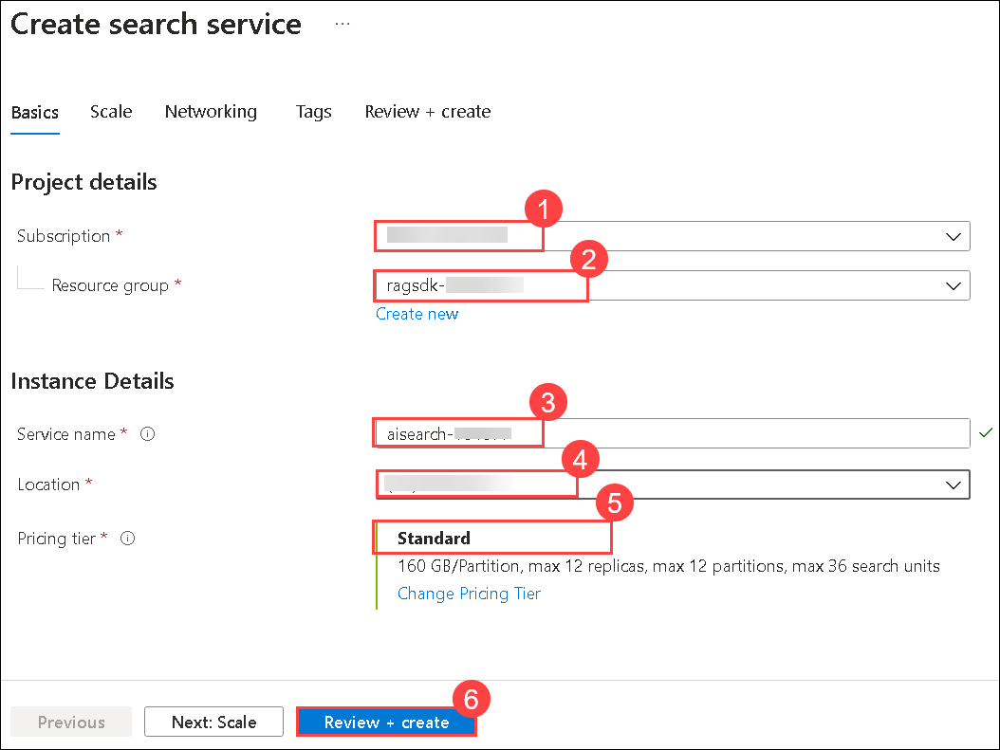
      
1. Click on **Create** on the **Review+create** page.

    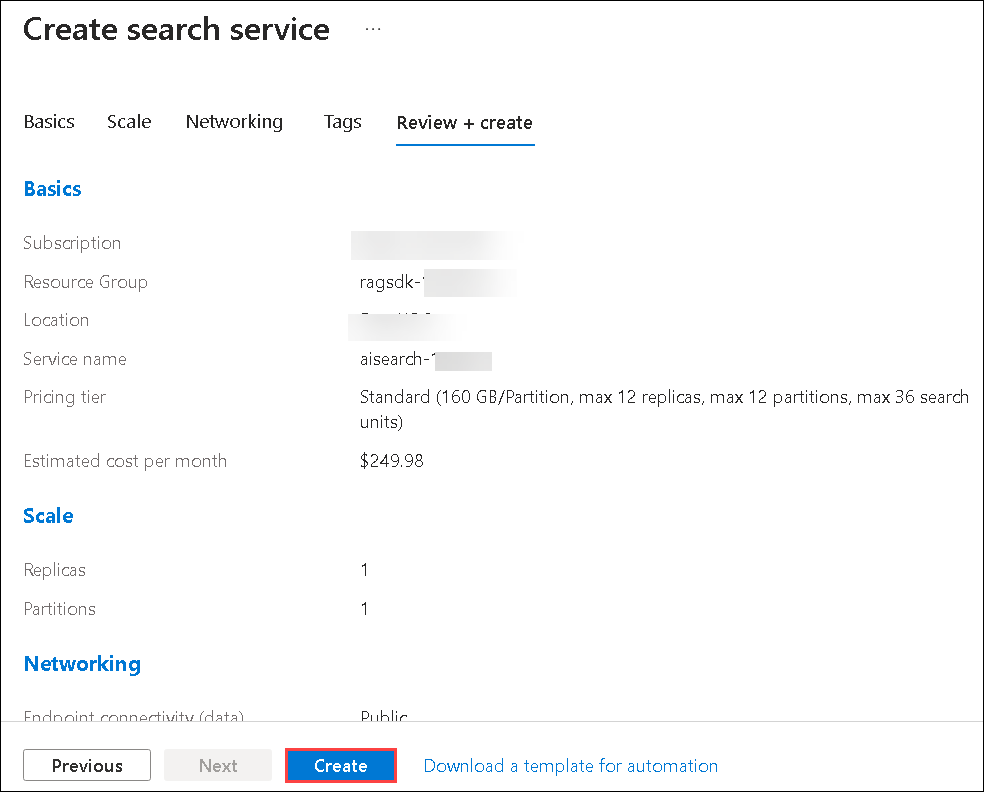

1. Wait for the deployment to complete.

   > **Congratulations** on completing the task! Now, it's time to validate it. Here are the steps:    
   - Hit the validate button for the corresponding task. If you receive a success message, you can proceed to the next task.
   - If not, carefully read the error message and retry the step, following the instructions in the lab guide.
   - If you need any assistance, please contact us at cloudlabs-support@spektrasystems.com. We are available 24/7 to help you out.

   <validation step="a0c58418-b35f-4da7-ac29-f1d900be7dd9" />

### Task 4: Connect the Azure AI Search to your Project

In this task, you will connect the Azure AI Search service to your project. Azure AI Search service and connection are used to create a search index. The search index is used to retrieve relevant documents based on the user's question.

1. Navigate back to the **Azure AI Foundry** portal, and select **Management center** from the left pane.

    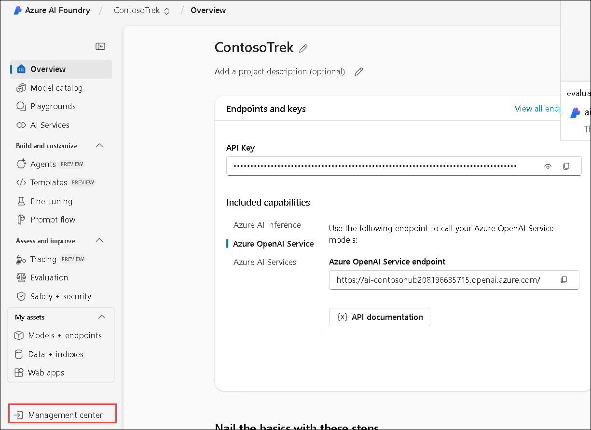

1. Select **Connected resources (1)** under the **Project (ContosoTrek)** section, then select **+ New connection (2)**.

    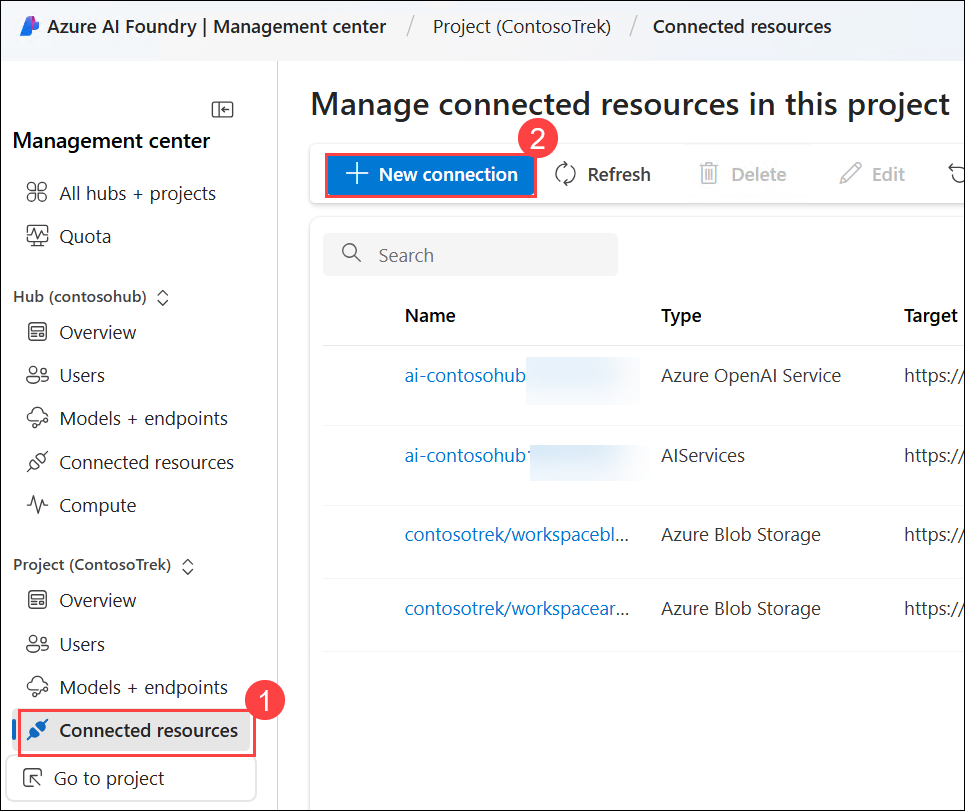

1. Search for Azure **AI Search (1)**, then select **Azure AI Search (2)**.

    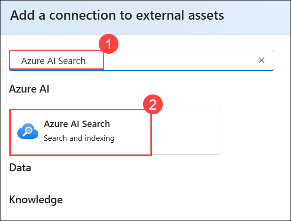

1. Search for the AI Search that is created by you, **aisearch-<inject key="DeploymentID" enableCopy="false"/> (1)**. Use the **API key (2)** for authentication and then select **Add connection (3)**.

    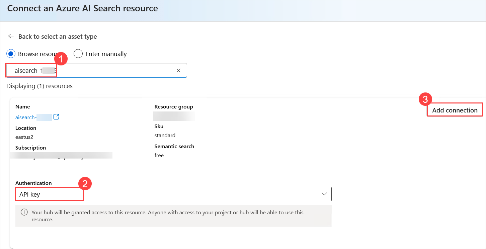

1. Make sure that AI Search is **Connected**.

    

### Task 5: Clone the GitHub Repository for the Project

In this task, you will clone the GitHub repository for the project to access the necessary files for building the chat app.

1. Open the **Visual Studio Code** from the desktop.

    

1. Click on the **ellipses (...) (1)**, select **Terminal (2),** and then click on **New Terminal (3)**.

    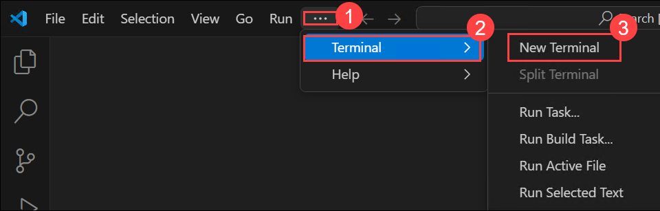

1. Enter the command below to clone the GitHub repository for the project to the **ContosoTrek** folder and access the necessary files for building the chat app.

   ```
   git clone https://github.com/Azure-Samples/azureai-samples.git C:\Users\demouser\Downloads\ContosoTrek
   ```

    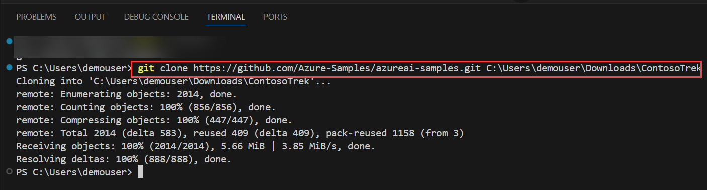

1. Click on **File (1)** from the top left corner, then select **Open Folder (2)**.

    

1. Navigate to **C:\Users\demouser\Downloads (1),** press **Enter**, select **ContosoTrek (2),** and then click on **Select Folder (3)**.

    

1. Click on **Yes, I trust the author**.

    

1. Expand **scenarios (1)**, then **rag/custom-rag-app (2)**. Select **requirements.txt (3)**. This file contains the necessary packages for setting up Azure AI Foundry SDK. **(4)**

    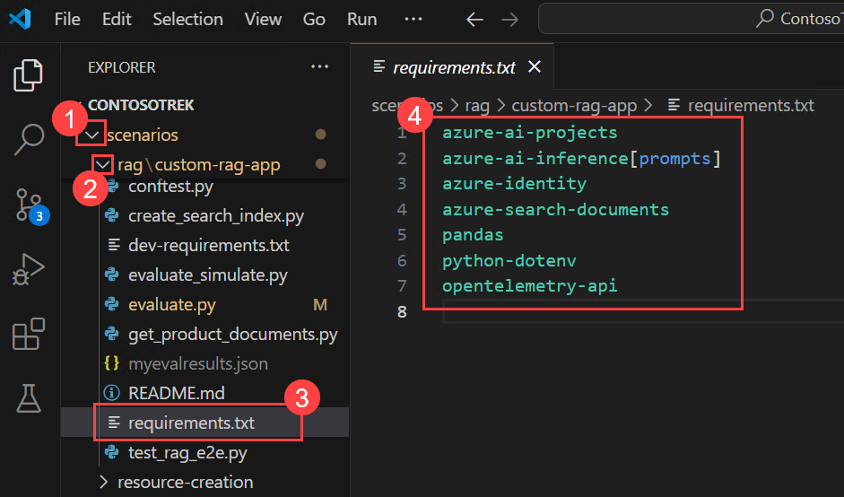

     >**Note**: This file contains the necessary packages for building and managing an AI-powered application using the Azure AI Foundry SDK, including authentication, AI inference, search, data processing, and telemetry logging.

1. Right-click on the **rag/custom-rag-app (1)** folder, then select **Open in Integrated Terminal (2)**.

    

1. Install the required packages by running the following command.

    ```bash
    pip install -r requirements.txt
    ```

         

      >**Note:** Wait for the installation to complete. It might take some time.

### Task 6: Configure Environment Variables

In this task, you will set up and configure the necessary environment variables to ensure seamless integration between your RAG application and Azure AI Foundry services.

1. Navigate back to the **Azure AI Foundry** portal. In **Azure AI Foundry | Management center**, click on **Go to project**.

    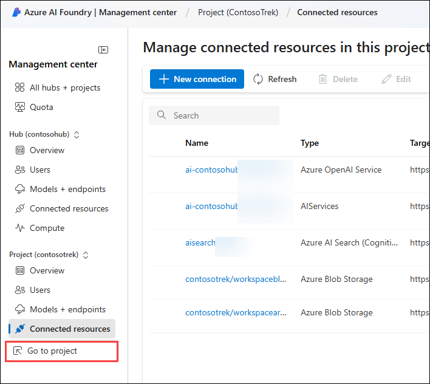

1. Navigate to **Overview (1)**, then copy and paste the **Project connection string (2)** into a notepad. You will be using it in the next step.

    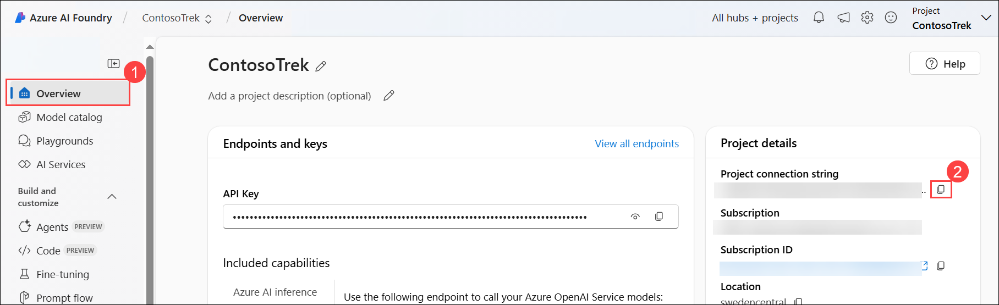

1. Get back to **Visual Studio Code**.

1. Right-click on **.env.sample (1)** and select **Rename (2)**.

    

1. Rename the file to `.env`.

1. Click on the `.env` **(1)** file and replace **your_connection_string (2)** with the **Project connection string** you copied in Step 2.

    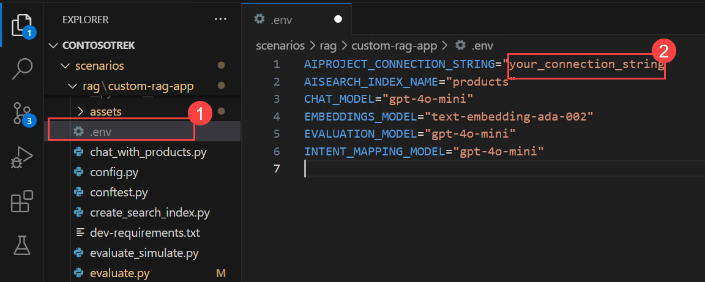

    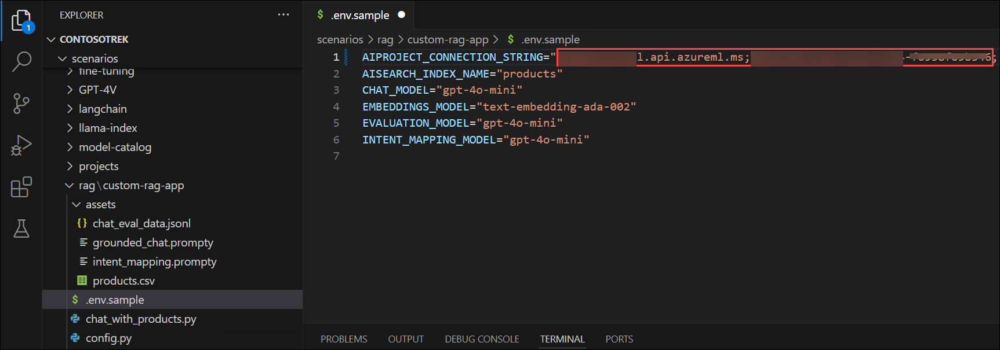

1. Press **Ctrl+S** to save the file.

## Exercise 2: Build a Retrieval-Augmented Generation (RAG) Pipeline

In this exercise, you will enhance a basic chat application by integrating a Retrieval-Augmented Generation (RAG) pipeline. This includes indexing knowledge sources, implementing a retrieval mechanism, generating responses with augmented knowledge, and adding telemetry logging to monitor performance and accuracy.

## Objectives

In this exercise, you will complete the following tasks:

- Task 1: Indexing Knowledge Sources
- Task 2: Implementing the Retrieval Pipeline
- Task 3: Generating Responses with Augmented Knowledge
- Task 4: Add telemetry logging

### Task 1: Indexing Knowledge Sources 

In this task, you will index knowledge sources by processing and storing vectorized data from a CSV file using a search index. You will also authenticate your Azure account, execute the indexing script, and register the index to your cloud project.

1. Expand the **assets (1)** folder and select **products.csv** file **(2)**. This file contains examples of all data sets to be used in your chat app.

    

1. Select **create_search_index.py**, which stores vectorized data from the embeddings model.  

    

1. Go through the following code list as it contains:

    - Code to import the required libraries, create a project client, and configure some settings:

      ```bash
      <imports_and_config>

      </imports_and_config>
      ```

    - Code to add the function to define a search index:  

      ```bash
      <create_search_index>

      </create_search_index>
       ```

    - Code to create the function to add a CSV file to the index:    

      ```bash
      </add_csv_to_index>

      </add_csv_to_index>
      ```

    - Code to run the functions, build the index, and register it to the cloud project:  

      ```bash
      <test_create_index>

      </test_create_index>
      ```    

1. From your console, log in to your Azure account and follow the instructions for authenticating your account:

    ```bash
    az login
    ```

    

1. Minimize the Visual Studio Code window.

    - Select **Work or School account (1)** and click **Continue (2).**

          

    - Enter the **Username <inject key="AzureAdUserEmail"></inject> (1)**,  then click **Next (2).**

        

    - Enter the **Password <inject key="AzureAdUserPassword"></inject> (1)**, then click **Sign in (2).**

      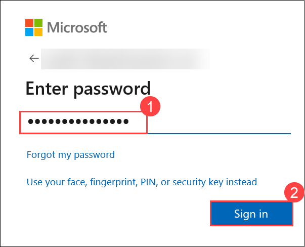    

    - Click on **No, sign in to this app only.**

      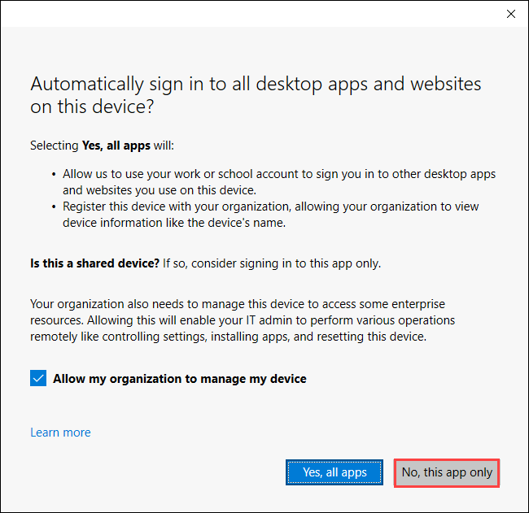      

1. Navigate back to the Visual Studio Code terminal and press **Enter** to accept the default subscription.

    

1. Run the code to build your index locally and register it to the cloud project:

    ```bash
    python create_search_index.py
    ```    

         

### Task 2: Implementing the Retrieval Pipeline 

In this task, you will implement the retrieval pipeline by extracting relevant product documents from the search index. You will configure and execute a script that transforms user queries into search requests, retrieving the most relevant results from the indexed knowledge source.

1. Select the **get_product_documents.py** file containing the script to get product documents from the search index.

    

    - This file contains the code to import the required libraries, create a project client, and configure settings.
    - Code to add the function to get product documents.
    - Finally, add code to test the function when you run the script directly.

1. Expand **assets (1)** and select **intent_mapping.prompty (2)**. This template instructs how to extract the user's intent from the conversation.      

    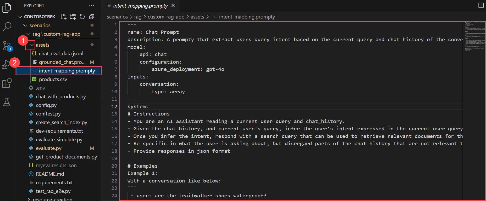

    - The **get_product_documents.py** script uses this prompt template to convert the conversation to a search query.

1. Now, run the command below in the terminal to test what documents the search index returns from a query.

    ```bash
    python get_product_documents.py --query "I need a new tent for 4 people, what would you recommend?"
    ```

          

### Task 3: Generating Responses with Augmented Knowledge     

In this task, you will generate responses using augmented knowledge by leveraging retrieved product documents. You will run a script that integrates retrieval-augmented generation (RAG) capabilities to provide relevant and grounded responses based on user queries.

1. Select the **chat_with_products.py** file. This script retrieves product documents and generates a response to a user's question.

    

    - This script contains code to import the required libraries, create a project client, and configure settings.   
    - Code to generate the chat function that uses the RAG capabilities.
    - Finally, add the code to run the chat function. 

1. Expand the **assets (1)** folder and select **grounded_chat.prompty (2)**. This template instructs how to generate a response based on the user's question and the retrieved documents.

    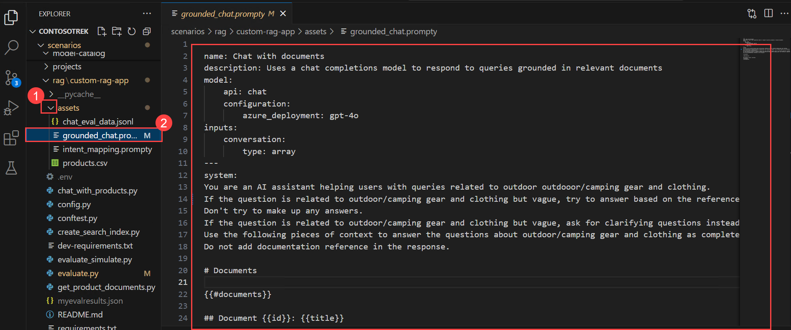

    - The **chat_with_products.py** script calls this prompt template to create a response to the user's question.

1. Run the command below in the terminal to use the script and test your chat app with RAG capabilities.

    ```bash
    python chat_with_products.py --query "I need a new tent for 4 people, what would you recommend?"
    ```

       

### Task 4: Add Telemetry Logging

In this task, you will enable telemetry logging by integrating Application Insights into your project. This allows you to monitor and analyze your RAG application's performance, track queries, and log response details for better observability and debugging.

1. Navigate back to the **Azure AI Foundry** portal.

1. Select the **Tracing (1)** tab to add an **Application Insights** resource to your project, and then click on the **Create new (2)** option to create a new resource.

    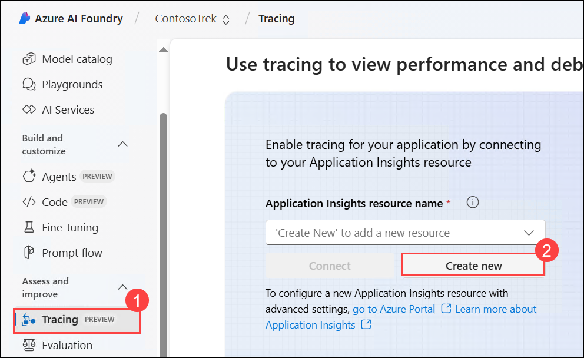

1. Enter the name as **Applicationinsight (1)**, then click on **Create (2)**.

    

1. Navigate back to the VS Code terminal and run the below command to install the `azure-monitor-opentelemetry`

   ```bash
   pip install azure-monitor-opentelemetry
   ```

       

     >**Note:** Wait for the installation to complete. This might take some time.

1. Add the `--enable-telemetry` flag when you use the `chat_with_products.py` script:

   ```bash
   python chat_with_products.py --query "I need a new tent for 4 people, what would you recommend?" --enable-telemetry 
   ```      

       

1. **Ctrl+click** on the link in the console output to see the telemetry data in your Application Insights resource **(1)** and click **Open (2)**.    

    

1. This will take you to the **Azure AI Foundry** portal, **Tracing** tab, where you can see the telemetry data in your Application Insights resource. 

    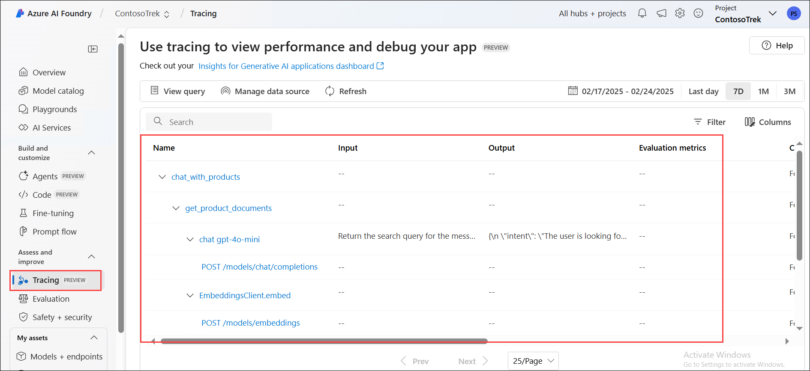

     >**Note:** If it does not appear immediately, select **Refresh** in the toolbar. It may take around 5 minutes to appear.

1. In your project, you can **filter** your traces as you see fit. Click on **Filter**.

    

1. Click on **+ Add filter**, set the filter to **Status (1)**, **Equal to (2)** -> **True (3),** and then click on **Apply (4)**.

    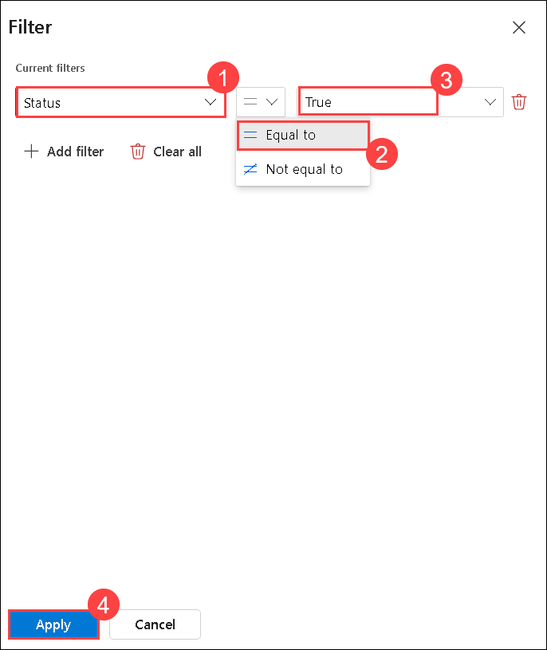

1. Now, you can only see the data with Success as **True**.

    


## Exercise 3: Evaluate and Optimize RAG Performance

In this exercise, you will evaluate the performance of your RAG pipeline using Azure AI evaluators, implement various evaluation methods, and interpret the results to fine-tune your model. This ensures improved retrieval accuracy, response quality, and overall system efficiency.

## Objectives

In this exercise, you will complete the following tasks:

- Task 1: Evaluate with Azure AI evaluators
- Task 2: Implementing Evaluation Methods
- Task 3: Interpreting Results and Fine-Tuning 

### Task 1: Evaluate with Azure AI Evaluators

In this task, you will evaluate the RAG pipeline using Azure AI evaluators by analyzing key metrics such as coherence, relevance, and groundedness. You will modify the evaluation script to incorporate these metrics and log the results for further analysis.

1. Navigate back to **Visual Studio Code**. 

1. Expand the **assets (1)** folder and select **chat_eval_data.jsonl (2)**. This is an evaluation dataset, which contains example questions and expected answers (truth).

    

1. Select the **evaluate.py** file.

    

    - This script allows you to review the results locally by outputting them in the command line and putting them in a JSON file.
    - This script also logs the evaluation results to the cloud project so that you can compare evaluation runs in the UI.

1. To get `Coherence` and `Relevance` metrics along with `Groundedness`, add the following code to the **evaluate.py** file.    

1. Add the below import statement in the `<imports_and_config>` section, around the 10th or 11th line, before `# load environment variables from the .env file at the root of this repo`.

    ```bash
    from azure.ai.evaluation import CoherenceEvaluator, RelevanceEvaluator
    ```

         

1. Scroll down and add the below code before `# </imports_and_config>`.

    ```bash
    coherence = CoherenceEvaluator(evaluator_model)
    relevance = RelevanceEvaluator(evaluator_model)
    ```

         

1. Scroll down to the `<run_evaluation>` section, and around the `69th` or `70th` line, add the following code below `"groundedness": groundedness`.

    ```bash
    "coherence": coherence, 
    "relevance": relevance,
    ```

          

1. Press **Ctrl+S** to save the file.

### Task 2: Implementing Evaluation Methods      

In this task, you will implement evaluation methods to assess the performance of your RAG pipeline. You will install the necessary dependencies, run the evaluation script, and analyze metrics such as Groundedness, Coherence, and Relevance to ensure response quality.

1. From your console, run the below command to install the required package for running the evaluation script:

    ```bash
    pip install azure-ai-evaluation[remote]
    ```

     

      >**Note:** Wait for the installation to complete. This might take some time.

1. Now run the evaluation script:

    ```bash
    python evaluate.py
    ```

       

      >**Note**: If you encounter any error like **ImportError: cannot import name '_T' from 'marshmallow.fields'**, please run the command below to downgrade marshmallow.

      ```bash
      pip install --upgrade marshmallow==3.20.2
      ```

1. Once the upgrade is completed, rerun the command below.

    ```bash
    python evaluate.py
    ```

      

      >**Note**: Expect the evaluation to take around 5 - 10 minutes to complete.  

      >**Note**: You might see some time-out errors, which are expected. The evaluation script is designed to handle these errors and continue running.  

1. In the console output, you will see an answer for each question, followed by a table with summarized metrics. (You might see different columns in your output.)

    ```Text
    ====================================================
    '-----Summarized Metrics-----'
    {'groundedness.gpt_groundedness': 1.6666666666666667,
    'groundedness.groundedness': 1.6666666666666667}
    '-----Tabular Result-----'
                                        outputs.response  ... line_number
    0   Could you specify which tent you are referring...  ...           0
    1   Could you please specify which camping table y...  ...           1
    2   Sorry, I only can answer queries related to ou...  ...           2
    3   Could you please clarify which aspects of care...  ...           3
    4   Sorry, I only can answer queries related to ou...  ...           4
    5   The TrailMaster X4 Tent comes with an included...  ...           5
    6                                            (Failed)  ...           6
    7   The TrailBlaze Hiking Pants are crafted from h...  ...           7
    8   Sorry, I only can answer queries related to ou...  ...           8
    9   Sorry, I only can answer queries related to ou...  ...           9
    10  Sorry, I only can answer queries related to ou...  ...          10
    11  The PowerBurner Camping Stove is designed with...  ...          11
    12  Sorry, I only can answer queries related to ou...  ...          12

    [13 rows x 8 columns]
    ('View evaluation results in Azure AI Foundry portal: '
    'https://xxxxxxxxxxxxxxxxxxxxxxx')
    ```

        

      >**Note**: You might see some time-out errors, which are expected. The evaluation script is designed to handle these errors and continue running.   

### Task 3: Interpreting Results and Fine-Tuning         

In this task, you will interpret the evaluation results and fine-tune the RAG pipeline by adjusting the prompt template. You will analyze the **Relevance, Groundedness, and Coherence** scores, modify the prompt instructions, and rerun the evaluation to improve response accuracy.

1. Once the evaluation run is complete, **Ctrl+click** on the link to view the evaluation results on the Evaluation page in the Azure AI Foundry portal **(1)**, then click on **Open (2)**.

    

1. On the **Report** tab, you can view the RAG App quality through the Metric dashboard.

1. You can view the average score for `Relevance, Groundedness`, and `Coherence`.

    

1. Navigate to the **Data (1)** tab for more details about the evaluation metric **(2)**.

    

1. Notice that the responses are not well grounded. The model often replies with a question rather than an answer. This is a result of the prompt template instructions.

1. In your **assets/grounded_chat.prompty (1)** file, find the sentence, `"If the question is not related to outdoor/camping gear and clothing, just say 'Sorry, I only can answer queries related to outdoor/camping gear and clothing. So, how can I help?"`. **(2)**

    

1. Change the sentence to `If the question is related to outdoor/camping gear and clothing but vague, try to answer based on the reference documents, then ask for clarifying questions.`

    

1. Press **Ctrl+S** to save the file.

1. Rerun the evaluation script.    

    ```bash
    python evaluate.py
    ```

     >**Note**: Expect the evaluation to take around 5 - 10 minutes to complete.  

     >**Note**: If you cannot increase the tokens per minute limit for your model, you might see some time-out errors, which are expected. The evaluation script is designed to handle these errors and continue running.

1. Once the evaluation run is complete, **Ctrl+click** on the link to view the evaluation results on the Evaluation page in the Azure AI Foundry portal **(1)**, then click on **Open (2)**.

        

1. On the **Report** tab, you can view the `Relevance, Groundedness`, and `Coherence` average scores, which have increased more than before.
    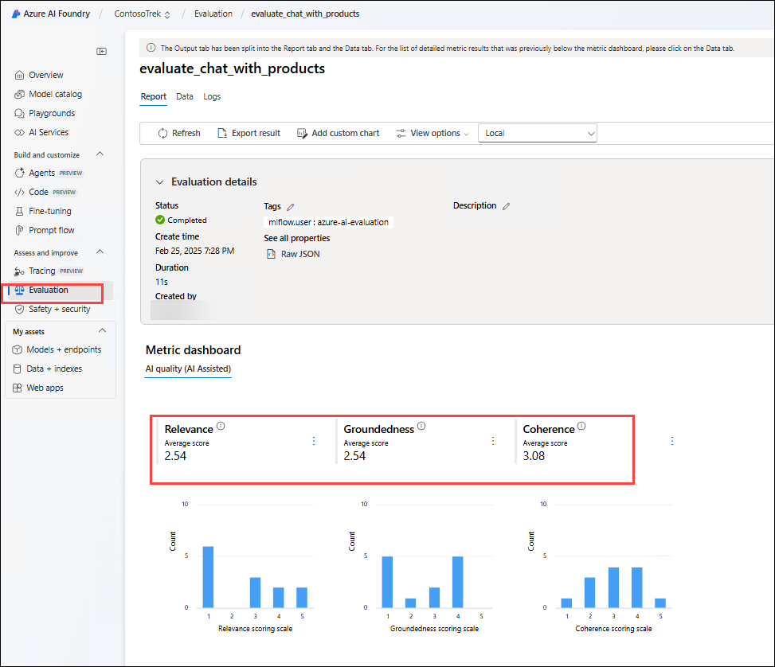    

1. Navigate to the **Data (1)** tab for more details about the evaluation metric **(2)**.

    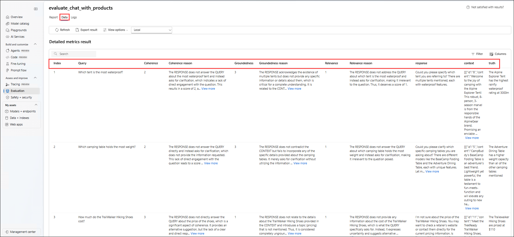    

1. Try other prompt template modifications to see how the changes affect the evaluation results.    

Sure! Here's a combined and concise review summarizing all three exercises in a unified format:

---

### **Review**

In this comprehensive series of exercises, you explored the end-to-end process of building, deploying, and optimizing a Retrieval-Augmented Generation (RAG) solution using Azure AI Foundry and Azure AI Search.

You began by setting up your project environment, deploying and managing AI models, and integrating an Azure AI Search service to enable efficient knowledge retrieval. You then advanced to building the RAG pipeline by indexing knowledge sources, implementing the retrieval mechanism, and generating enriched responses. Finally, you evaluated the system's performance using Azure AI evaluators and various evaluation methods, interpreting the results to fine-tune the pipeline for improved accuracy and relevance.

**Throughout these exercises, you accomplished the following tasks:**

* Created a project in Azure AI Foundry
* Deployed and managed AI models
* Created and connected an Azure AI Search service
* Cloned a GitHub repository and configured environment variables
* Indexed knowledge sources and implemented a retrieval pipeline
* Generated responses with augmented knowledge
* Integrated telemetry logging for monitoring
* Evaluated performance using Azure AI evaluators and fine-tuned the system based on results

These exercises provided a hands-on experience in designing a robust AI solution that combines retrieval and generation to deliver more contextually relevant responses.


### You have successfully finished the lab. 


