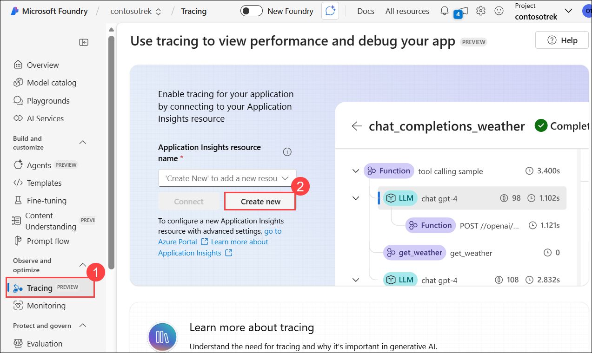
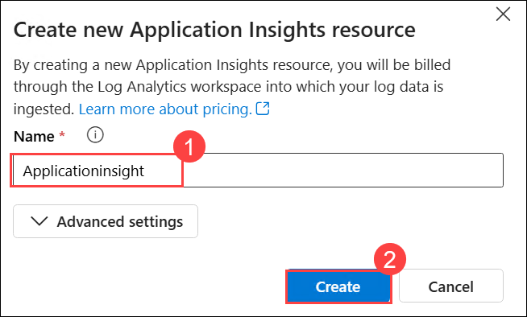
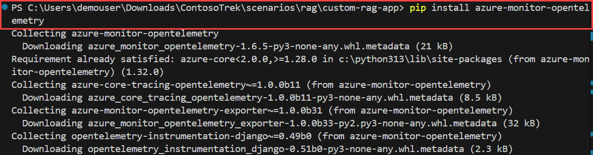
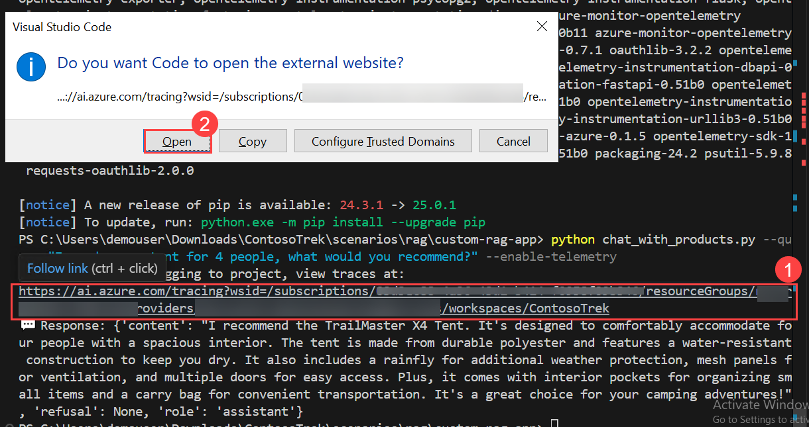
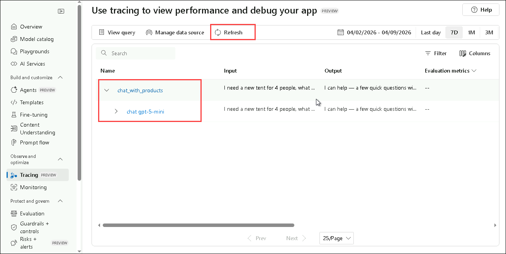
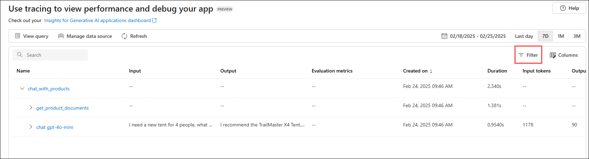

# Exercise 02: Build a Retrieval-Augmented Generation (RAG) Pipeline

### Estimated Duration: 1 Hour

## 📘 Scenario

Your company’s support chatbot currently gives generic answers and misses internal documentation. You are assigned to enhance it by implementing a RAG pipeline that indexes internal documents into Azure AI Search, retrieves the most relevant content for a query, and uses it to generate grounded responses. You will also enable telemetry logging to monitor how well retrieval and generation are performing.

## 📖 Overview

In this exercise, you will enhance a basic chat application by integrating a **Retrieval-Augmented Generation (RAG)** pipeline. This includes indexing knowledge sources, implementing a retrieval mechanism, generating responses with augmented knowledge, and adding telemetry logging to monitor performance and accuracy.

## 🎯 Objectives

In this exercise, you will complete the following tasks:

- Task 1: Indexing Knowledge Sources
- Task 2: Implementing the Retrieval Pipeline
- Task 3: Generating Responses with Augmented Knowledge
- Task 4: Add telemetry logging

## Task 1: Indexing Knowledge Sources 

In this task, you will index knowledge sources by processing and storing vectorized data from a CSV file using a search index. You will also authenticate your Azure account, execute the indexing script, and register the index to your cloud project.

> [!NOTE]
> The sample scripts use the new **Microsoft Foundry SDK** (`azure-ai-projects` 2.x). They authenticate to your project with the `PROJECT_ENDPOINT` value you configured in the `.env` file, so no code changes are required.

1. In the Visual Studio Code, expand the **assets (1)** folder and select **products.csv** file **(2)**. Review the file. It contains example datasets used in your chat application.

    

1. Select **create_search_index.py** file, which stores vectorized data from the embeddings model.

    > 📌 **You do not need to modify anything.**

    

    - This file contains the code to import required libraries, create a project client, and configure connections with Microsoft Foundry and Azure AI Search.
    - Code to define the search index schema and generate vector embeddings from the CSV data.
    - Finally, add code to create the index and upload documents when the script is run directly.

1. From your terminal in VS Code, log in to your Azure account and follow the instructions for authenticating your account. Please make sure your in **rag/custom-rag-app** directory.

    ```bash
    az login
    ```

    

1. Minimize the Visual Studio Code window.

    - Select **Work or School account (1)** and click **Continue (2).**

          

    - Enter the **Username: <inject key="AzureAdUserEmail"></inject> (1)**,  then click **Next (2).**

        

    - Enter the **Temporary Access Pass: <inject key="AzureAdUserPassword"></inject> (1)**, then click **Sign in (2).**

          

    - Click on **No, sign in to this app only.**

            

1. Navigate back to the Visual Studio Code terminal and press **Enter** to accept the default subscription.

    

1. If any installation / Extension pop-up appears, please close it.    

1. Run the code to build your index locally and register it to the cloud project:

    ```bash
    python create_search_index.py
    ```    

         

1. If prompted, please close the pop-ups.

    

1. Enter **Clear** in the terminal, to clear the terminal history.    


## Task 2: Implementing the Retrieval Pipeline 

In this task, you will implement the retrieval pipeline by extracting relevant product documents from the search index. You will configure and execute a script that transforms user queries into search requests, retrieving the most relevant results from the indexed knowledge source.

1. Select the **get_product_documents.py** file containing the script to get product documents from the search index.

    > 📌 **You do not need to modify anything.**

    

    - This file contains the code to import the required libraries, create a project client, and configure settings.
    - Code to add the function to get product documents.
    - Finally, add code to test the function when you run the script directly.

1. Expand **assets (1)** and select **intent_mapping.prompty (2)**. This template instructs how to extract the user's intent from the conversation.

    > 📌 **You do not need to modify anything.**

    

    - The **get_product_documents.py** script uses this prompt template to convert the conversation to a search query.

1. Please make sure your in **rag/custom-rag-app** directory.    

1. Now, run the command below in the terminal to test what documents the search index returns from a query.

    ```bash
    python get_product_documents.py --query "I need a new tent for 4 people, what would you recommend?"
    ```

        

1. Enter **Clear** in the terminal, to clear the terminal history.   

## Task 3: Generating Responses with Augmented Knowledge     

In this task, you will generate responses using augmented knowledge by leveraging retrieved product documents. You will run a script that integrates retrieval-augmented generation (RAG) capabilities to provide relevant and grounded responses based on user queries.

1. Select the **chat_with_products.py** file. This script retrieves product documents and generates a response to a user's question.

    > 📌 **You do not need to modify anything.**

    

    - This script contains code to import the required libraries, create a project client, and configure settings.   
    - Code to generate the chat function that uses the RAG capabilities.
    - Finally, add the code to run the chat function. 

1. Expand the **assets (1)** folder and select **grounded_chat.prompty (2)**. This template instructs how to generate a response based on the user's question and the retrieved documents.

    > 📌 **You do not need to modify anything.**

    

    - The **chat_with_products.py** script calls this prompt template to create a response to the user's question.
 
1. Please make sure your in **rag/custom-rag-app** directory.    

1. Run the command below in the terminal to use the script and test your chat app with RAG capabilities.

    ```bash
    python chat_with_products.py --query "I need a new tent for 4 people, what would you recommend?"
    ```

       

1. Enter **Clear** in the terminal, to clear the terminal history.   
   

## Task 4: Add Telemetry Logging

In this task, you will enable telemetry logging by integrating Application Insights into your project. This allows you to monitor and analyze your RAG application's performance, track queries, and log response details for better observability and debugging.

1. Navigate back to the **Microsoft Foundry** portal.

1. Select the **Tracing (1)** tab to add an **Application Insights** resource to your project, and then click on the **Create new (2)** option to create a new resource.

    

1. Enter the name as **Applicationinsight (1)**, then click on **Create (2)**.

    

    > **Note:** Wait for the application insight to be created.

1. Navigate back to the VS Code terminal and run the command below to install the `azure-monitor-opentelemetry`

   ```bash
   pip install azure-monitor-opentelemetry
   ```

       

     >**Note:** Wait for the installation to complete. This might take few minutes.

1. Add the `--enable-telemetry` flag when you use the `chat_with_products.py` script:

   ```bash
   python chat_with_products.py --query "I need a new tent for 4 people, what would you recommend?" --enable-telemetry 
   ```      

       

1. Press **Ctrl + Right click** on the link in the console output to see the telemetry data in your Application Insights resource **(1)** and click **Open (2)**.    

    

1. This will take you to the **Microsoft Foundry** portal, **Tracing** tab, where you can see the telemetry data in your Application Insights resource. 

    

     >**Note:**  Please keep **Refreshing** in the toolbar. It may take around 5 - 10 minutes to appear.

1. In your project, you can **filter** your traces as you see fit. Click on **Filter**.

    

1. Click on **+ Add filter (1)**, set the filter to **Success (2)**, **Equal to (3)** -> **True (4),** and then click on **Apply (5)**.

    

1. Now, you can only see the data with Success as **True**.

    

## 🧾 Summary

In this exercise, you built a smart chatbot that doesn’t guess answers.

- First, you uploaded product information from `products.csv` into a searchable system using `create_search_index.py`.
- Then, when a user asks a question (like “I need a tent for 4 people”), your app uses `get_product_documents.py` to search and find the best matching products.
- After that, `chat_with_products.py` takes those matching products and uses AI to generate a proper recommendation based on real data.
- Finally, you enabled telemetry logging so you can track what the chatbot is doing and monitor performance using Application Insights.

### You have successfully completed the exercise. Click **Next >>** to continue to the next exercise.


