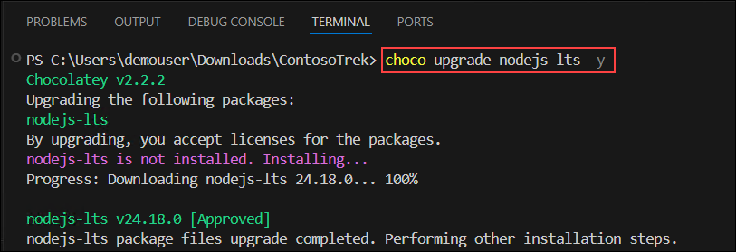
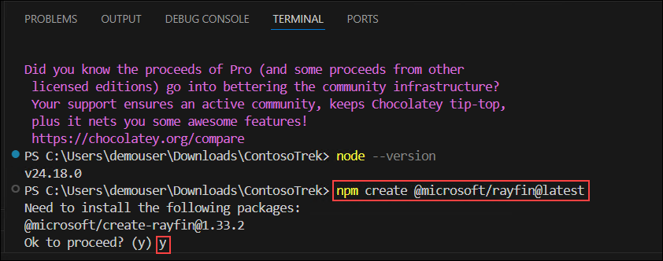
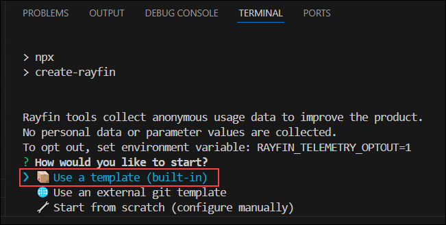
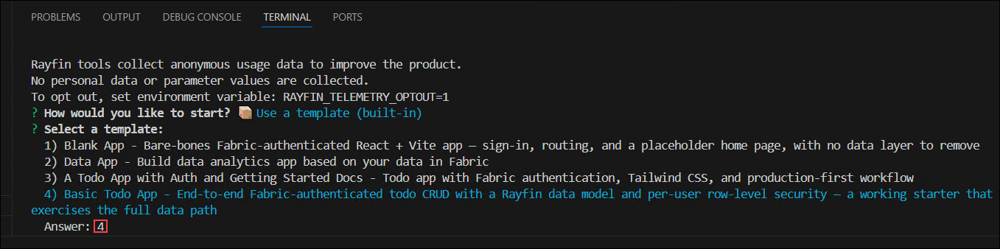
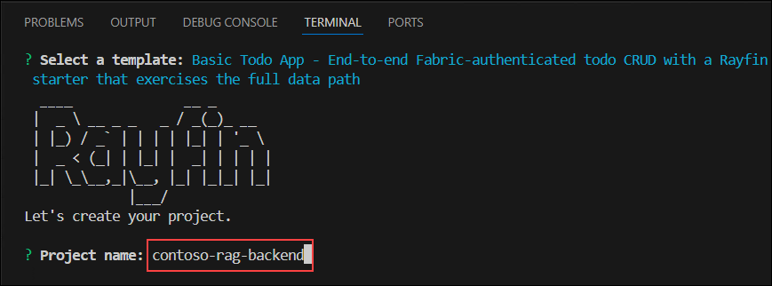
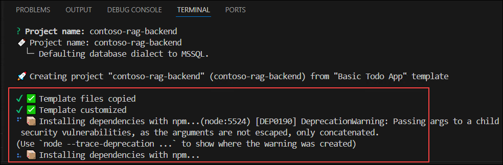
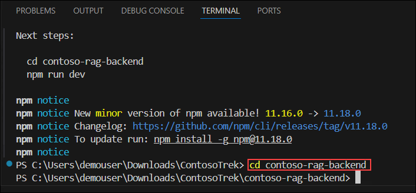
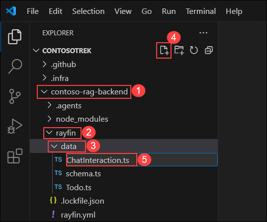
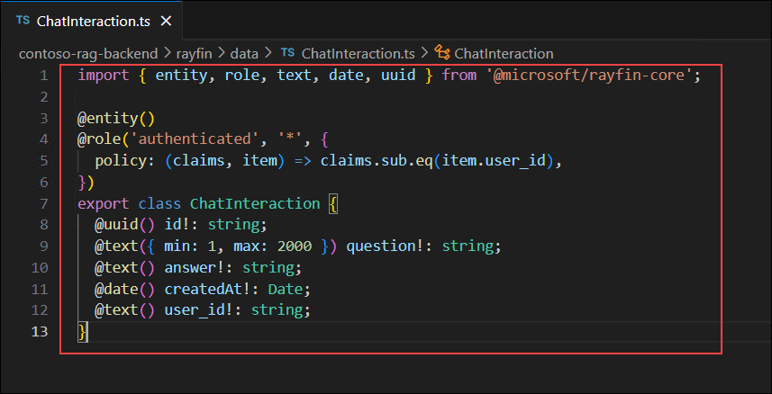

# Module 04: Deploy the RAG App as a Production Endpoint with Rayfin

### Estimated Duration: 1 Hour 30 Minutes

## 📘 Scenario

Your RAG assistant works locally and passes evaluation, and the business now wants it available to a front-end web application. Instead of building and operating backend infrastructure yourself, you will host it on **Rayfin**, the managed Backend-as-a-Service (BaaS) platform introduced at Build 2026. Rayfin runs inside your organization's **Microsoft Fabric** data estate, so it inherits enterprise governance and access control, and it provisions authentication, a data API, and static hosting directly from your TypeScript code.

You will complete this module in **two phases**:

- **Phase A — Build the base Rayfin app.** You scaffold and deploy the stock Rayfin **To-Do** app to prove the managed backend works end to end: Fabric SSO sign-in, a data API with per-user row-level security, and static hosting.
- **Phase B — Extend it into the Contoso RAG app.** On top of that same app, you add a `ChatInteraction` data model, an "Ask Contoso Products" experience that retrieves from Azure AI Search and grounds an answer with your Microsoft Foundry **gpt-5-mini** model, and a "Recent questions" history backed by the Rayfin data API.

## 📖 Overview

In Phase A you install the Rayfin CLI, scaffold the To-Do template, create a Fabric workspace, deploy with `rayfin up`, and confirm the todo app runs. In Phase B you add the RAG data model and UI, wire the retrieve-then-generate flow to Azure AI Search and Microsoft Foundry, redeploy, and verify grounded answers plus the per-user access controls that protect the stored interactions.

> [!IMPORTANT]
> **Where the RAG logic runs.** A deployed Rayfin/Fabric app provisions **only** a database (data API), authentication, and static hosting — it does **not** run custom server-side functions (confirmed in the [Fabric Apps overview](https://learn.microsoft.com/en-us/fabric/apps/overview)). In this lab the retrieval and model calls therefore run **in the browser**, and Rayfin stores the question/answer history through its data API. Because the front-end calls Azure AI Search and Microsoft Foundry directly, this lab supplies their keys through front-end environment values — acceptable for a lab, but **not** for production. In production, route model and search calls through a protected server-side proxy (for example an Azure Function) so keys are never exposed to the browser.

> [!NOTE]
> Rayfin is a new Build 2026 platform and is evolving quickly. Screenshots are placeholders, and some CLI and portal labels may differ in your environment. Capture each screen as you complete the step, and confirm command names and options against the Rayfin documentation at [https://aka.ms/rayfin/docs](https://aka.ms/rayfin/docs).

## 🎯 Objectives

**Phase A — Build the base Rayfin app**

- Task 1: Install the Rayfin CLI and scaffold the To-Do app
- Task 2: Create a Fabric workspace and deploy the base app

**Phase B — Extend it into the Contoso RAG app**

- Task 3: Add the `ChatInteraction` data model
- Task 4: Add the RAG service and configure environment values
- Task 5: Replace the To-Do UI with the "Ask Contoso Products" UI
- Task 6: Redeploy, test grounded answers, and verify access controls

## Prerequisites

- A completed and evaluated RAG app from the previous modules, including a populated Azure AI Search **products** index.
- Your Microsoft Foundry **Azure OpenAI endpoint**, **API key**, and a deployed **gpt-5-mini** model (from Exercise 1).
- **Node.js 24 (LTS)** installed on the lab virtual machine. The Rayfin CLI requires Node.js version 24.x (`>=24.0.0 <25.0.0`).
- Access to a **Microsoft Fabric** workspace in your Azure subscription.

---

# Phase A — Build the Base Rayfin App

## Task 1: Install the Rayfin CLI and Scaffold the To-Do App

In this task, you install the Rayfin tooling and scaffold the stock To-Do application. This is the unmodified starter you will extend in Phase B.

1. Navigate back to **Visual Studio Code**.

1. In **Visual Studio Code**, select **Terminal (1)**, and then select **New Terminal (2)**.

   

1. Upgrade Node.js to version 24 (LTS) using Chocolatey:

   ```bash
   choco upgrade nodejs-lts -y
   ```

   

1. In the terminal, run the following command to verify that **Node.js** has been upgraded to version **24.x**.

   ```bash
   node --version
   ```

   Verify that the output displays **v24.x.x**.

   

1. In the terminal, run the following command to scaffold a new **Rayfin** project.

   ```bash
   npm create @microsoft/rayfin@latest
   ```

   When prompted with **Ok to proceed? (y)**, enter **y** and press **Enter**.

   

1. When prompted with **How would you like to start?**, select **Use a template (built-in)** using the arrow keys, and then press **Enter**.

   

1. When prompted to **Select a template**, choose the **Basic Todo App** template, and then press **Enter**.

   

1. When prompted for the **Project name**, enter **contoso-rag-backend**, and then press **Enter**.

   

1. Wait for the project scaffolding process to complete. This may take **2–5 minutes** while Rayfin copies the template files and installs the required npm dependencies.

   

1. Change into the new project directory:

   ```bash
   cd contoso-rag-backend
   ```

   

## Task 2: Create a Fabric Workspace and Deploy the Base App

In this task, you create a Microsoft Fabric workspace with capacity and deploy the unmodified To-Do app so Rayfin provisions the database, data API, authentication, and hosting. Deploying first confirms the managed backend works before you add any RAG code.

### Create a Fabric workspace

1. Open a new browser tab, enter **https://app.fabric.microsoft.com** in the address bar, and then sign in with **<inject key="AzureAdUserEmail" enableCopy="false"/>**.

    

1. If prompted, start the **Fabric trial** to obtain trial capacity for your account.

    

1. From the left navigation pane, select **Workspaces (1)**, and then select **+ New workspace (2)**.

    

1. Enter **contoso-rag-ws<inject key="DeploymentID" enableCopy="false"/> (1)** as the workspace name, expand **Advanced (2)**, select **Trial (3)** as the license mode, and then select **Apply (4)**.

    

    > [!NOTE]
    > A Rayfin deployment requires a workspace with Fabric capacity assigned. The **Fabric Apps (preview)** workload must also be enabled by a tenant administrator; in this lab environment it is pre-enabled.

1. Verify that the **contoso-rag-ws** workspace opens.

### Deploy with the Rayfin CLI

1. Back in the **Visual Studio Code** terminal (in the **contoso-rag-backend** folder), sign in to Azure if you are prompted:

   ```bash
   az login
   ```

1. Deploy and run the backend:

   ```bash
   npx rayfin up
   ```

1. When prompted **Enter a Fabric workspace name to deploy to**, enter **contoso-rag-ws<inject key="DeploymentID" enableCopy="false"/>**, and then press **Enter**. If a browser window opens for sign-in, sign in with **<inject key="AzureAdUserEmail" enableCopy="false"/>**.

   

   > **Note:** Rayfin provisions the database, authentication, data API, and hosting. Wait for the deployment to complete. This might take several minutes.

1. When the deployment finishes, the terminal displays the **Deployment details**. Copy the following values into a notepad — you will need them later:

    - **Static Hosting URL (1)** — the live app URL (format: `https://<name>-swedencentral.webapp.fabricapps.net`)
    - **Portal (2)** — the Fabric portal link for the deployed app backend
    - **Publishable Key (3)** — used as the `X-Publishable-Key` header in data-plane requests

   

1. Verify that the output displays **Project "contoso-rag-backend" is now deployed to Fabric!**

### Confirm the base To-Do app works

1. Open the **Static Hosting URL** you copied above in the browser, and then sign in with **<inject key="AzureAdUserEmail" enableCopy="false"/>** when prompted. Fabric SSO protects the app, so only authenticated users can open it.

   

1. In the **Todo App**, add a task in the **What needs to be done?** box, select **Add**, and then toggle and delete it. Each action is persisted through the Rayfin data API and protected by per-user row-level security.

   

   > [!NOTE]
   > You have now confirmed the Rayfin managed backend end to end — Fabric SSO authentication, the data API, and static hosting all work. In Phase B you extend this same app into the Contoso RAG assistant.

---

# Phase B — Extend It into the Contoso RAG App

In this phase you add a RAG data model, service, and UI on top of the app you just deployed, then redeploy. You will edit files under **contoso-rag-backend** in Visual Studio Code.

## Task 3: Add the `ChatInteraction` Data Model

In this task, you add a data model that stores each question and its grounded answer, protected by the same per-user access policy the To-Do entity uses.

1. In the **Explorer** pane, expand **contoso-rag-backend (1)**, expand **rayfin (2)** and **data (3)**, select **New File (4)**, enter **ChatInteraction.ts (5)**, and then press **Enter**.

   

1. Paste the following code, and then press **Ctrl+S** to save the file. The `@role` policy restricts each record to the user who created it, and the `answer` field sets an explicit `max` length (an unbounded `@text()` maps to `NVARCHAR(MAX)`, which breaks GraphQL schema generation on MSSQL).

   ```typescript
   import { entity, role, text, date, uuid } from '@microsoft/rayfin-core';

   @entity()
   @role('authenticated', '*', {
     policy: (claims, item) => claims.sub.eq(item.user_id),
   })
   export class ChatInteraction {
     @uuid() id!: string;
     @text({ min: 1, max: 2000 }) question!: string;
     @text({ max: 4000 }) answer!: string;
     @date() createdAt!: Date;
     @text() user_id!: string;
   }
   ```

   

1. Open the **rayfin/data/schema.ts** file, register the new entity as shown below, and then press **Ctrl+S** to save the file.

   ```typescript
   import { Todo } from './Todo.js';
   import { ChatInteraction } from './ChatInteraction.js';

   export type TodoAppSchema = {
     Todo: Todo;
     ChatInteraction: ChatInteraction;
   };

   export const schema = [Todo, ChatInteraction];
   ```

## Task 4: Add the RAG Service and Configure Environment Values

In this task, you add the service that retrieves grounding documents from Azure AI Search, calls your Microsoft Foundry **gpt-5-mini** model for a grounded answer, and stores the interaction through the Rayfin data API. You then supply the search and Foundry values the browser needs.

1. In the **Explorer** pane, expand the **contoso-rag-backend/src (1)** folder, and then expand the **services (2)** folder. This folder contains the template's service modules, including **rayfinClient.ts** (the typed data client) and **todos.ts** (the To-Do service).

   

1. Right-click the **src/services** folder, select **New File**, name the file **askRag.ts**, paste the following code, and then press **Ctrl+S** to save the file. `askRag()` runs the retrieve-then-generate flow and saves the result; `listInteractions()` reads the signed-in user's history for the UI.

   ```typescript
   // src/services/askRag.ts
   import { getRayfinClient, isLocalBackend } from './rayfinClient';

   export interface Interaction {
     id: string;
     question: string;
     answer: string;
     createdAt: Date;
   }

   // Local-dev fallback: keep interactions in memory so the sample runs without
   // a deployed Fabric backend (mirrors the pattern in todos.ts).
   let inMemory: Interaction[] = [];

   // Retrieve the most relevant product documents from the Azure AI Search index.
   async function retrieveDocuments(question: string): Promise<string> {
     const response = await fetch(
       `${import.meta.env.VITE_SEARCH_ENDPOINT}/indexes/${import.meta.env.VITE_AISEARCH_INDEX_NAME}/docs/search?api-version=2024-07-01`,
       {
         method: 'POST',
         headers: {
           'Content-Type': 'application/json',
           'api-key': import.meta.env.VITE_SEARCH_KEY,
         },
         body: JSON.stringify({ search: question, top: 5, select: 'title,content' }),
       },
     );
     if (!response.ok) {
       throw new Error(`Azure AI Search request failed (${response.status}).`);
     }
     const results = await response.json();
     return (results.value ?? [])
       .map((doc: { title: string; content: string }) => `${doc.title}: ${doc.content}`)
       .join('\n');
   }

   // Generate a grounded answer using the Microsoft Foundry (Azure OpenAI) endpoint.
   async function getGroundedAnswer(question: string, context: string): Promise<string> {
     const response = await fetch(`${import.meta.env.VITE_FOUNDRY_OPENAI_ENDPOINT}/responses`, {
       method: 'POST',
       headers: {
         'Content-Type': 'application/json',
         'api-key': import.meta.env.VITE_FOUNDRY_API_KEY,
       },
       body: JSON.stringify({
         model: import.meta.env.VITE_CHAT_MODEL,
         input: `Answer the question using only the product documents below. Cite the products you recommend.\n\nDocuments:\n${context}\n\nQuestion: ${question}`,
       }),
     });
     if (!response.ok) {
       throw new Error(`Microsoft Foundry request failed (${response.status}).`);
     }
     const result = await response.json();
     return result.output_text ?? '';
   }

   export async function askRag(question: string): Promise<string> {
     const context = await retrieveDocuments(question);
     const answer = await getGroundedAnswer(question, context);

     // Persist the interaction so it appears in the "Recent questions" list.
     if (isLocalBackend()) {
       inMemory.unshift({ id: crypto.randomUUID(), question, answer, createdAt: new Date() });
       return answer;
     }

     const client = getRayfinClient();
     const session = client.auth.getSession();
     if (!session.isAuthenticated || !session.user) {
       throw new Error('Cannot save interaction: user is not authenticated.');
     }
     await client.data.ChatInteraction.create({
       question,
       answer,
       createdAt: new Date(),
       user_id: session.user.id,
     });

     return answer;
   }

   // Read past interactions for the signed-in user (row-level security is
   // enforced server-side by the ChatInteraction @role policy).
   export async function listInteractions(): Promise<Interaction[]> {
     if (isLocalBackend()) {
       return [...inMemory];
     }

     const client = getRayfinClient();
     const rows = await client.data.ChatInteraction.select([
       'id',
       'question',
       'answer',
       'createdAt',
     ])
       .orderBy({ createdAt: 'desc' })
       .execute();
     return rows as Interaction[];
   }
   ```

   > [!NOTE]
   > This service mirrors the Python `chat_with_products.py` flow from Exercise 2 — Azure AI Search for retrieval, then the Microsoft Foundry **responses** API for generation — and persists through `client.data.ChatInteraction`, which enforces the `@role` policy from Task 3.

1. Enable CORS on the search index so the browser-based app can query it. Switch to the **rag/custom-rag-app** terminal, and re-run the index creation script, which now includes `cors_options` in the index definition:

   ```bash
   python create_search_index.py
   ```

   > [!NOTE]
   > Browsers block cross-origin requests unless the target service allows them. The updated `create_search_index.py` recreates the **products** index with `CorsOptions(allowed_origins=["*"])` so the deployed app can call the Azure AI Search REST API directly. Without this, the search call fails with a CORS error in the browser console.

1. Right-click the **contoso-rag-backend (1)** folder (the project root), select **New File (2)**, name the file **.env**, add the following values, and then press **Ctrl+S** to save the file.

   ```bash
   VITE_SEARCH_ENDPOINT=<your-search-endpoint>
   VITE_SEARCH_KEY=<your-search-key>
   VITE_AISEARCH_INDEX_NAME=products
   VITE_FOUNDRY_OPENAI_ENDPOINT=<your-foundry-azure-openai-endpoint>
   VITE_FOUNDRY_API_KEY=<your-foundry-api-key>
   VITE_CHAT_MODEL=gpt-5-mini
   ```

   - **`VITE_SEARCH_ENDPOINT`** / **`VITE_SEARCH_KEY`** — from your `aisearch-<DeploymentID>` resource (**Overview** URL, and **Settings › Keys**).
   - **`VITE_FOUNDRY_OPENAI_ENDPOINT`** — the **Azure OpenAI endpoint** shown on your Microsoft Foundry project **Overview** page, for example `https://contosofoundry<DeploymentID>.openai.azure.com/openai/v1`.
   - **`VITE_FOUNDRY_API_KEY`** — the **API key** shown on the same **Overview** page.

   > [!NOTE]
   > Vite automatically loads `VITE_*` variables from the project-root `.env` file into `import.meta.env`. The `rayfin/.env` file is managed by the Rayfin CLI — do not add these values there. Using the Foundry **API key** (rather than a short-lived access token) keeps the app working for the whole lab without re-authenticating.

## Task 5: Replace the To-Do UI with the "Ask Contoso Products" UI

In this task, you replace the todo interface with a question box, a grounded answer, and a "Recent questions" list backed by the `ChatInteraction` data API.

1. Right-click the **src/components** folder, select **New File**, name the file **AskRag.tsx**, paste the following code, and then press **Ctrl+S** to save the file.

   ```tsx
   // src/components/AskRag.tsx
   import { useState } from 'react';
   import { askRag } from '../services/askRag';

   export function AskRag({ onAnswered }: { onAnswered?: () => void }) {
     const [question, setQuestion] = useState('');
     const [answer, setAnswer] = useState('');
     const [error, setError] = useState('');
     const [loading, setLoading] = useState(false);

     async function handleAsk(e: React.FormEvent) {
       e.preventDefault();
       const q = question.trim();
       if (!q) return;
       setLoading(true);
       setAnswer('');
       setError('');
       try {
         setAnswer(await askRag(q));
         onAnswered?.();
       } catch (err) {
         setError(err instanceof Error ? err.message : String(err));
       } finally {
         setLoading(false);
       }
     }

     return (
       <section>
         <h2 className="text-lg font-semibold text-gray-900 mb-3">Ask Contoso Products</h2>
         <form onSubmit={(e) => void handleAsk(e)} className="flex gap-3">
           <input
             type="text"
             value={question}
             onChange={(e) => setQuestion(e.target.value)}
             placeholder="I need a new tent for 4 people, what would you recommend?"
             className="flex-1 rounded-xl border border-gray-300 bg-white px-4 py-3 text-sm text-gray-900 placeholder-gray-400 shadow-sm focus:border-blue-500 focus:outline-none focus:ring-1 focus:ring-blue-500"
           />
           <button
             type="submit"
             disabled={loading || !question.trim()}
             className="rounded-xl bg-blue-600 px-5 py-3 text-sm font-medium text-white shadow-sm transition-all hover:bg-blue-700 disabled:opacity-40"
           >
             {loading ? 'Asking…' : 'Ask'}
           </button>
         </form>
         {error && (
           <p className="mt-4 rounded-lg bg-red-50 px-4 py-3 text-sm text-red-700">Error: {error}</p>
         )}
         {answer && (
           <p className="mt-4 rounded-xl bg-white px-4 py-3 text-sm text-gray-800 shadow-sm border border-gray-100 whitespace-pre-wrap">
             {answer}
           </p>
         )}
       </section>
     );
   }
   ```

1. Open the **src/pages/HomePage.tsx** file, replace its **entire** contents with the following, and then press **Ctrl+S** to save the file. This removes the todo list and renders the Ask experience plus a "Recent questions" history from the data API.

   ```tsx
   import { useCallback, useEffect, useState } from 'react';
   import { AskRag } from '../components/AskRag';
   import { useAuth } from '@/hooks/AuthContext';
   import { listInteractions, type Interaction } from '@/services/askRag';

   export function HomePage() {
     const { signOut, user } = useAuth();
     const [history, setHistory] = useState<Interaction[]>([]);
     const [loading, setLoading] = useState(true);

     const refresh = useCallback(async () => {
       setHistory(await listInteractions());
       setLoading(false);
     }, []);

     useEffect(() => {
       void refresh();
     }, [refresh]);

     return (
       <div className="bg-gray-50 min-h-screen">
         <header className="flex items-center justify-between px-8 py-5 bg-white border-b border-gray-200">
           <h1 className="text-xl font-bold text-gray-900">Contoso Product Assistant</h1>
           <div className="flex items-center gap-4">
             {user?.email && (
               <span className="text-sm text-gray-600" title={user.email}>
                 {user.email}
               </span>
             )}
             <button
               onClick={() => void signOut()}
               className="text-gray-400 hover:text-gray-600 transition-colors text-sm"
               aria-label="Sign out"
             >
               Sign out
             </button>
           </div>
         </header>

         <main className="max-w-xl mx-auto px-4 py-10">
           <AskRag onAnswered={() => void refresh()} />

           <section className="mt-10">
             <h2 className="text-xs font-semibold uppercase tracking-wider text-gray-400 mb-3">
               Recent questions
             </h2>
             {loading ? (
               <p className="text-center text-gray-400 text-sm">Loading…</p>
             ) : history.length === 0 ? (
               <p className="text-gray-400 text-sm">No questions yet. Ask something above!</p>
             ) : (
               <ul className="space-y-3">
                 {history.map((item) => (
                   <li
                     key={item.id}
                     className="rounded-xl bg-white px-4 py-3 shadow-sm border border-gray-100"
                   >
                     <p className="text-sm font-medium text-gray-900">{item.question}</p>
                     <p className="mt-1 text-sm text-gray-600 whitespace-pre-wrap">{item.answer}</p>
                   </li>
                 ))}
               </ul>
             )}
           </section>
         </main>
       </div>
     );
   }
   ```

   

   > [!NOTE]
   > This template uses React Router, so the authenticated content is rendered by **HomePage**, not `App.tsx`. The template's `todos.ts` service and `Todo` entity remain in the project but are no longer shown in the UI — you can leave them in place.

## Task 6: Redeploy, Test Grounded Answers, and Verify Access Controls

In this task, you redeploy the extended app (which applies the new `ChatInteraction` table and publishes the new UI), then verify grounded answers, stored history, and the per-user access controls.

1. In the **contoso-rag-backend** terminal, redeploy the app and apply the schema change:

   ```bash
   npx rayfin up
   ```

1. Verify that the output displays **Project "contoso-rag-backend" is now deployed to Fabric!**

1. Open the **Static Hosting URL** in the browser (refresh if it is already open), and sign in with **<inject key="AzureAdUserEmail" enableCopy="false"/>** if prompted. The app now shows **Contoso Product Assistant** instead of the todo list.

   

1. In the **Ask Contoso Products** box, enter `I need a new tent for 4 people, what would you recommend?`, select **Ask**, and then verify that a grounded answer is returned that references the product documents. The question and answer appear under **Recent questions**.

   

   > [!NOTE]
   > If the answer box shows a CORS or "Failed to fetch" error, open the browser **DevTools › Console** to see which host was blocked. A block on `*.search.windows.net` means the index was not recreated with CORS (re-run `create_search_index.py` from Task 4). A block on the Foundry host means the Azure OpenAI endpoint is rejecting the browser origin — in that case the retrieval/model calls must be moved behind a server-side proxy (for example an Azure Function), as noted at the top of this module.

1. Verify that the interaction was stored through the data API. Open the **Portal** link you copied in Task 2, select the **SQL database in Fabric** child item, and then verify that the **ChatInteraction** table contains the question and answer.

   

1. Review the access control that protects the stored interactions. Open **rayfin/data/ChatInteraction.ts** and review the `@role` decorator:

   ```typescript
   @role('authenticated', '*', {
     policy: (claims, item) => claims.sub.eq(item.user_id),
   })
   ```

   - **`'authenticated'`** — only signed-in users can access the entity; anonymous requests are rejected.
   - **`'*'`** — the policy applies to all operations (create, read, update, delete).
   - **`policy`** — row-level security: each user can only access records where `user_id` matches their own identity claim.

1. Confirm that the backend rejects unauthenticated requests. Open a new **InPrivate** browser window and open the **Static Hosting URL** without signing in. Verify that Fabric SSO blocks access and the data API cannot be reached anonymously.

   > [!NOTE]
   > Data-plane requests require Fabric authentication and the **Publishable Key** sent as the `X-Publishable-Key` header — this is how any front-end consumes the API with the Rayfin client SDK. The `@role('authenticated', ...)` policy rejects anonymous requests, confirming the access controls are enforced end to end.

You have successfully extended the base Rayfin app into the Contoso RAG assistant.

## 🧾 Summary

In this module, you deployed your RAG assistant on the Rayfin managed backend in two phases.

- **Phase A** — you installed the Rayfin CLI, scaffolded the **Basic Todo App**, created a Fabric workspace, deployed with `rayfin up`, and confirmed Fabric SSO, the data API, and static hosting worked end to end.
- **Phase B** — you added a `ChatInteraction` data model with per-user row-level security, an `askRag` service that retrieves from Azure AI Search and grounds an answer with **gpt-5-mini**, and an "Ask Contoso Products" UI with a history list. You redeployed, verified grounded answers, confirmed interactions were stored through the data API, and confirmed unauthenticated requests are rejected.

You also saw the key architectural boundary: a Rayfin/Fabric app provides authentication, a data API, and hosting, while the retrieval and model calls run client-side in this lab — and should move behind a server-side proxy in production.

### You have successfully completed the module. Click **Next >>** to continue to the next module.
