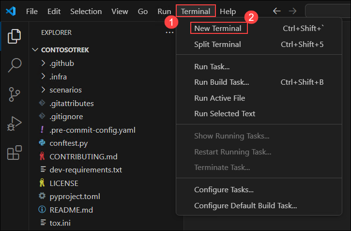
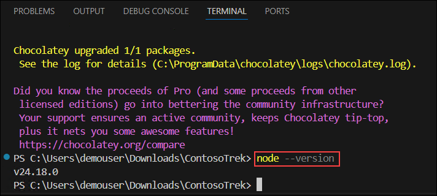

# Module 04: Deploy the RAG App as a Production Endpoint with Rayfin

### Estimated Duration: 1 Hour

## 📘 Scenario

Your RAG assistant works locally and passes evaluation, and the business now wants it available as a web application. Instead of building and operating backend infrastructure yourself, you will host it on **Rayfin**, the managed Backend-as-a-Service (BaaS) platform introduced at Build 2026. Rayfin runs inside your organization's **Microsoft Fabric** data estate, so it inherits enterprise governance and access control, and it provisions authentication, a data API, and static hosting directly from your TypeScript code.

The complete Contoso RAG app is **already built for you** and provided on the lab virtual machine in the **contoso-rag-backend** folder. Rather than hand-writing the data model, services, and UI, you will open the finished project, supply your own Azure AI Search and Microsoft Foundry values in a single `.env` file, and deploy it to Fabric with one command. Then you will test it end to end: sign in with Fabric SSO, ask a product question, get a grounded answer, and confirm the per-user chat history is stored and protected.

## 📖 Overview

You will open the prebuilt **contoso-rag-backend** project and take a short tour so you understand how it works, enable CORS on your Azure AI Search index, fill in the front-end environment values, create a Microsoft Fabric workspace, and deploy with `rayfin up`. You will then verify grounded answers, the stored `ChatInteraction` history, and the row-level access controls that protect it.

> [!IMPORTANT]
> **Where the RAG logic runs.** A deployed Rayfin/Fabric app provisions **only** a SQL database exposed as a GraphQL data API, authentication (Fabric SSO), static hosting, and storage — it does **not** run custom server-side functions (confirmed in the [Fabric Apps overview](https://learn.microsoft.com/en-us/fabric/apps/overview)). Because there is no server compute, the retrieval and model calls in this lab run **in the browser**: the front-end calls Azure AI Search and the Microsoft Foundry Azure OpenAI endpoint directly, and Rayfin is used only for authentication, storing the question/answer history through its data API, and hosting. This means the app ships the search and Foundry keys to the browser through front-end environment values — acceptable for a lab, but **not** production-secure. In production, route the search and model calls through a protected server-side proxy (for example an external Azure Function that holds the keys) so they are never exposed to the browser.

> [!NOTE]
> Rayfin is a new Build 2026 platform and is evolving quickly. Screenshots are placeholders, and some CLI and portal labels may differ in your environment. Capture each screen as you complete the step, and confirm command names and options against the Rayfin documentation at [https://aka.ms/rayfin/docs](https://aka.ms/rayfin/docs).

## 🎯 Objectives

- Task 1: Open the prebuilt Contoso RAG project and tour how it works
- Task 2: Enable CORS on the products index and configure environment values
- Task 3: Create a Fabric workspace
- Task 4: Deploy the app with the Rayfin CLI
- Task 5: Test grounded answers and verify the access controls

## Prerequisites

- A completed and evaluated RAG app from the previous modules, including a populated Azure AI Search **products** index.
- Your Microsoft Foundry **Azure OpenAI endpoint**, **API key**, and a deployed **gpt-5-mini** model (from Exercise 1).
- The **contoso-rag-backend** project folder, provided on the lab virtual machine.
- **Node.js 24 (LTS)** installed on the lab virtual machine. The Rayfin CLI requires Node.js version 24.x (`>=24.0.0 <25.0.0`).
- Access to a **Microsoft Fabric** workspace in your Azure subscription.

---

## Task 1: Open the Prebuilt Contoso RAG Project and Tour How It Works

In this task, you open the finished project in Visual Studio Code and take a short read-only tour. You will **not** edit any source files — the app is already complete. The tour helps you understand the three pieces that make the RAG app work on Rayfin.

1. Navigate to **Visual Studio Code**.

1. Select **File (1)**, then **Open Folder (2)**, browse to the **contoso-rag-backend** folder provided on the lab virtual machine, and select **Select Folder**.

   

   > [!NOTE]
   > If the project is provided as **contoso-rag-backend.zip**, right-click it and select **Extract All** first, then open the extracted **contoso-rag-backend** folder. You will install dependencies with `npm install` in Task 4.

1. In **Visual Studio Code**, select **Terminal (1)**, and then select **New Terminal (2)**.

   

1. In the terminal, run the following command to verify that **Node.js** is version **24.x**. If it is not, upgrade it with `choco upgrade nodejs-lts -y` and reopen the terminal.

   ```bash
   node --version
   ```

   Verify that the output displays **v24.x.x**.

   

1. In the **Explorer** pane, expand **rayfin (1)** › **data (2)** and open **ChatInteraction.ts (3)**. This is the data model that stores each question and its grounded answer. Review it — **do not change it**:

   ```typescript
   import { entity, role, text, date, uuid } from '@microsoft/rayfin-core';

   @entity()
   @role('authenticated', '*', {
     policy: (claims, item) => claims.sub.eq(item.user_id),
   })
   export class ChatInteraction {
     @uuid() id!: string;
     @text({ min: 1, max: 2000 }) question!: string;
     @text({ max: 4000 }) answer!: string;
     @date() createdAt!: Date;
     @text({ max: 200 }) user_id!: string;
   }
   ```

   

   - The **`@role`** decorator applies row-level security: **`'authenticated'`** means only signed-in users can access the entity, **`'*'`** applies the policy to all operations, and the **`policy`** limits each user to rows where `user_id` matches their own identity claim.
   - Every **`@text`** field sets an explicit **`max`**. This matters on MSSQL (the Fabric database dialect): an unbounded `@text()` maps to `NVARCHAR(MAX)`, which breaks GraphQL schema generation. The `answer` field is capped at 4000, the largest non-`MAX` `NVARCHAR` width.

1. Open **src/services/askRag.ts**. This is the browser-side retrieve-then-generate flow. Review — **do not change it**:

   - **`retrieveDocuments()`** calls the Azure AI Search REST API to pull the most relevant product documents for the question.
   - **`getGroundedAnswer()`** calls the Microsoft Foundry Azure OpenAI **chat completions** endpoint with your **gpt-5-mini** deployment, passing the retrieved documents as grounding.
   - **`askRag()`** ties them together and then persists the question and answer through `client.data.ChatInteraction.create(...)`, stamped with the signed-in user's id.
   - **`getRecentInteractions()`** reads the signed-in user's history back for the UI — row-level security ensures only that user's rows are returned.

   > [!NOTE]
   > This mirrors the Python `chat_with_products.py` flow from Exercise 2 — Azure AI Search for retrieval, then Microsoft Foundry for generation — but runs in the browser because a deployed Fabric app has no server compute, and persists through the Rayfin data API.

1. Open **src/components/AskRag.tsx** and **src/pages/HomePage.tsx**. Together these render the **Ask Contoso Products** experience: a question box, the grounded answer, and a **Recent questions** list. There is no todo UI — the app is RAG-only.

## Task 2: Enable CORS on the Products Index and Configure Environment Values

In this task, you make sure the browser can call your Azure AI Search index, then supply the search and Foundry values the app needs. This is the **only** file you edit in the lab — a single `.env` file. You do not touch any source code.

1. Enable CORS on the search index so the browser-based app can query it. Switch to the **rag/custom-rag-app** terminal and re-run the index creation script, which includes `cors_options` in the index definition:

   ```bash
   python create_search_index.py
   ```

   > [!IMPORTANT]
   > Browsers block cross-origin requests unless the target service allows them. The `create_search_index.py` script recreates the **products** index with `CorsOptions(allowed_origins=["*"])` so the deployed app can call the Azure AI Search REST API directly. If your index was created before this setting was added, you **must** re-run the script now — otherwise the search call fails with a CORS error in the browser console. (Azure OpenAI/Foundry has no CORS setting; see the troubleshooting note in Task 5 for the fallback if the Foundry call is blocked.)

1. Back in the **contoso-rag-backend** project, open the **.env** file in the project root. It already contains the required keys with placeholder values. Replace the placeholders with your own values, and then press **Ctrl+S** to save the file:

   ```bash
   VITE_SEARCH_ENDPOINT=<your-search-endpoint>
   VITE_SEARCH_KEY=<your-search-key>
   VITE_AISEARCH_INDEX_NAME=products
   VITE_FOUNDRY_OPENAI_ENDPOINT=<your-foundry-azure-openai-endpoint>
   VITE_FOUNDRY_API_KEY=<your-foundry-api-key>
   VITE_CHAT_MODEL=gpt-5-mini
   ```

   - **`VITE_SEARCH_ENDPOINT`** / **`VITE_SEARCH_KEY`** — from your `aisearch-<inject key="DeploymentID" enableCopy="false"/>` resource (**Overview** URL, and **Settings › Keys**). These are the same values you used in Exercises 1–3.
   - **`VITE_AISEARCH_INDEX_NAME`** — leave as **products** (the index you populated earlier).
   - **`VITE_FOUNDRY_OPENAI_ENDPOINT`** — the **Azure OpenAI endpoint** for your Microsoft Foundry project, in the form `https://contosofoundry<inject key="DeploymentID" enableCopy="false"/>.openai.azure.com/`. Use the **base** resource endpoint (ending in `.openai.azure.com/`) — the app appends the deployment path for you.
   - **`VITE_FOUNDRY_API_KEY`** — the **API key** for that Azure OpenAI resource.
   - **`VITE_CHAT_MODEL`** — leave as **gpt-5-mini** (your chat deployment name).

   > [!NOTE]
   > Vite automatically loads `VITE_*` variables from the project-root `.env` file into `import.meta.env`. The `rayfin/.env` file is managed by the Rayfin CLI — do not add these values there. Using the Foundry **API key** (rather than a short-lived access token) keeps the app working for the whole lab without re-authenticating. As noted at the top of this module, shipping these keys to the browser is a lab-only convenience, not a production pattern.

## Task 3: Create a Fabric Workspace

In this task, you create a Microsoft Fabric workspace with capacity. Rayfin deploys the app into this workspace and provisions the database, data API, authentication, and hosting inside it.

1. Open a new browser tab, enter **https://app.fabric.microsoft.com** in the address bar, and then sign in with **<inject key="AzureAdUserEmail" enableCopy="false"/>**.

    

1. If prompted, start the **Fabric trial** to obtain trial capacity for your account.

    

1. From the left navigation pane, select **Workspaces (1)**, and then select **+ New workspace (2)**.

    

1. Enter **contoso-rag-ws<inject key="DeploymentID" enableCopy="false"/> (1)** as the workspace name, expand **Advanced (2)**, select **Trial (3)** as the license mode, and then select **Apply (4)**.

    

    > [!NOTE]
    > A Rayfin deployment requires a workspace with Fabric capacity assigned. The **Fabric Apps (preview)** workload must also be enabled by a tenant administrator; in this lab environment it is pre-enabled.

1. Verify that the **contoso-rag-ws<inject key="DeploymentID" enableCopy="false"/>** workspace opens.

## Task 4: Deploy the App with the Rayfin CLI

In this task, you install dependencies, sign in to Rayfin, and deploy the app. `rayfin up` builds the front-end, provisions the backend services, creates the `ChatInteraction` table from your data model, and publishes the static site.

1. Back in the **Visual Studio Code** terminal (in the **contoso-rag-backend** folder), install the project dependencies:

   ```bash
   npm install
   ```

   > [!NOTE]
   > If the folder already ships with a `node_modules` directory, `npm install` simply verifies it and finishes quickly.

1. Sign in to Rayfin with Entra ID:

   ```bash
   npx rayfin login
   ```

   When a browser window opens, sign in with **<inject key="AzureAdUserEmail" enableCopy="false"/>**.

   

1. Deploy the app:

   ```bash
   npx rayfin up
   ```

1. When prompted **Enter a Fabric workspace name to deploy to**, enter **contoso-rag-ws<inject key="DeploymentID" enableCopy="false"/>**, and then press **Enter**.

   

   > **Note:** Rayfin provisions the SQL database and GraphQL data API, authentication, and static hosting, and applies the `ChatInteraction` schema. Wait for the deployment to complete. This might take several minutes.

1. When the deployment finishes, the terminal displays the **Deployment details**. Copy the following values into a notepad — you will need them later:

    - **Static Hosting URL (1)** — the live app URL (format: `https://<name>-swedencentral.webapp.fabricapps.net`)
    - **Portal (2)** — the Fabric portal link for the deployed app backend
    - **Publishable Key (3)** — used as the `X-Publishable-Key` header in data-plane requests

   

1. Verify that the output displays **Project "contoso-rag-backend" is now deployed to Fabric!**

   > [!NOTE]
   > If you make a change later (for example editing the `.env` and rebuilding, or adjusting the data model), simply re-run `npx rayfin up`. It redeploys the app and applies any pending schema changes in one step. Run `npx rayfin up status` to check deployment health.

   > [!NOTE]
   > **Troubleshooting the schema apply.** On a clean workspace this step just works. Two situations can appear if the workspace previously hosted a different app:
   > - *"Drop table … would result in data loss but force mode is not enabled."* — a table from an earlier deploy needs to be removed. Re-apply with force: `npx rayfin up db apply --force`. Only use `--force` when you are sure the old table's data is disposable.
   > - *"500 Internal Server Error"* while applying — the database workload is still warming up. Wait a few seconds and re-run the same command; it is safe to retry.

## Task 5: Test Grounded Answers and Verify the Access Controls

In this task, you exercise the deployed app end to end and confirm the per-user access controls that protect the stored interactions.

1. Open the **Static Hosting URL** you copied above in the browser, and then sign in with **<inject key="AzureAdUserEmail" enableCopy="false"/>** when prompted. Fabric SSO protects the app, so only authenticated users can open it. The app shows **Contoso Products Assistant**.

   

1. In the **Ask Contoso Products** box, enter the following question, select **Ask**, and then verify that a grounded answer is returned that references the product documents. The question and answer appear under **Recent questions**.

   ```
   I need a new tent for 4 people, what would you recommend?
   ```

   

   > [!NOTE]
   > **If you see a CORS or "Failed to fetch" error**, open the browser **DevTools › Console** to see which host was blocked, then check the **Network** tab for the two requests the app makes — one to `*.search.windows.net` (Azure AI Search) and one to `*.openai.azure.com` (Microsoft Foundry). Both should return **200** with an `Access-Control-Allow-Origin: *` response header.
   > - A block on `*.search.windows.net` means the index was not recreated with CORS — re-run `create_search_index.py` from Task 2.
   > - The Microsoft Foundry (Azure OpenAI) endpoint used in this lab returns permissive CORS headers, so the model call normally succeeds from the browser. If your environment uses a Foundry endpoint that *does* reject the browser origin, the retrieval/model calls must be moved behind a server-side proxy (for example an external Azure Function that holds the keys), as described in the architecture note at the top of this module.

1. Verify that the interaction was stored through the data API. Open the **Portal** link you copied in Task 4, select the **SQL database in Fabric** child item, and then verify that the **ChatInteraction** table contains the question and answer, stamped with your `user_id`.

   

1. Review the access control that protects the stored interactions. Reopen **rayfin/data/ChatInteraction.ts** and review the `@role` decorator:

   ```typescript
   @role('authenticated', '*', {
     policy: (claims, item) => claims.sub.eq(item.user_id),
   })
   ```

   - **`'authenticated'`** — only signed-in users can access the entity; anonymous requests are rejected.
   - **`'*'`** — the policy applies to all operations (create, read, update, delete).
   - **`policy`** — row-level security: each user can only access records where `user_id` matches their own identity claim, so one user can never see another user's chat history.

1. Confirm that the backend rejects unauthenticated requests. Open a new **InPrivate** browser window and open the **Static Hosting URL** without signing in. Verify that Fabric SSO blocks access and the data API cannot be reached anonymously.

   > [!NOTE]
   > Data-plane requests require Fabric authentication and the **Publishable Key** sent as the `X-Publishable-Key` header — this is how any front-end consumes the API with the Rayfin client SDK. The `@role('authenticated', ...)` policy rejects anonymous requests, confirming the access controls are enforced end to end.

You have successfully deployed the Contoso RAG assistant as a Fabric-hosted web app.

## 🧾 Summary

In this module, you deployed your RAG assistant on the Rayfin managed backend without hand-writing any application code.

- You opened the **prebuilt contoso-rag-backend project**, toured its `ChatInteraction` data model (per-user row-level security, bounded `@text` fields), its browser-side `askRag` retrieve-then-generate service, and its "Ask Contoso Products" UI.
- You enabled CORS on the **products** index, supplied your Azure AI Search and Microsoft Foundry values in a single `.env` file, created a Fabric workspace, and deployed with `npx rayfin up`.
- You verified grounded answers from **gpt-5-mini**, confirmed that interactions are stored through the data API in the **ChatInteraction** table, and confirmed that Fabric SSO and the `@role` policy reject unauthenticated and cross-user access.

You also saw the key architectural boundary: a Rayfin/Fabric app provides authentication, a GraphQL data API, storage, and hosting — but no server compute — so the retrieval and model calls run client-side in this lab and should move behind a server-side proxy in production.

### You have successfully completed the module. Click **Next >>** to continue to the next module.
