# Exercise 03: Evaluate and Optimize RAG Performance

### Estimated Duration: 1 Hour

## 📘 Scenario

After deploying the RAG chatbot, stakeholders report that some answers are incomplete or not fully aligned with the retrieved content. You must evaluate the RAG system using Azure AI evaluators to measure retrieval accuracy and response quality. Based on the evaluation results, you will fine-tune retrieval settings and prompting to improve the assistant’s reliability and efficiency.

## 📖 Overview

In this exercise, you will evaluate the performance of your RAG pipeline using Azure AI evaluators, implement various evaluation methods, and interpret the results to fine-tune your model. This ensures improved retrieval accuracy, response quality, and overall system efficiency.

## 🎯 Objectives

In this exercise, you will complete the following tasks:

- Task 1: Evaluate with Azure AI evaluators
- Task 2: Implementing Evaluation Methods
- Task 3: Interpreting Results and Fine-Tuning 

## Task 1: Evaluate with Azure AI Evaluators

In this task, you will evaluate the RAG pipeline using Azure AI evaluators by analyzing key metrics such as coherence, relevance, and groundedness. You will modify the evaluation script to incorporate these metrics and log the results for further analysis.

1. Navigate back to **Visual Studio Code**. 

1. Expand the **assets (1)** folder and select **chat_eval_data.jsonl (2)**. This is an evaluation dataset, which contains example questions and expected answers (truth).

   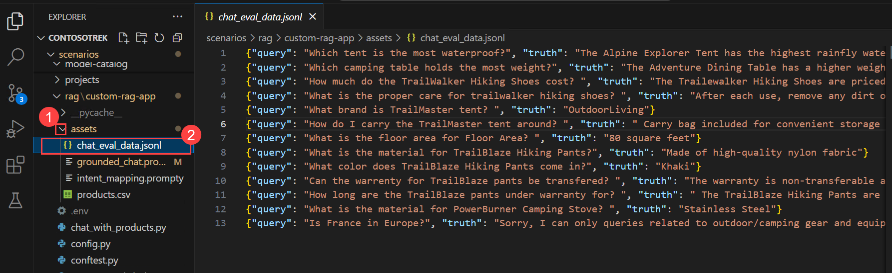

1. Select the **evaluate.py** file.

   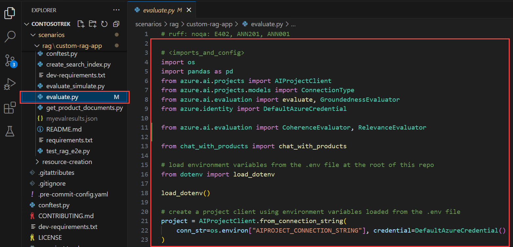

   - This script allows you to review the results locally by outputting them in the command line and putting them in a JSON file.
   - This script also logs the evaluation results to the cloud project so that you can compare evaluation runs in the UI.

1. To get `Coherence` and `Relevance` metrics along with `Groundedness`, add the following code to the **evaluate.py** file.    

1. Add the below import statement in the `<imports_and_config>` section, around the 10th or 11th line, before `# load environment variables from the .env file at the root of this repo`.

   ```bash
   from azure.ai.evaluation import CoherenceEvaluator, RelevanceEvaluator
   ```

   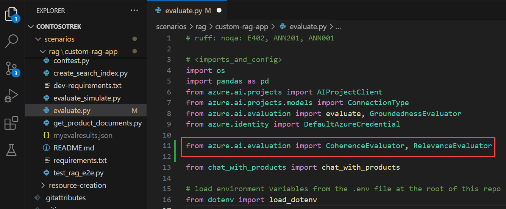    

1. Scroll down and add the code right above `# </imports_and_config>`.

   ```bash
   coherence = CoherenceEvaluator(evaluator_model)
   relevance = RelevanceEvaluator(evaluator_model)
   ```

   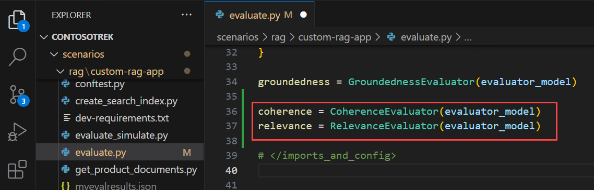    

1. Scroll down to the `<run_evaluation>` section, and around the `69th` or `70th` line, add the following code below `"groundedness": groundedness`.

   ```bash
   "coherence": coherence, 
   "relevance": relevance,
   ```

   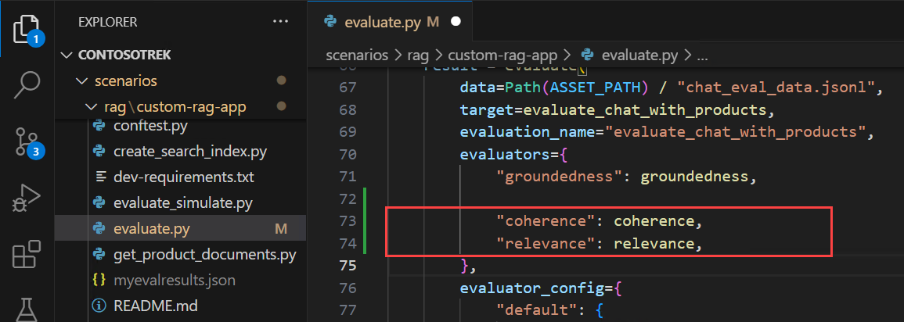     

   >**Note:** Ensure that the code indentation is correct before saving the file. 

1. After making the required modifications, verify that your **evaluate.py** file is similar to the updated code provided below.
   
   ```
   # <imports_and_config>
   import os
   import pandas as pd
   from azure.ai.projects import AIProjectClient
   from azure.ai.projects.models import ConnectionType
   from azure.ai.evaluation import evaluate, GroundednessEvaluator
   from azure.identity import DefaultAzureCredential

   from azure.ai.evaluation import CoherenceEvaluator, RelevanceEvaluator

   from chat_with_products import chat_with_products

   # load environment variables from the .env file at the root of this repo
   from dotenv import load_dotenv

   load_dotenv()

   # create a project client using environment variables loaded from the .env file
   project = AIProjectClient.from_connection_string(
       conn_str=os.environ["AIPROJECT_CONNECTION_STRING"], credential=DefaultAzureCredential()
   )

   connection = project.connections.get_default(connection_type=ConnectionType.AZURE_OPEN_AI, include_credentials=True)

   evaluator_model = {
       "azure_endpoint": connection.endpoint_url,
       "azure_deployment": os.environ["EVALUATION_MODEL"],
       "api_version": "2024-06-01",
       "api_key": connection.key,
   }

   groundedness = GroundednessEvaluator(evaluator_model)
   coherence = CoherenceEvaluator(evaluator_model)
   relevance = RelevanceEvaluator(evaluator_model)

   # </imports_and_config>

   # create a wrapper function that implements the evaluation interface for query & response evaluation
   # <evaluate_wrapper>
   def evaluate_chat_with_products(query):
       response = chat_with_products(messages=[{"role": "user", "content": query}])
       return {"response": response["message"].content, "context": response["context"]["grounding_data"]}

   # </evaluate_wrapper>

   # <run_evaluation>
   # Evaluate must be called inside of __main__, not on import
   if __name__ == "__main__":
       from config import ASSET_PATH

       # workaround for multiprocessing issue on linux
       from pprint import pprint
       from pathlib import Path
       import multiprocessing
       import contextlib

       with contextlib.suppress(RuntimeError):
           multiprocessing.set_start_method("spawn", force=True)

       # run evaluation with a dataset and target function, log to the project
       result = evaluate(
           data=Path(ASSET_PATH) / "chat_eval_data.jsonl",
           target=evaluate_chat_with_products,
           evaluation_name="evaluate_chat_with_products",
           evaluators={
               "groundedness": groundedness,
               "coherence": coherence, 
               "relevance": relevance,
           },
           evaluator_config={
               "default": {
                   "query": {"${data.query}"},
                   "response": {"${target.response}"},
                   "context": {"${target.context}"},
               }
           },
           azure_ai_project=project.scope,
           output_path="./myevalresults.json",
       )

       tabular_result = pd.DataFrame(result.get("rows"))

       pprint("-----Summarized Metrics-----")
       pprint(result["metrics"])
       pprint("-----Tabular Result-----")
       pprint(tabular_result)
       pprint(f"View evaluation results in AI Studio: {result['studio_url']}")
   # </run_evaluation>

   # If encountering issues with uploading evaluation results, check out
   # the troubleshooting guide for known issues and workarounds:
   # https://github.com/Azure/azure-sdk-for-python/blob/main/sdk/evaluation/azure-ai-evaluation/TROUBLESHOOTING.md#troubleshoot-remote-tracking-issues
   ```

1. Press **Ctrl+S** to save the file.

## Task 2: Implementing Evaluation Methods      

In this task, you will implement evaluation methods to assess the performance of your RAG pipeline. You will install the necessary dependencies, run the evaluation script, and analyze metrics such as Groundedness, Coherence, and Relevance to ensure response quality.
 

1. Make sure you are in the **rag/custom-rag-app** directory.

1. From your console, run the command below to install the required package for running the evaluation script.

   ```bash
   pip install azure-ai-evaluation[remote]
   ```

   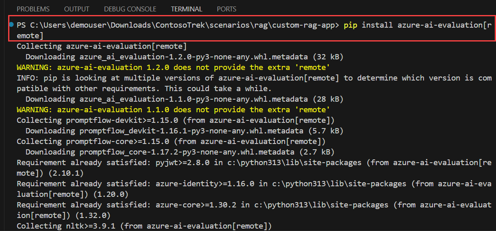

   > **Note:** Wait for the installation to complete. This might take 3–5 minutes.

1. Once the installation is complete, enter **clear** in the terminal to clear the terminal history.   
      
1. Now run the evaluation script:

   ```bash
   python evaluate.py
   ```

   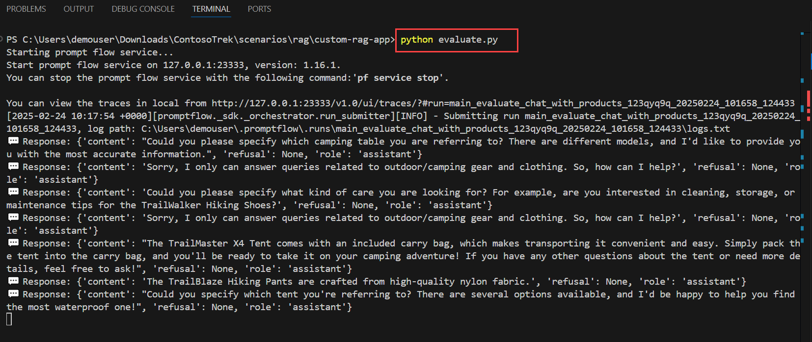  

   > **Note:** If you encounter an error such as **ImportError: cannot import name '_T' from 'marshmallow.fields'**, it may be due to an incompatible marshmallow version. Run the command below to install a compatible version:

   ```bash
   pip install marshmallow==3.20.2
   ```

   After the installation completes, rerun:

   ```bash
   python evaluate.py
   ```

    

   > **Note:** Expect the evaluation to take around 5–10 minutes to complete.  

   > **Note:** You might see some timeout errors, which are expected. The evaluation script is designed to handle these errors and continue running.

1. In the console output, you will see an answer for each question, followed by a table with summarized metrics. (You might see different columns in your output.)

   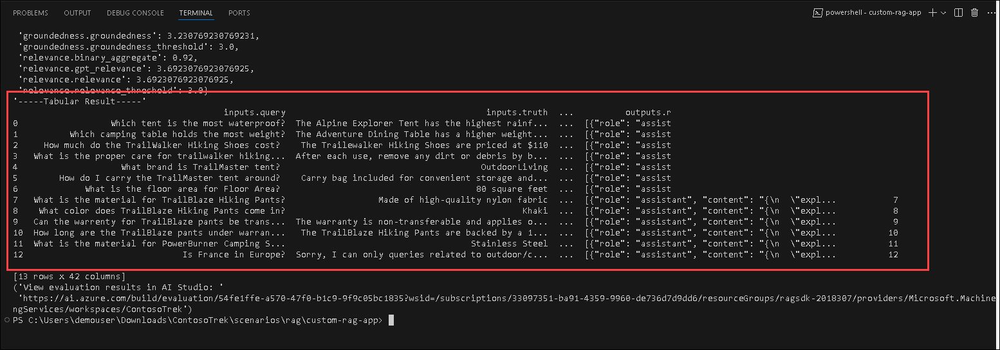   

   >**Note**: You might see some time-out errors, which are expected. The evaluation script is designed to handle these errors and continue running.   

## Task 3: Interpreting Results and Fine-Tuning         

In this task, you will interpret the evaluation results and fine-tune the RAG pipeline by adjusting the prompt template. You will analyze the **Relevance, Groundedness, and Coherence** scores, modify the prompt instructions, and rerun the evaluation to improve response accuracy.

1. Once the evaluation run is complete, press **Ctrl + Right click (1)** on the **link** to view the evaluation results on the Evaluation page in the Microsoft Foundry portal , then click on **Open (2)**.

   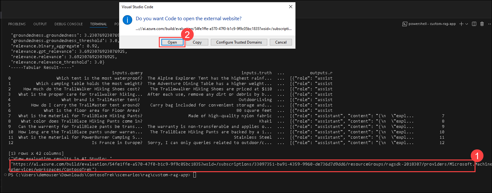

1. On the **Report** tab, you can view the RAG App quality through the Metric dashboard.

1. You can view the average score for `Relevance, Groundedness`, and `Coherence`.

   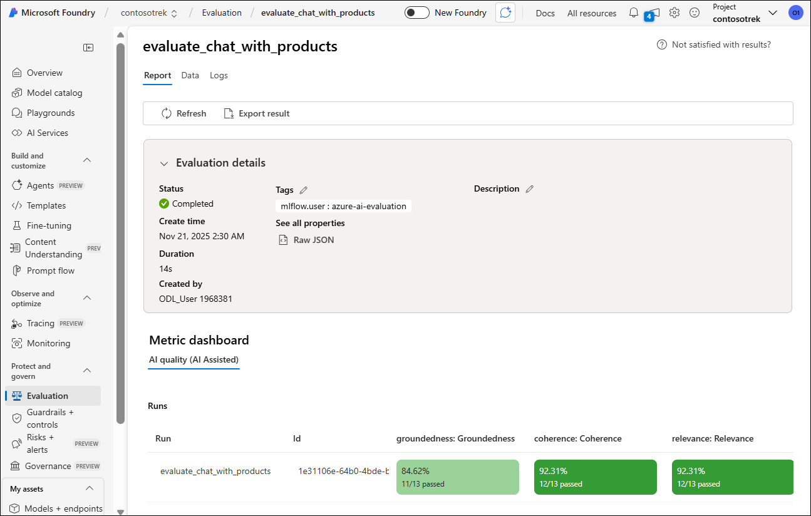

1. Navigate to the **Data** tab for more details about the evaluation metric.

   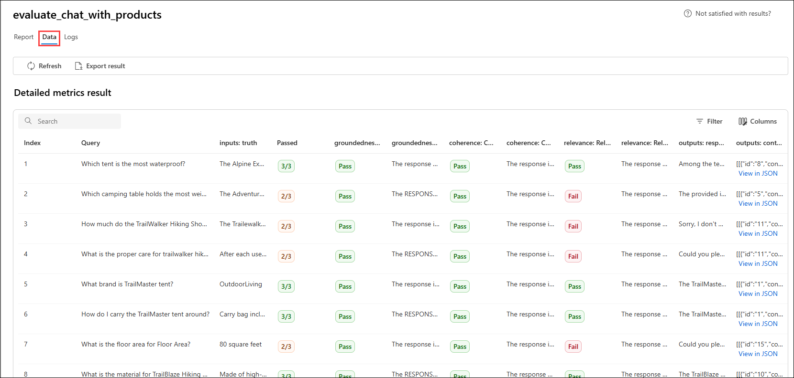

1. Notice that the responses are not well-grounded. The model often replies with a question rather than an answer. This is a result of the prompt template instructions.

1. Navigate to VS Code, and in your **assets/grounded_chat.prompty (1)** file, find the sentence, `"If the question is not related to outdoor/camping gear and clothing, just say 'Sorry, I can only answer queries related to outdoor/camping gear and clothing. So, how can I help?'"`. **(2)**

   

1. Replace the sentence with `If the question is related to outdoor/camping gear and clothing but vague, try to answer based on the reference documents, then ask for clarifying questions.`

   

1. Press **Ctrl+S** to save the file.

1. Rerun the evaluation script.    

   ```bash
   python evaluate.py
   ```

   >**Note**: Expect the evaluation to take around 5 - 10 minutes to complete.  

   >**Note**: If you cannot increase the tokens per minute limit for your model, you might see some time-out errors, which are expected. The evaluation script is designed to handle these errors and continue running.

1. Once the evaluation run is complete, press **Ctrl + Right click (1)** on the **link** to view the evaluation results on the Evaluation page in the Microsoft Foundry portal , then click on **Open (2)**.

     

1. On the **Report** tab, you can view the `Relevance, Groundedness`, and `Coherence` average scores, which have increased more than before.

   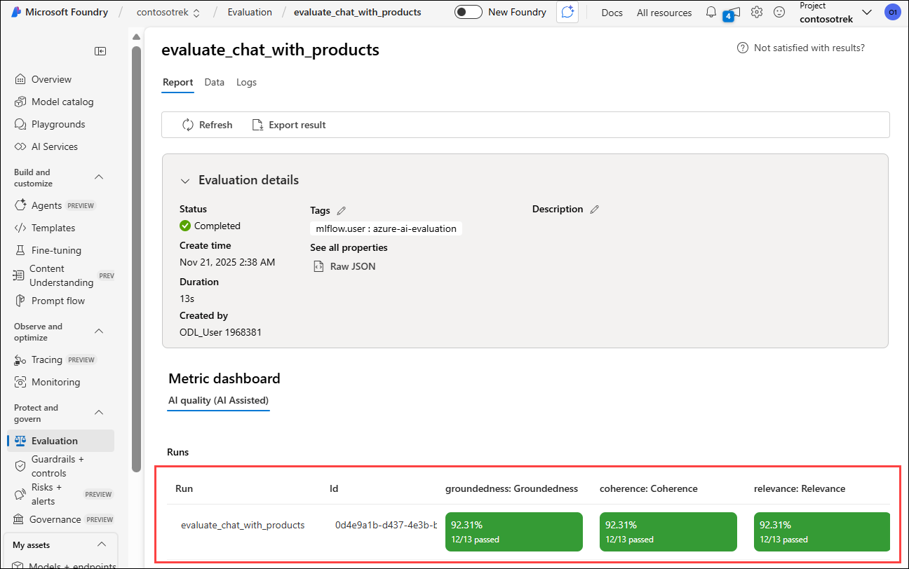    

1. Navigate to the **Data (1)** tab for more details about the evaluation metric **(2)**.

   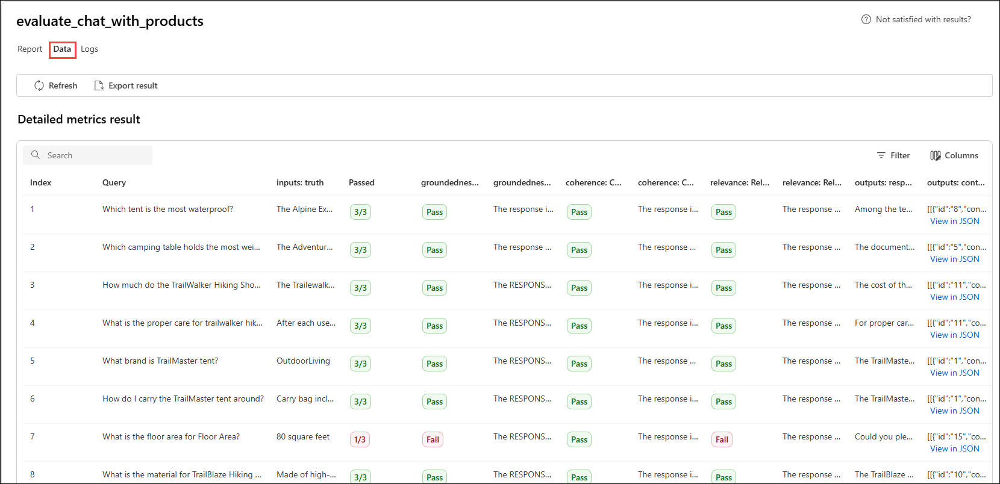    

1. Try other prompt template modifications to see how the changes affect the evaluation results.    

   > **Note:** The evaluation results may not exactly match the values shown in the screenshot. Metric scores can vary depending on the input data and execution environment. Minor differences in results are expected.

## 🧾 Summary

In this exercise, you evaluated and improved your RAG application to make its responses more accurate and reliable.

- First, you used `chat_eval_data.jsonl` as a test dataset and updated `evaluate.py` to include additional metrics like Coherence and Relevance using Azure AI Evaluation.
- Then, you ran `evaluate.py` to generate responses and measure performance across Groundedness, Relevance, and Coherence.
- Next, you reviewed the evaluation results in the Microsoft Foundry portal to identify issues in response quality.
- After that, you improved the prompt in `grounded_chat.prompty` to guide the model toward better, more context-aware answers.
- Finally, you reran `evaluate.py` to confirm improvements and observed higher-quality responses based on the updated evaluation metrics.

## 🎉 You have successfully finished the lab

In this lab, you have successfully developed a **custom Retrieval-Augmented Generation (RAG) application** using **Microsoft Foundry**. You began by setting up the foundational Azure resources and configuring the Microsoft Foundry environment to support model deployment and data retrieval. Then, you built and implemented a **RAG pipeline** that indexed knowledge sources, retrieved contextually relevant information, and enhanced the quality of AI-generated responses. You also explored techniques to **evaluate and optimize the RAG system’s performance**, leveraging Azure AI evaluators to measure retrieval accuracy, response quality, and overall efficiency. Through these exercises, you gained practical experience in integrating **Azure AI Search, Azure OpenAI models, and telemetry logging** into a cohesive and scalable AI solution. By completing this exercise, you now have a solid understanding of how to **design, build, and evaluate custom RAG-based applications** using Microsoft Foundry, equipping you with the skills to develop enterprise-grade AI systems that deliver more reliable, context-aware, and intelligent responses.
