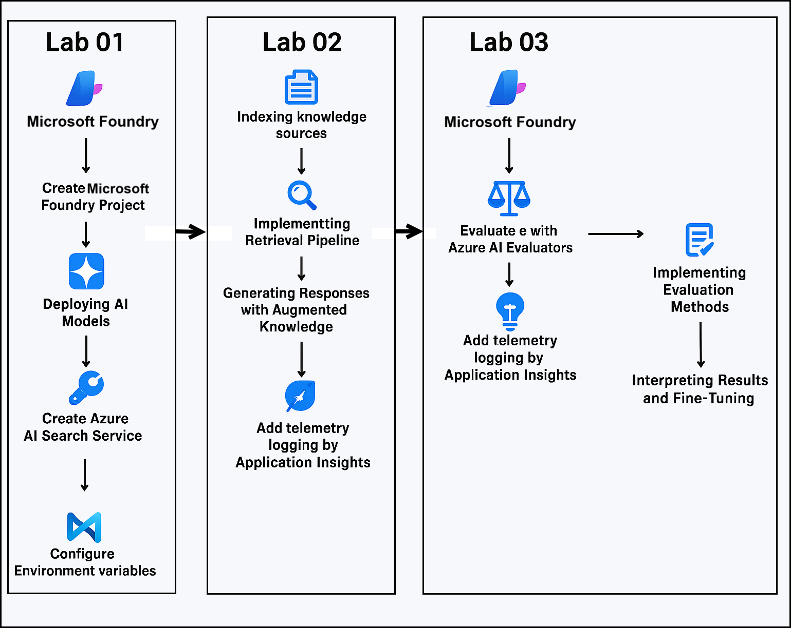
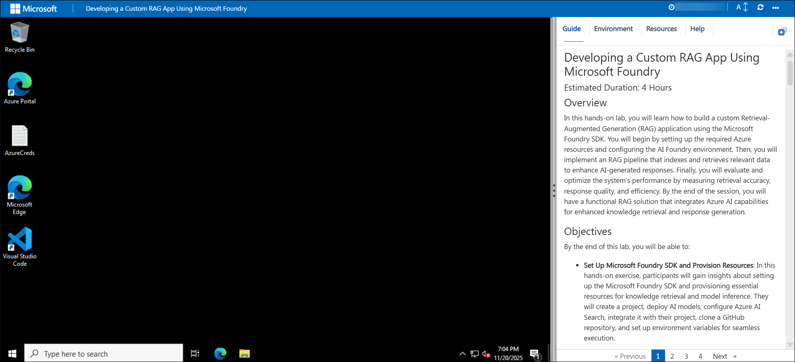
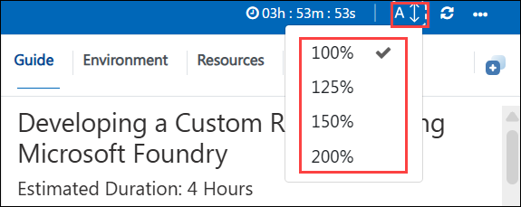
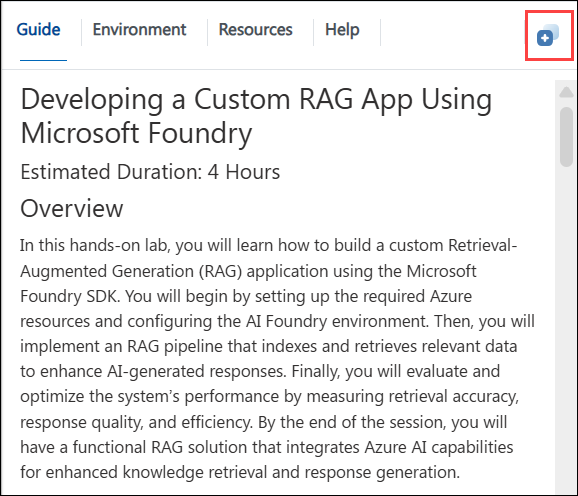
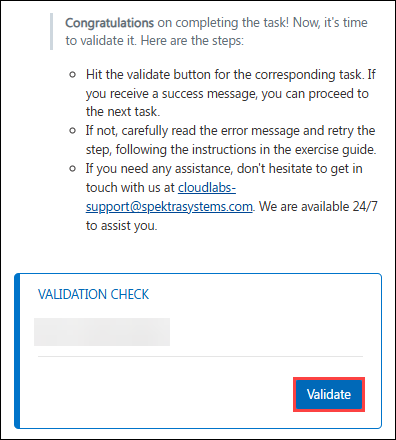
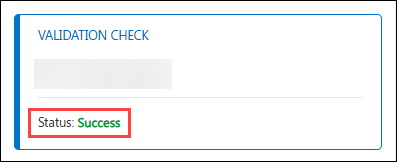
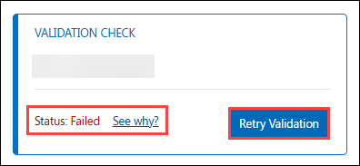
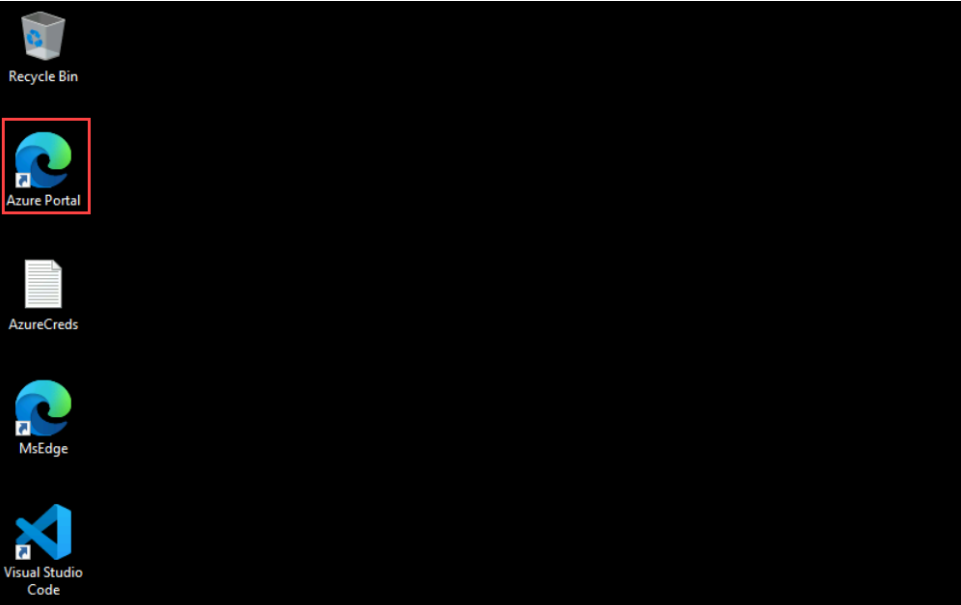
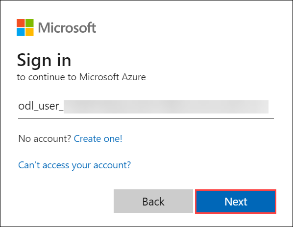
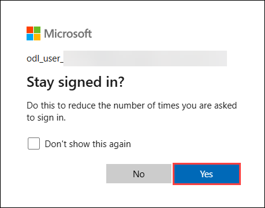

# Developing a Custom RAG App Using Microsoft Foundry

### Overall Estimated Duration: 6 Hours

## 📘 Lab Scenario

You are part of an AI engineering team at Contoso Knowledge Services, a company that provides intelligent knowledge assistants for internal business teams. The organization has a large volume of technical documents, internal policies, onboarding manuals, and troubleshooting guides stored in various formats (PDFs, Markdown files, and text files). Employees often struggle to find the right information quickly, leading to repeated support tickets and inefficient operations.
 
To solve this, Contoso wants to build a custom AI assistant that can answer employee questions accurately using the organization’s internal documentation. The assistant must generate responses that are grounded in trusted enterprise knowledge, rather than relying only on general model responses.
 
To achieve this, you will build a **Retrieval-Augmented Generation (RAG)** application using the **Microsoft Foundry SDK**, integrating **Azure AI Search** as the vector database for retrieval and using a deployed **Azure AI model** for response generation.

## 📖 Lab Overview

In this hands-on lab, you will learn how to build a custom **Retrieval-Augmented Generation (RAG)** application using the **Microsoft Foundry SDK**. You will begin by setting up the required Azure resources and configuring the Microsoft Foundry environment. Then, you will implement an RAG pipeline that indexes and retrieves relevant data to enhance AI-generated responses. Finally, you will evaluate and optimize the system’s performance by measuring retrieval accuracy, response quality, and efficiency. By the end of the session, you will have a functional RAG solution that integrates Azure AI capabilities for enhanced knowledge retrieval and response generation.

## 🎯 Objectives

By the end of this lab, you will be able to:

- **Set Up Microsoft Foundry SDK and Provision Resources**: In this hands-on exercise, you will gain insights about setting up the Microsoft Foundry SDK and provisioning essential resources for knowledge retrieval and model inference. They will create a project, deploy AI models, configure Azure AI Search, integrate it with their project, clone a GitHub repository, and set up environment variables for seamless execution.

- **Building a RAG pipeline**: In this hands-on exercise, you will gain insights about building a Retrieval-Augmented Generation (RAG) pipeline to enhance AI-generated responses. They will index knowledge sources, implement a retrieval pipeline, and generate responses enriched with relevant data. Additionally, they will integrate telemetry logging to monitor and optimize system performance.

- **Evaluate and Optimize RAG Performance with ASSERT**: In this hands-on exercise, you will gain insights about evaluating and optimizing a Retrieval-Augmented Generation (RAG) system using ASSERT, Microsoft's open-source, policy-driven evaluation framework. You will define an evaluation specification, generate spec-driven test cases, score responses with an LLM judge, and re-run ASSERT to validate improvements instead of inspecting prompts manually.

- **Deploy the RAG App as a Production Endpoint with Rayfin**: In this hands-on module, you will deploy the RAG app as a production REST endpoint using the Rayfin managed backend. You will scaffold a Rayfin project, define a backend function, deploy it to Microsoft Fabric, configure access controls, and expose a REST API that a front-end can consume.

- **(Optional) Connect Web IQ and Foundry IQ for Hybrid Grounding**: In this optional module, you will add hybrid grounding by combining Foundry IQ, the knowledge layer over your enterprise data, with Web IQ, the live web grounding introduced at Build 2026, so the assistant can cite both enterprise and web sources.
  
## ⚙️ Prerequisites

- Familiarity with the Microsoft Foundry portal.
- Basic understanding of large language models and their applications.
- Familiarity with Retrieval-Augmented Generation (RAG) concepts.
- An active Microsoft Azure subscription to provision and access required resources.
- A pre-provisioned Microsoft Entra ID user account with sufficient permissions to create and manage resources within the Azure subscription.

## 🏗️ Architecture

The architecture involves using Microsoft Foundry to provision resources, including AI models and a vector database for knowledge retrieval. Visual Studio Code is used to develop the RAG application, integrating retrieval and generation components. Once deployed, the app is evaluated in Microsoft Foundry to monitor retrieval accuracy, response quality, and performance, ensuring an optimized AI system.

## 🖼️ Architecture Diagram

  

## 🔍 Explanation of Components

1. **Microsoft Foundry SDK**: The Microsoft Foundry SDK provides a programmable interface to interact with Azure AI resources directly from your development environment. It allows you to create projects, deploy models, manage vector indexes, and orchestrate the entire RAG workflow using Python. This SDK enables automation, faster iteration, and seamless integration between your local code and Azure AI services, forming the foundation for building and running your custom RAG application.

1. **Azure AI Search**: Azure AI Search serves as the vector database and retrieval engine for the RAG application. It stores document embeddings and enables semantic, vector-based, and hybrid search to fetch the most relevant knowledge for a given query. By powering accurate and efficient context retrieval, It plays a critical role in improving the quality and grounding of AI-generated responses in the lab. 

1. **Visual Studio Code**: Visual Studio Code is the primary development environment used to write, run, and debug the RAG application code. It provides extensions for Python, Azure tools, and GitHub integration, enabling smooth interaction with Microsoft Foundry resources. In this lab, VS Code serves as the workspace for building the retrieval pipeline, configuring the SDK, and executing end-to-end RAG workflows.

1. **Retrieval-Augmented Generation (RAG) Pipeline**: The Retrieval-Augmented Generation (RAG) pipeline enhances model responses by combining vector-based retrieval with generative AI. It first fetches the most relevant context from indexed knowledge sources and then uses that context to guide the language model’s output. In this lab, the RAG pipeline is the central mechanism that improves answer accuracy and enables knowledge-grounded response generation.

1. **Evaluation & Monitoring (Microsoft Foundry)**: Evaluation and monitoring in Microsoft Foundry allow you to assess retrieval accuracy, response quality, and overall system performance using built-in evaluators. These tools help identify improvement areas and ensure the RAG pipeline is functioning effectively. In this lab, you will implement telemetry logging using Application Insights to capture runtime metrics, track pipeline behavior, and monitor the application's health in real time.

1. **ASSERT (Evaluation Framework)**: ASSERT (Adaptive Spec-driven Scoring for Evaluation and Regression Testing) is Microsoft's open-source, policy-driven evaluation framework. It turns natural-language behavior specifications into executable test cases, runs them against your app, and scores each response with an LLM judge. In this lab, ASSERT replaces manual prompt inspection with repeatable, spec-driven evaluation and regression testing.

1. **Rayfin (Managed Backend)**: Rayfin is a fully managed Backend-as-a-Service platform built on Microsoft Fabric. It provisions a database, authentication, data APIs, storage, and hosting from your code. In this lab, Rayfin hosts the RAG app as a production REST endpoint with enterprise access controls that a front-end can consume.

1. **Foundry IQ & Web IQ (Grounding)**: Foundry IQ is the knowledge layer that unifies enterprise knowledge sources behind a single retrieval endpoint, and Web IQ provides low-latency live web grounding. In this optional part of the lab, they combine to give the assistant hybrid enterprise and web grounding with citations from both.

## 📁 Repository Structure

```
azureai-samples/
├── scenarios/                         # End-to-end AI scenarios
│   ├── rag/                           # Retrieval-Augmented Generation examples
│   │   ├── custom-rag-app/            # Custom RAG application (your lab focus)
│   │   │   ├── *.py                   # Core Python scripts (indexing, querying, etc.)
│   │   │   ├── requirements.txt       # Python dependencies
│   │   │   ├── data/                  # Sample data for indexing
│   │   │   └── *.env / config files   # Environment configurations
│   │   └── other-rag-scenarios/       # Additional RAG implementations
│   ├── agents/                        # AI agent-based scenarios
│   ├── evaluations/                   # Evaluation workflows and samples
│   └── other-scenarios/               # Additional AI use cases
│
├── labs/                              # Hands-on lab exercises
│   ├── lab-guides/                    # Step-by-step lab instructions
│   └── assets/                        # Images, diagrams, and supporting files
│
├── scripts/                           # Automation scripts (setup, deployment)
│
├── infrastructure/                    # IaC (ARM/Bicep/Terraform templates)
│
├── docs/                              # Documentation and reference materials
│   ├── setup-guides/                  # Environment setup instructions
│   ├── architecture/                  # Design and architecture docs
│   └── troubleshooting/               # Common issues and fixes
│
├── notebooks/                         # Jupyter notebooks for experiments/demos
│
├── tests/                             # Validation and testing scripts
│
├── .github/                           # GitHub workflows and configurations
│   └── workflows/                     # CI/CD pipelines
│
├── requirements.txt                   # Root-level dependencies (if applicable)
└── README.md                          # Repository overview and instructions
```

## 🚀 Getting Started with the Lab

Welcome to your Developing a Custom RAG App Using Microsoft Foundry​ Workshop! We've prepared a seamless environment for you to explore and learn about Azure services. Let's begin by making the most of this experience:
 
## Accessing Your Lab Environment
 
Once you are ready to dive in, your virtual machine and **Guide** will be right at your fingertips within your web browser.

   

## Lab Guide Zoom In/Zoom Out

To adjust the zoom level for the environment page, click the **A↕: 100%** icon located next to the timer in the lab environment.

   

## Virtual Machine & Lab Guide
 
Your virtual machine is your workhorse throughout the workshop. The lab guide is your roadmap to success.
 
## Exploring Your Lab Resources
 
To get a better understanding of your lab resources and credentials, navigate to the **Environment** tab.
 
   
 
## Utilizing the Split Window Feature
 
For convenience, you can open the lab guide in a separate window by selecting the **Split Window** button from the top right corner.
 
 
 
## Managing Your Virtual Machine
 
Feel free to **start, stop, or restart (2)** your virtual machine as needed from the **Resources (1)** tab. Your experience is in your hands!
 
 

## Validating Your Lab Tasks

Once you complete a task, you will see a **Validate** button integrated within the lab guide. Click this button to ensure the lab instructions have been followed correctly and the tasks have been completed successfully.

- Click **Validate** to run the validation check for the current task.

  

- If the validation is successful, a **Success** status will be displayed, and you can proceed to the next task.

  

- If the validation fails, you will see a **“See why?”** option. Select this to view details about what went wrong.

- After addressing the issue, click **Retry Validation** to re-run the check.

  

If you continue to face issues, carefully review the steps in the lab guide before attempting validation again.

## ☁️ Let's Get Started with Azure Portal

1. On your virtual machine, click on the **Azure Portal** icon as shown below:

   
   
1. You will see the **Sign in to the Microsoft Azure** tab. Here, enter your credentials:
 
   - **Email/Username:** <inject key="AzureAdUserEmail"></inject>
 
       
 
1. Next, provide your Temporary Access Password:
 
   - **Temporary Access Pass:** <inject key="AzureAdUserPassword"></inject>
 
       
    
1. If prompted to stay signed in, you can click **Yes**.

   
 
1. If a **Welcome to Microsoft Azure** pop-up window appears, click **Cancel** to skip the tour.

## 🆘 Support Contact

The CloudLabs support team is available 24/7, 365 days a year, via email and live chat to ensure seamless assistance anytime. We offer dedicated support channels tailored specifically for learners and instructors, ensuring that all your needs are promptly and efficiently addressed.

Learner Support Contacts:

- Email Support: cloudlabs-support@spektrasystems.com
- Live Chat Support: https://cloudlabs.ai/labs-support

Click **Next** from the lower right corner to move on to the next page.


## Happy Learning!!
