# Exercise 01: Developing a Custom RAG App Using Microsoft Foundry

### Estimated Duration: 2 Hours

## 📘 Scenario

You are an AI developer at a company building an internal knowledge assistant. Before development begins, you must set up the Microsoft Foundry project, deploy the required chat and embedding models, and configure Azure AI Search as the retrieval engine. You will also clone the development repository and configure environment variables so the RAG application can run locally in VS Code.

## 📖 Overview

In this exercise, you will prepare an end-to-end environment for a **Retrieval-Augmented Generation (RAG)** application using **Microsoft Foundry**. You will provision an AI Foundry project and hub, deploy an OpenAI chat model and an embedding model, create and connect an Azure AI Search service, clone the sample repository, and configure local environment variables so the sample RAG app can run locally.

By the end of the exercise, you will have a functional foundation for building and testing a custom RAG pipeline that retrieves relevant knowledge and augments model-generated responses.

## 🎯 Objectives

In this exercise, you will complete the following task:

- Task 1: Create a Project
- Task 2: Deploying and managing AI models
- Task 3: Create an Azure AI Search Service
- Task 4: Connect the Azure AI search to your project.
- Task 5: Clone the GitHub repository for the project.
- Task 6: Configure environment variables.

### Task 1: Set Up Microsoft Foundry and create a Project

In this task, you will create a new project in Microsoft Foundry and configure the required resources.

1. Navigate to the home page of **Azure Portal**.

1. On the home page, search for **Microsoft Foundry (1)** in the Search bar and select **Microsoft Foundry (2)**.

    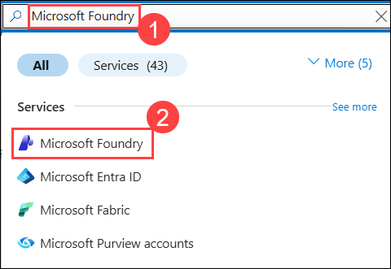 

1. In the Microsoft Foundry home page, click on select **AI Hubs (1)** under **Use with Foundry**. Click on **+ Create (2)** and select **Hub (3)**. 

    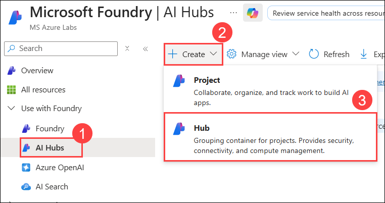    

1. On the Azure AI Hub creation page, enter the following details and then click on **Review + Create (5)**:

    - Subscription: Select Default Subscription **(1)**
    - Resource group : **ragsdk-<inject key="DeploymentID" enableCopy="false"/> (2)**
    - Region : **<inject key="Region" enableCopy="false"/> (3)**
    - Name : **ContosoHub (4)**

      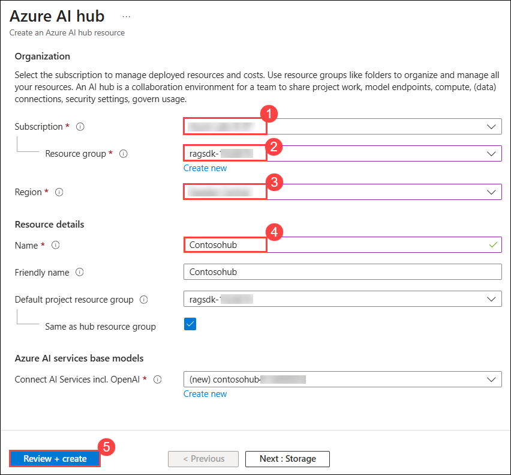

1. Then click on **Create**.

   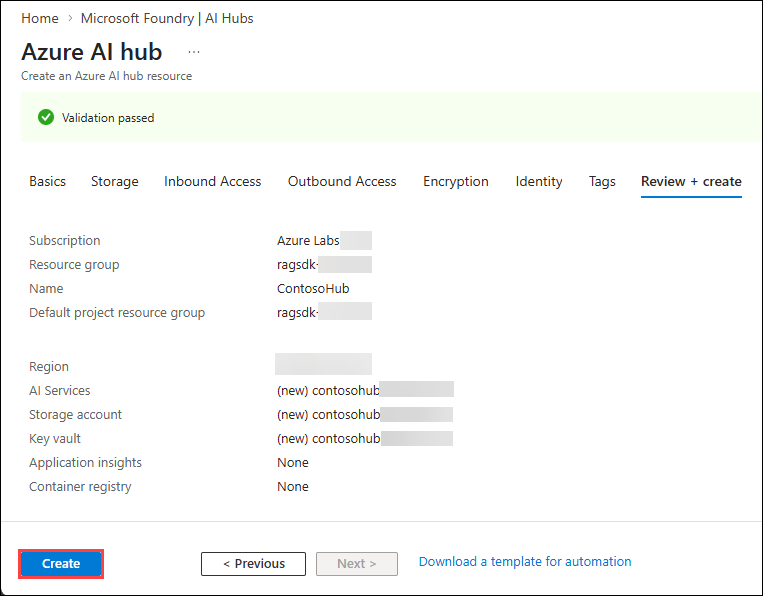

1. After deployment is successful, click on **Go to resource**.      

      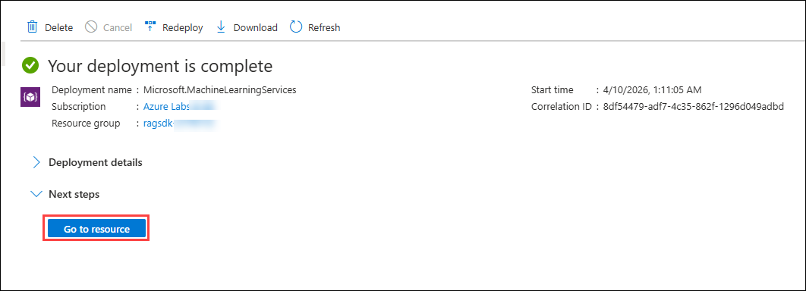

1. On the **ContosoHub** page click on **Launch Azure AI Foundry**.

    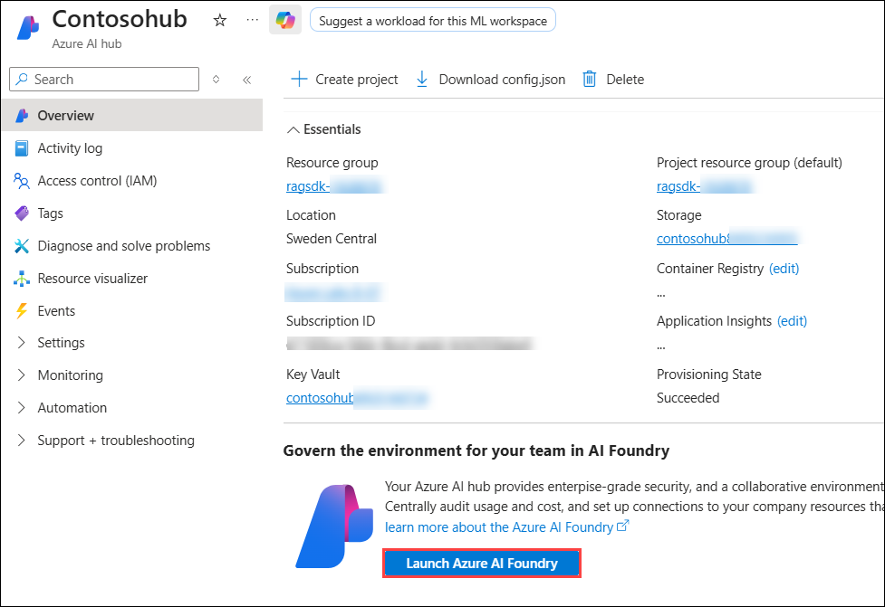

1. From the left navigation pane, select **Overview (1)**, scroll down and click on **+ New Project (2)**. 

    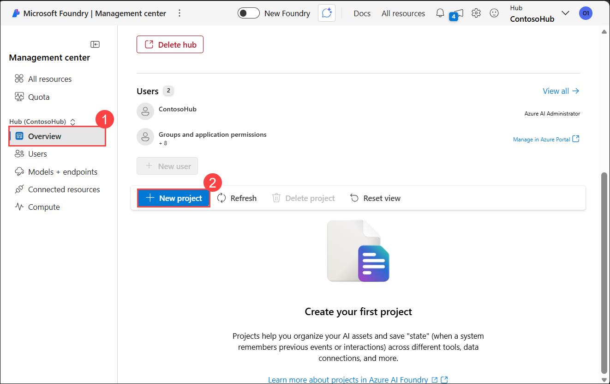

1. Now Enter Project name as **ContosoTrek (1)** and click on **Create (2)**

    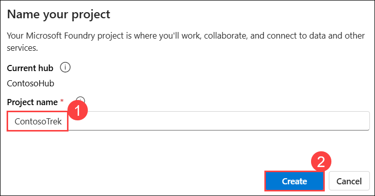

   > **Congratulations** on completing the task! Now, it's time to validate it. Here are the steps:    
   - Hit the validate button for the corresponding task. If you receive a success message, you can proceed to the next task.
   - If not, carefully read the error message and retry the step, following the instructions in the exercise guide.
   - If you need any assistance, don't hesitate to get in touch with us at cloudlabs-support@spektrasystems.com. We are available 24/7 to assist you.

   <validation step="116ffc00-e134-4fc6-82db-c383b9d13758" />

### Task 2: Deploying and Managing AI Models 

In this task, you will deploy models in your Microsoft Foundry project. You need two models to build a RAG-based chat app: an Azure OpenAI chat model (gpt-4.1-mini) and an Azure OpenAI embedding model (text-embedding-ada-002).

1. On the Microsoft Foundry portal from the left navigation pane, select **Model catalog (1)**. Scroll down and search for **gpt-4.1-mini (2)** and then select **gpt-4.1-mini (3)**.

    

1. Click on **Use this model**.

    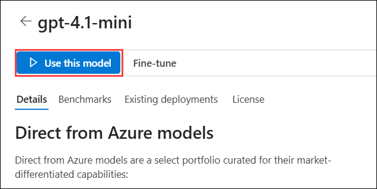

1. Select **Direct from Azure models** as Purchase options.

    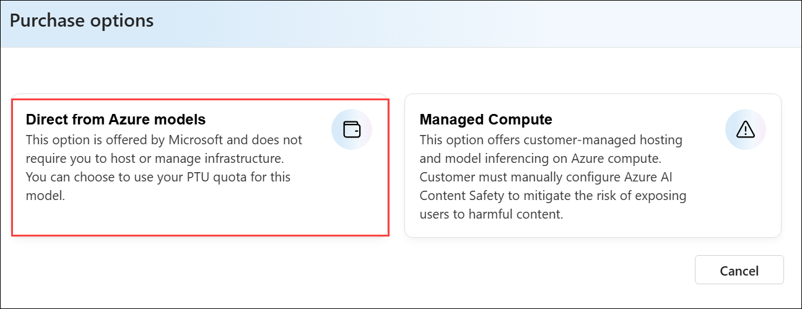

1. On **Deploy gpt-4.1-mini** window,

    - Select **Global Standard (1)** as Deployment type
    - Select **Connect and deploy (2)**

      

1. On the Microsoft Foundry portal, from the left navigation pane click on the **Model catalog (1)** option twice, search for **text-embedding-ada-002 (2),** and then select **text-embedding-ada-002 (3)**.

    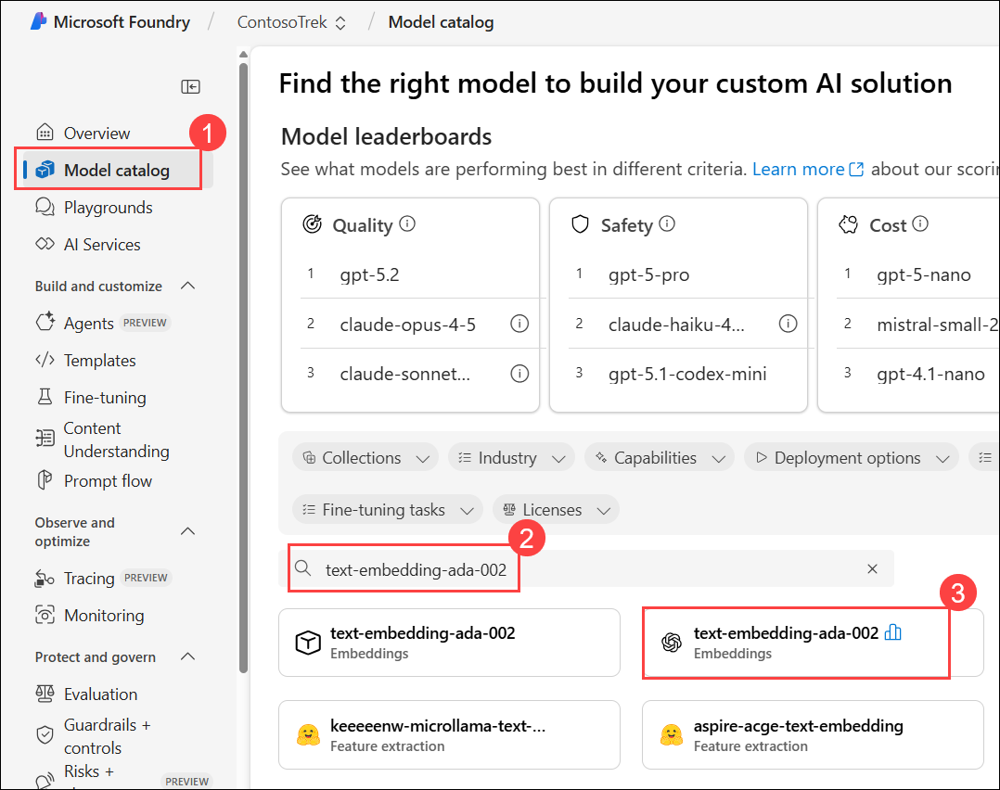

1. Click on **Use this model**.

    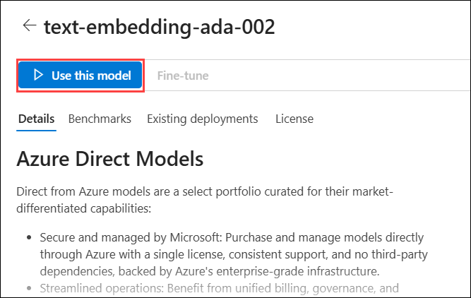

1. Select **Direct from Azure models** as Purchase options.

    

1. On the **Deploy model text-embedding-ada-002** window,

    - Deployment type: **Standard (1)**
      
        
      
    - Tokens per Minute Rate limit: **20k (2)**
      
    - Click on **Deploy (3)**

      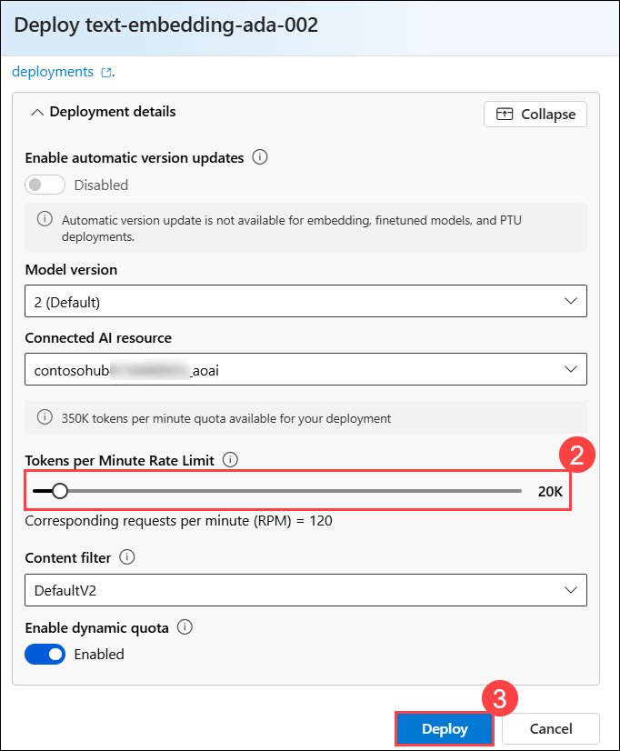  

1. From the left navigation pane, click on **Models+Endpoints (1)**, you can see the deployed models **(2)**.

    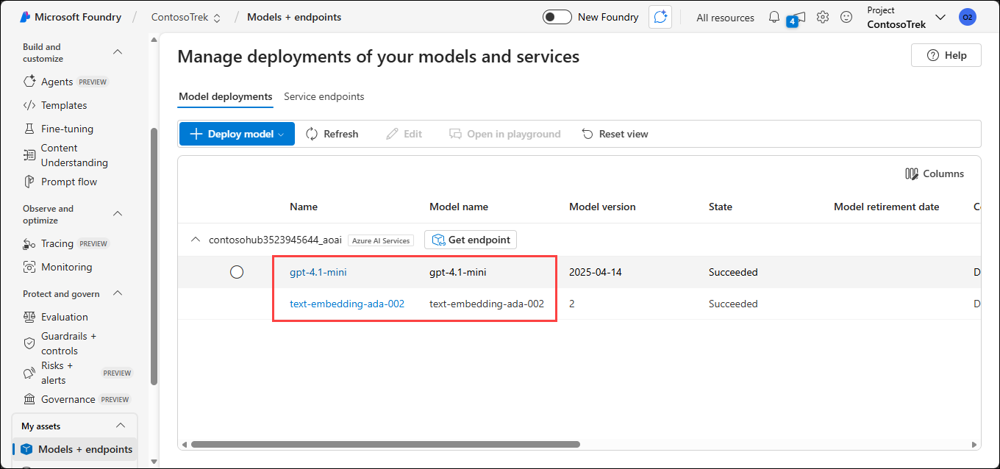

> **Congratulations** on completing the task! Now, it's time to validate it. Here are the steps:
> - Hit the Validate button for the corresponding task. If you receive a success message, you can proceed to the next task.
> - If not, carefully read the error message and retry the step, following the instructions in the exercise guide. 
> - If you need any assistance, please contact us at cloudlabs-support@spektrasystems.com. We are available 24/7 to assist you. 

<validation step="9712c051-408a-4142-9efa-0337dca323d9" />

### Task 3: Create an Azure AI Search Service

In this task, you will create an Azure AI Search service. You need an Azure AI Search service and a connection to create a search index.

1. In the exercise VM browser, navigate to the Azure portal by entering [https://portal.azure.com](https://portal.azure.com) in the address bar. In the Azure portal, in the search box, type **AI Search (1)**, and select **AI Search (2)** from the results.

    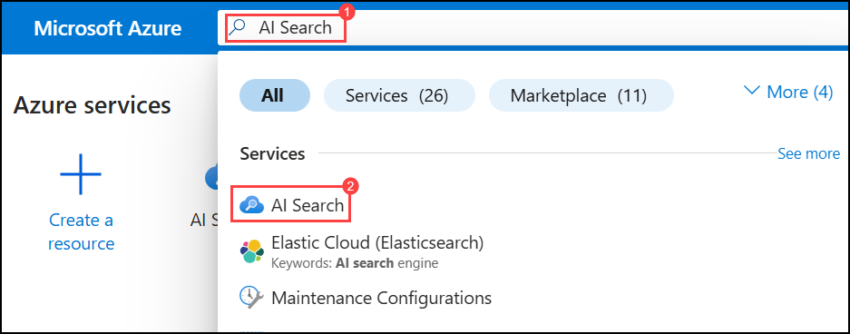

1. On the **Microsoft Foundry | AI Search** page, select **+ Create** to begin provisioning the Azure AI Search service.

    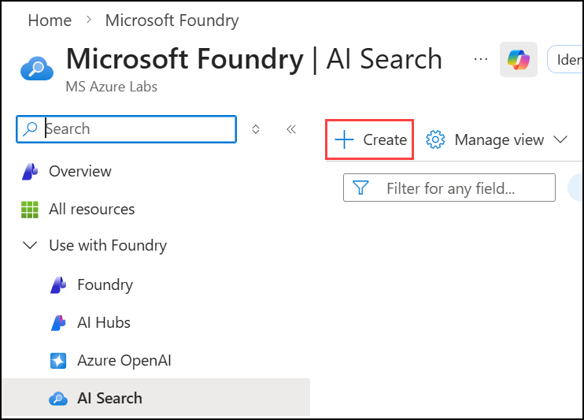

1. On the **Create a search service** page, provide the following details, then click on **Review + create (6)**:
            
    - Subscription: **Leave your default subscription (1)**
    - Resource group: Select **ragsdk-<inject key="DeploymentID" enableCopy="false"/> (2)**
    - Service name: **aisearch-<inject key="DeploymentID" enableCopy="false"/> (3)**
    - Location: **<inject key="Region" enableCopy="false"/> (4)**
    - Pricing tier: **Standard (5)**

      
      
1. Click on **Create** on the **Review + create** page.

    

1. Wait for the deployment to complete.

    >**Note:** Sometimes the **AI Search** deployment can take up to **10-15 minutes**. Please wait for the deployment to complete then proceed with the next task.

> **Congratulations** on completing the task! Now, it's time to validate it. Here are the steps:
> - Hit the Validate button for the corresponding task. If you receive a success message, you can proceed to the next task.
> - If not, carefully read the error message and retry the step, following the instructions in the exercise guide. 
> - If you need any assistance, please contact us at cloudlabs-support@spektrasystems.com. We are available 24/7 to assist you. 

<validation step="671b186b-85fe-413f-b791-7896dbfaf8c6" />

### Task 4: Connect the Azure AI Search to your Project

In this task, you will connect the Azure AI Search service to your project. Azure AI Search service and connection are used to create a search index. The search index is used to retrieve relevant documents based on the user's question.

1. Navigate back to the **Microsoft Foundry** portal, and select **Management center** from the left pane.

    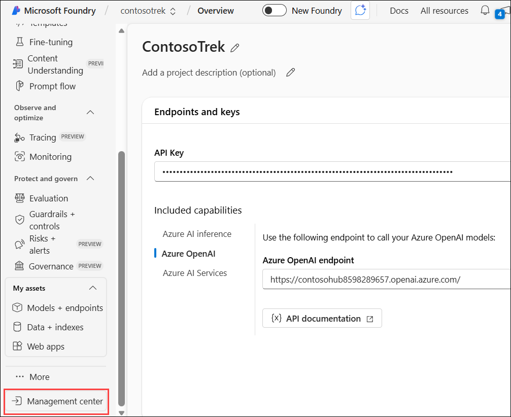

1. Select **Connected resources (1)** under the **Project (ContosoTrek)** section, then select **+ New connection (2)**.

    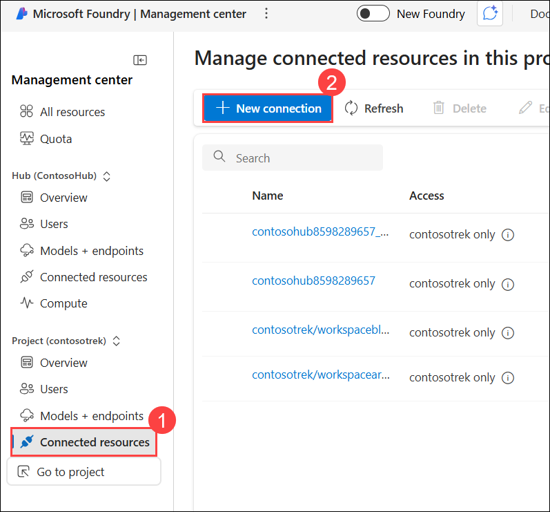

1. Search for Azure **AI Search (1)**, then select **Azure AI Search (2)**.

    

1. Search for the Azure AI Search service you created, **aisearch-<inject key="DeploymentID" enableCopy="false"/> (1)**. Use the **API key (2)** for authentication and then select **Add connection (3)**.

    

1. Make sure that AI Search is **Connected**.

    

### Task 5: Clone the GitHub Repository for the Project

In this task, you will clone the GitHub repository for the project to access the necessary files for building the chat app.

1. On you Lab-VM, open the **Visual Studio Code** from the desktop.

    

1. Click on **File (1)** from the top left corner, then select **Open Folder (2)**.

    

1. Navigate to **C:\Users\demouser\Downloads (1),** press **Enter**, select **ContosoTrek (2),** and then click on **Select Folder (3)**.

    

1. Click on **Yes, I trust the author**.

    

1. Expand **scenarios (1)**, then **rag/custom-rag-app (2)**. Select **requirements.txt (3)**. This file contains the necessary packages for setting up the Microsoft Foundry SDK. **(4)**

    

     >**Note**: This file contains the necessary packages for building and managing an AI-powered application using the Microsoft Foundry SDK, including authentication, AI inference, search, data processing, and telemetry logging.

1. Right-click on the **rag/custom-rag-app (1)** folder, then select **Open in Integrated Terminal (2)**.

    
   
1. Install the required dependencies by running:

    ```
    pip install -r requirements.txt
    ```

    

1. Install the required Azure SDK packages:

    ```
    pip install azure-ai-projects==1.0.0b5  
    ```
   ```
   pip install azure-ai-inference==1.0.0b8
   ```
    
   >**Note:** Wait for the installation to complete. It might take some time.

### Task 6: Configure Environment Variables

In this task, you will set up and configure the necessary environment variables to ensure seamless integration between your RAG application and Microsoft Foundry services.

1. Navigate back to the **Microsoft Foundry** portal. In **Microsoft Foundry | Management center**, click on **Go to project**.

    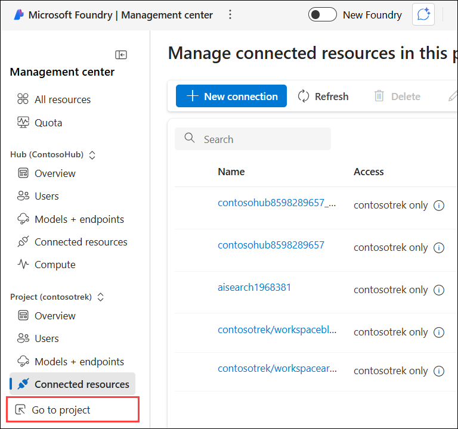

1. Navigate to **Overview (1)**, scroll down then copy and paste the **Project connection string (2)** into a notepad. You will be using it in the next step.

    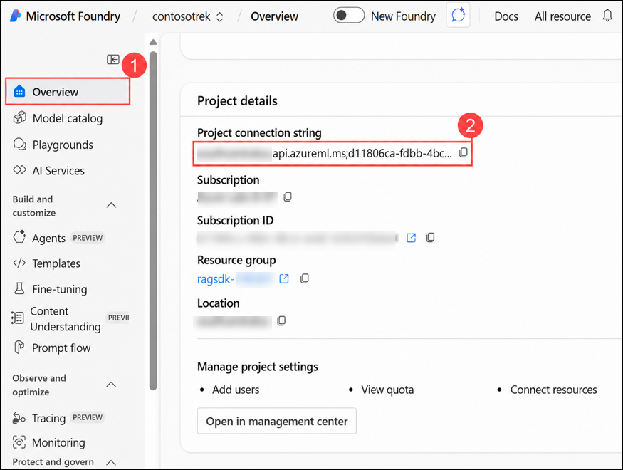

1. Navigate back to the **Visual Studio Code**.

1. Right-click on **.env.sample (1)** and select **Rename (2)**.

    

1. Rename the file to `.env`.

1. Click on the `.env` **(1)** file and replace **your_connection_string (2)** with the **Project connection string** you copied in **Task 6 > Step 2** and ensure that the **CHAT_MODEL**, **EVALUATION_MODEL** and **INTENT_MAPPING_MODEL** values are mapped with **gpt-4.1-mini**.

    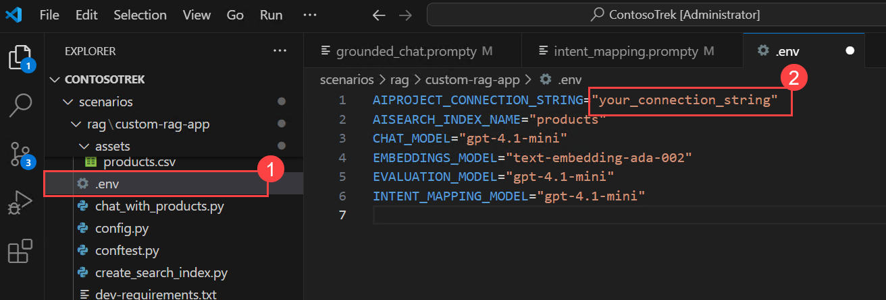

    

1. Press **Ctrl+S** to save the file.

## 🧾 Summary

In this exercise, you have successfully:

- Created an AI Hub and a project in the Microsoft Foundry portal.
- Deployed the gpt-4.1-mini model for chat-based interactions and the text-embedding-ada-002 model for generating embeddings.
- Provisioned an Azure AI Search service in Microsoft Azure.
- Connected the Azure AI Search service to your project to enable retrieval capabilities.
- Cloned the GitHub repository to access the required code and resources for building the chat application.
- Configured the necessary environment variables in the `.env` file to integrate your application with Azure services and deployed models.

### You have successfully completed the exercise. Click **Next >>** to continue to the next exercise.


