# Exercise 01: Developing a Custom RAG App Using Microsoft Foundry

### Estimated Duration: 2 Hours

## 📘 Scenario

You are an AI developer at a company building an internal knowledge assistant. Before development begins, you must set up the Microsoft Foundry project, deploy the required chat and embedding models, and configure Azure AI Search as the retrieval engine. You will also clone the development repository and configure environment variables so the RAG application can run locally in VS Code.

## 📖 Overview

In this exercise, you will prepare an end-to-end environment for a **Retrieval-Augmented Generation (RAG)** application using **Microsoft Foundry**. You will provision a Microsoft Foundry project in the new portal, deploy an OpenAI chat model and an embedding model, create and connect an Azure AI Search service, clone the sample repository, and configure local environment variables so the sample RAG app can run locally.

By the end of the exercise, you will have a functional foundation for building and testing a custom RAG pipeline that retrieves relevant knowledge and augments model-generated responses.

## 🎯 Objectives

In this exercise, you will complete the following task:

- Task 1: Create a Project
- Task 2: Deploying and managing AI models
- Task 3: Create an Azure AI Search Service
- Task 4: Connect the Azure AI search to your project.
- Task 5: Clone the GitHub repository for the project.
- Task 6: Configure environment variables.

### Task 1: Create a Microsoft Foundry Project

In this task, you will create a **Microsoft Foundry** resource and project directly from the **Azure portal**. Creating the resource with project management enabled provisions a hub-less Foundry project, so you no longer create a separate AI Hub.

> [!NOTE]
> The screenshots are placeholders. During the ongoing rename, the resource may still appear as **Azure AI Foundry** on some Azure portal screens. Capture each screen as you complete the step, and confirm that the on-screen labels match the instruction before continuing.

1. On your virtual machine, open the **Azure portal**.

1. In the search bar, enter **Microsoft Foundry (1)**, and then select **Microsoft Foundry (2)** from the results.

    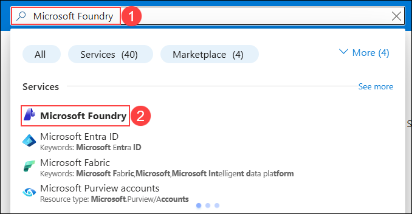

1. On the **Microsoft Foundry** page, expand **Use with Foundry (1)**, select **Foundry (2)**, and then select **+ Create (3)**.

    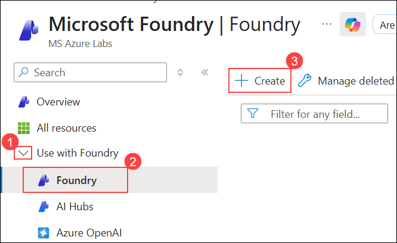

1. On the **Create a Foundry resource** page, enter the following details, and then select **Review + create (6)**:

    - Subscription: Select the default subscription **(1)**
    - Resource group: **ragsdk-<inject key="DeploymentID" enableCopy="false"/> (2)**
    - Name: **ContosoFoundry<inject key="DeploymentID" enableCopy="false"/> (3)**
    - Region: **<inject key="Region" enableCopy="false"/> (4)**
    - Default project name: **ContosoTrek (5)**

        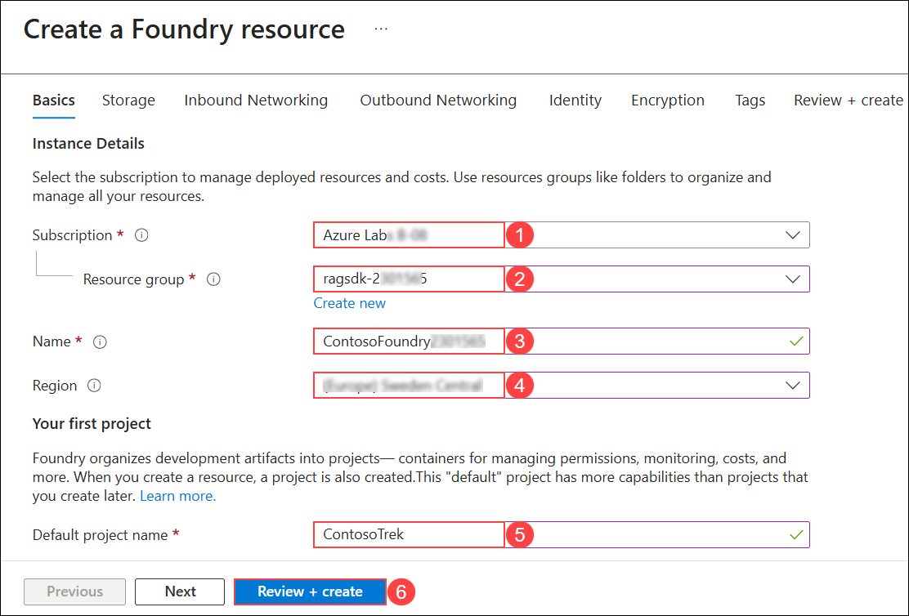

1. Review the configuration settings, and then select **Create**.

1. Wait for the deployment to complete, and then select **Go to resource**.

    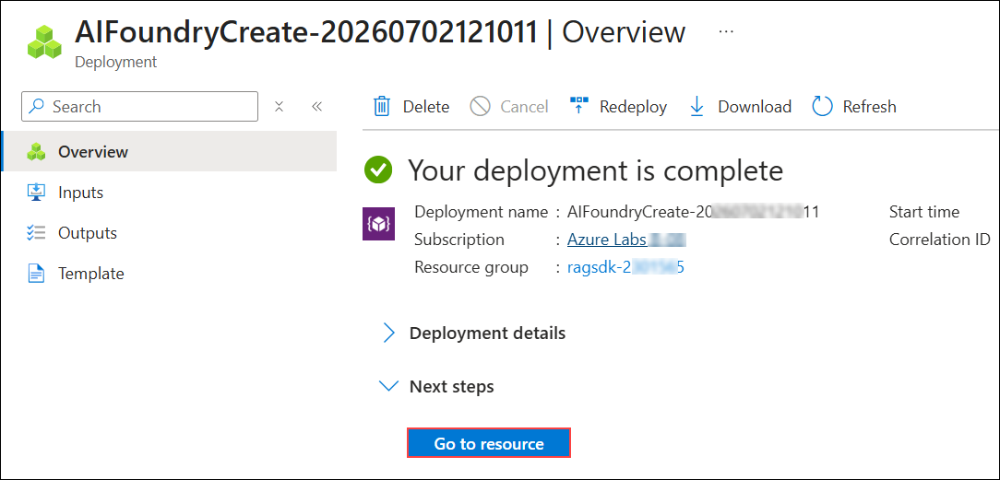

1. On the **Overview (1)** page of the **ContosoFoundry** resource, select **Go to Foundry portal (2)**.

    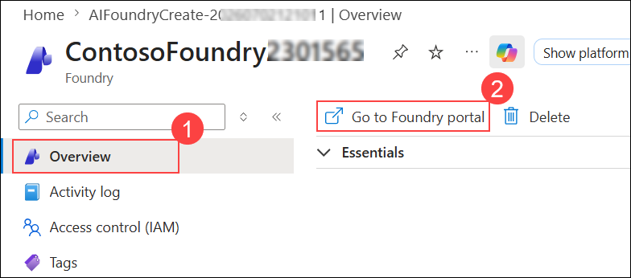

   > **Congratulations** on completing the task! Now, it's time to validate it. Here are the steps:    
   - Hit the validate button for the corresponding task. If you receive a success message, you can proceed to the next task.
   - If not, carefully read the error message and retry the step, following the instructions in the exercise guide.
   - If you need any assistance, don't hesitate to get in touch with us at cloudlabs-support@spektrasystems.com. We are available 24/7 to assist you.

### Task 2: Deploying and Managing AI Models 

In this task, you will deploy models in your Microsoft Foundry project. You need two models to build a RAG-based chat app: an Azure OpenAI chat model (gpt-5-mini) and an Azure OpenAI embedding model (text-embedding-ada-002).

1. In the **Build (1)** section, select **Models (2)**, and then select **Deploy a base model (3)**.

    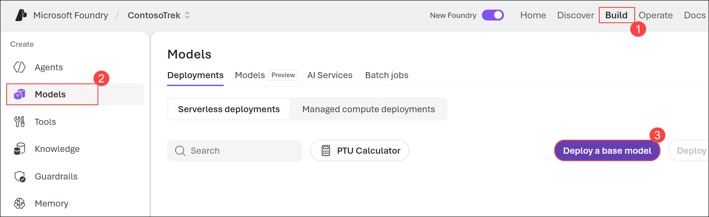

1. Search for **gpt-5-mini (1)**, and then select **gpt-5-mini (2)** from the search results.

    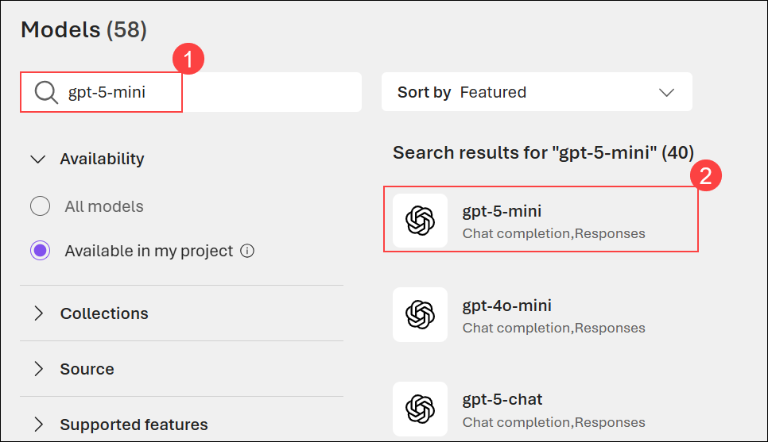

1. Select **Deploy (1)**, and then choose **Custom settings (2)**.

    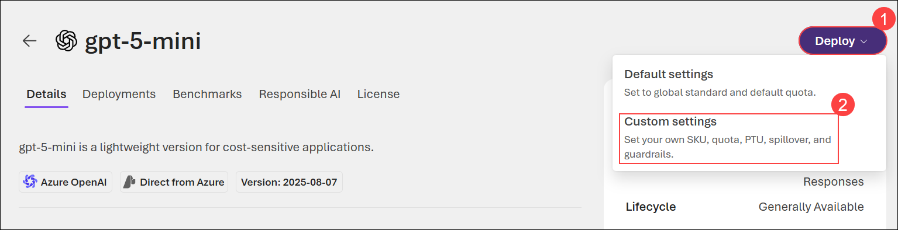

1. On the **Deploy gpt-5-mini** pane, set **Tokens per Minute Rate Limit (1)** to **30000**, and then select **Deploy (2)**.

    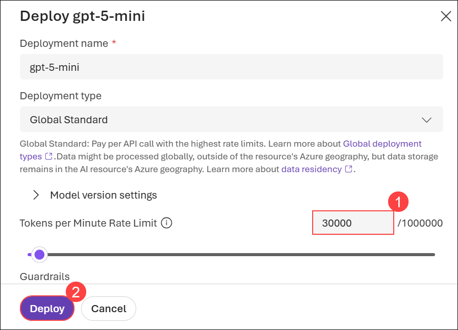

1. From the left navigation pane, select **Models (1)**, and then select **Deploy a base model (2)**.

    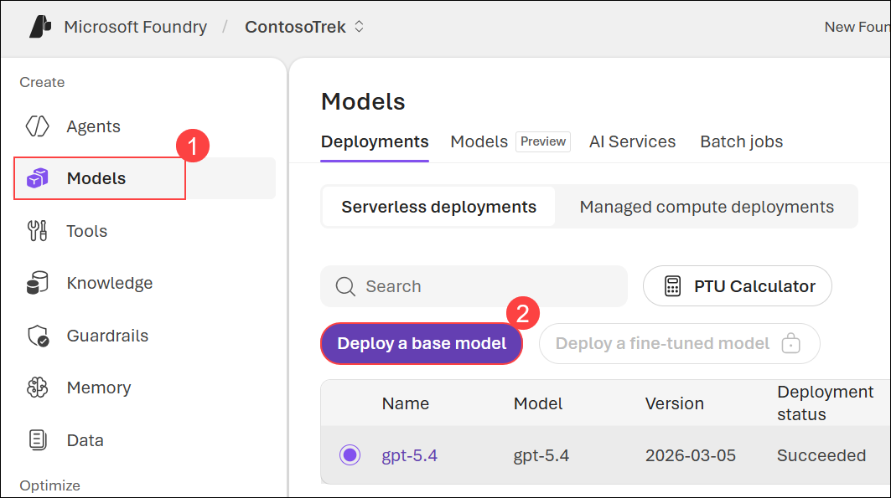

1. Search for **text-embedding-ada-002 (1)**, and then select **text-embedding-ada-002 (2)** from the search results.

    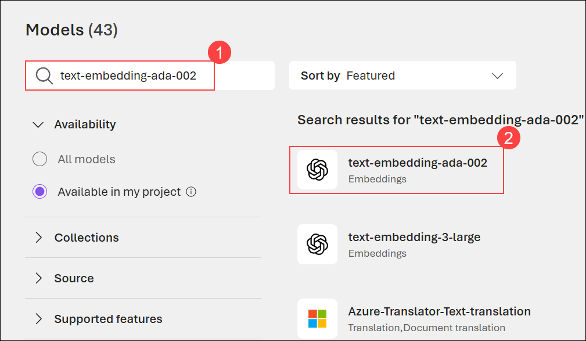

1. Select **Deploy (1)**, and then choose **Custom settings (2)**.

    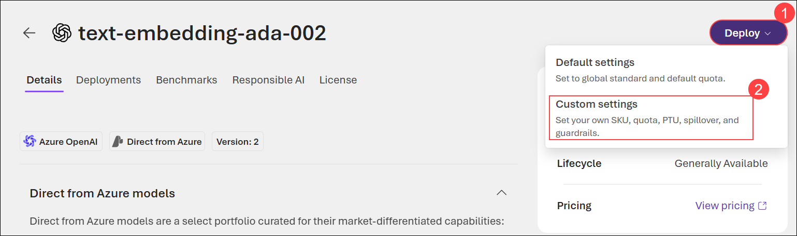

1. On the **Deploy text-embedding-ada-002** pane, set **Tokens per Minute Rate Limit (1)** to **30000**, and then select **Deploy (2)**.

    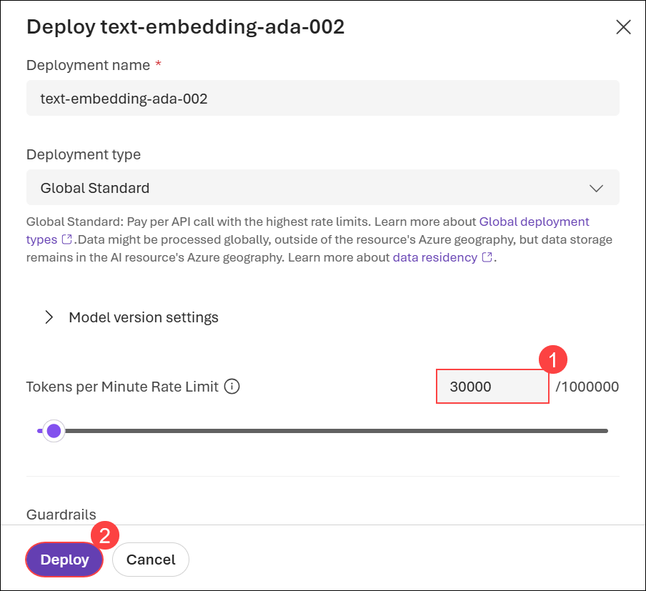

1. On the **Home (1)** page, copy the **Project endpoint (2)**, and then paste it into a notepad. You will use it to configure the environment variables in Task 6.

    > [!NOTE]
    > The project endpoint uses the format `https://<resource-name>.services.ai.azure.com/api/projects/<project-name>`.

    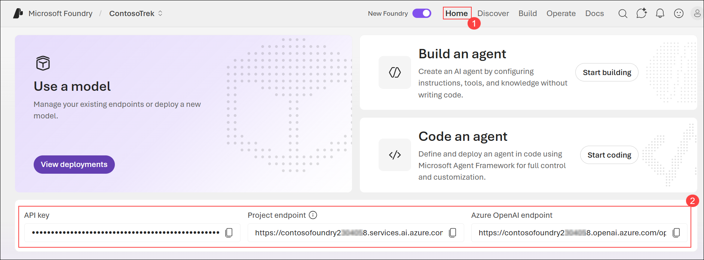

### Task 3: Create an Azure AI Search Service

In this task, you will create an Azure AI Search service. You need an Azure AI Search service and a connection to create a search index.

1. In the Azure portal, search for **AI Search (1)**, and then select **AI Search (Foundry IQ) (2)** from the results.

    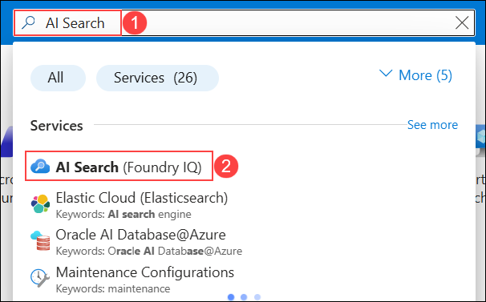

1. On the **AI Search (1)** page, select **+ Create (2)**.

    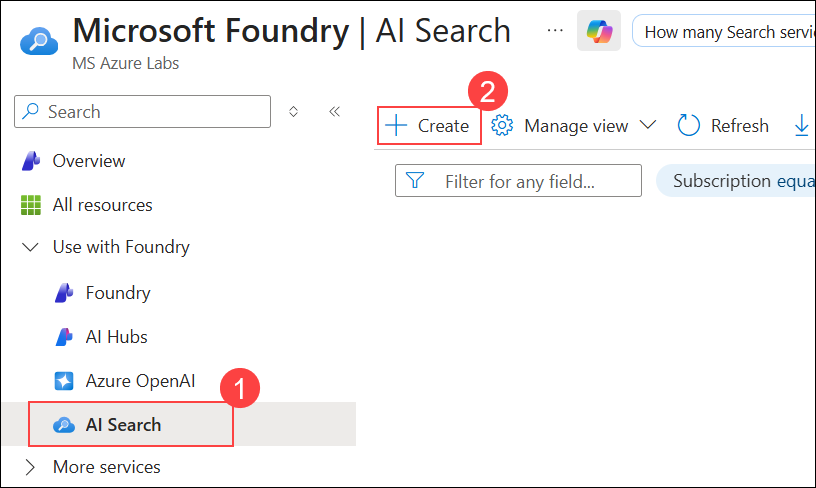

1. On the **Create a search service** page, provide the following details, then click on **Review + create (6)**:
            
    - Subscription: **Leave your default subscription (1)**
    - Resource group: Select **ragsdk-<inject key="DeploymentID" enableCopy="false"/> (2)**
    - Service name: **aisearch-<inject key="DeploymentID" enableCopy="false"/> (3)**
    - Location: **<inject key="Region" enableCopy="false"/> (4)**
    - Pricing tier: **Standard (5)**

      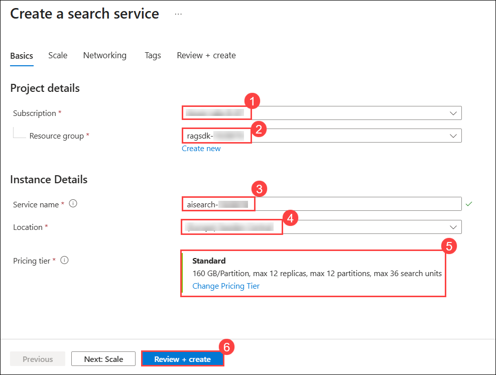
      
1. Click on **Create** on the **Review + create** page.

    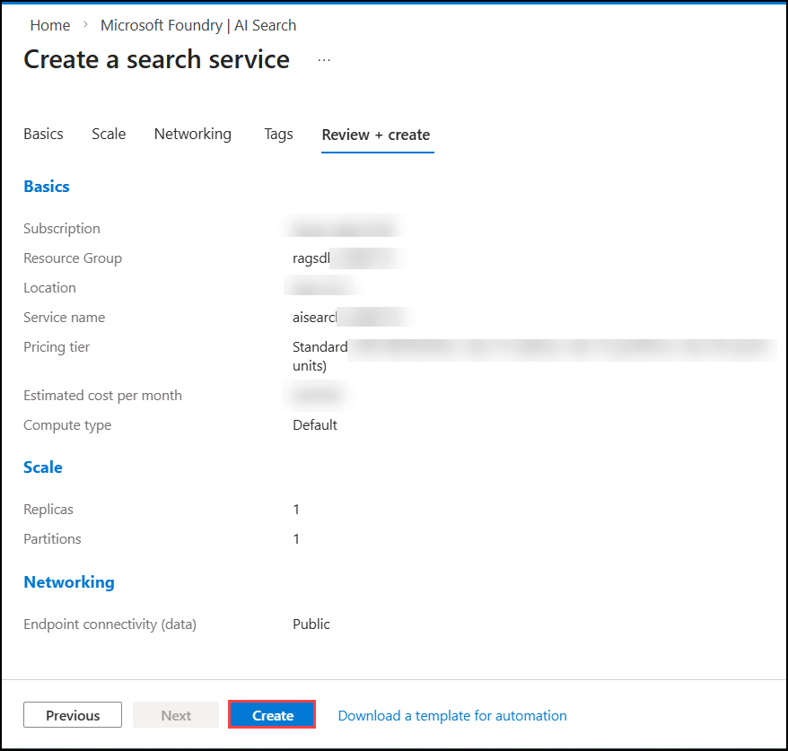

1. Wait for the deployment to complete.

    >**Note:** Sometimes the **AI Search** deployment can take up to **10-15 minutes**. Please wait for the deployment to complete then proceed with the next task.

> **Congratulations** on completing the task! Now, it's time to validate it. Here are the steps:
> - Hit the Validate button for the corresponding task. If you receive a success message, you can proceed to the next task.
> - If not, carefully read the error message and retry the step, following the instructions in the exercise guide. 
> - If you need any assistance, please contact us at cloudlabs-support@spektrasystems.com. We are available 24/7 to assist you. 

<validation step="671b186b-85fe-413f-b791-7896dbfaf8c6" />

### Task 4: Connect the Azure AI Search to your Project

In this task, you will connect the Azure AI Search service to your project. Azure AI Search service and connection are used to create a search index. The search index is used to retrieve relevant documents based on the user's question.

1. From the left navigation pane, select **Knowledge**.

    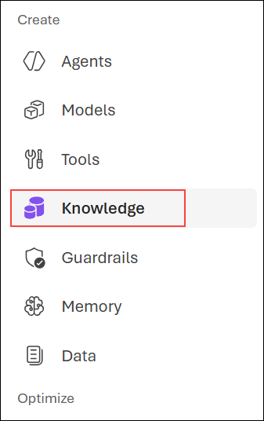

1. Scroll down if necessary, select the **Foundry IQ resource (1)** dropdown, choose your **AI Search resource (2)**, keep **Auth Type** as **API Key**, and then select **Connect**.

    > [!NOTE]
    > You may need to scroll down to view the **Foundry IQ resource** option.

    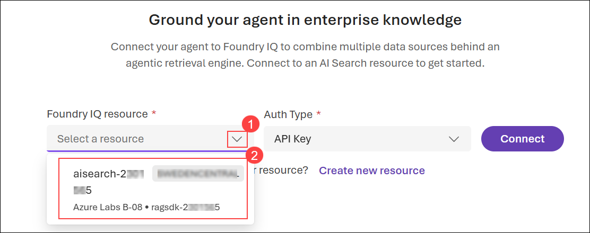

1. Verify that **Auth Type (1)** is set to **API Key**, and then select **Connect (2)**.

    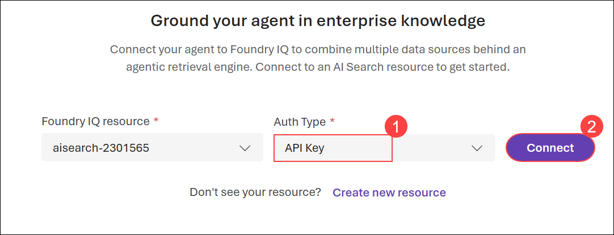

1. On the **Overview (1)** page of your **AI Search** resource, copy the **URL (2)**. You will use this value as the **SEARCH_ENDPOINT** in Task 6.

    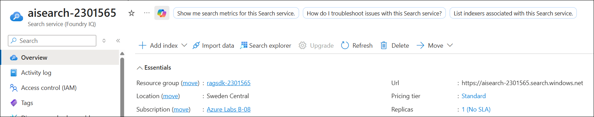

1. Make sure that AI Search is **Connected**.

    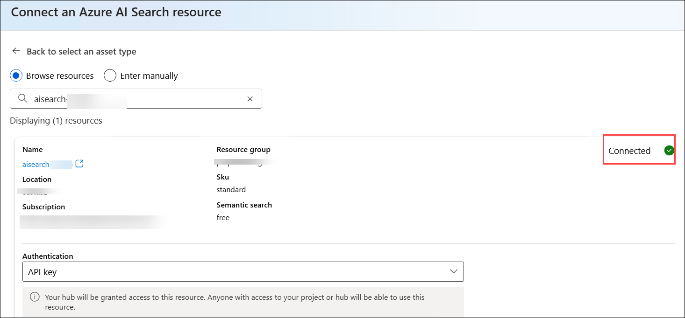

### Task 5: Clone the GitHub Repository for the Project

In this task, you will clone the GitHub repository for the project to access the necessary files for building the chat app.

1. On you Lab-VM, open the **Visual Studio Code** from the desktop.

    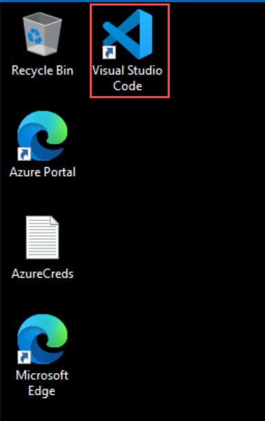

1. Click on **File (1)** from the top left corner, then select **Open Folder (2)**.

    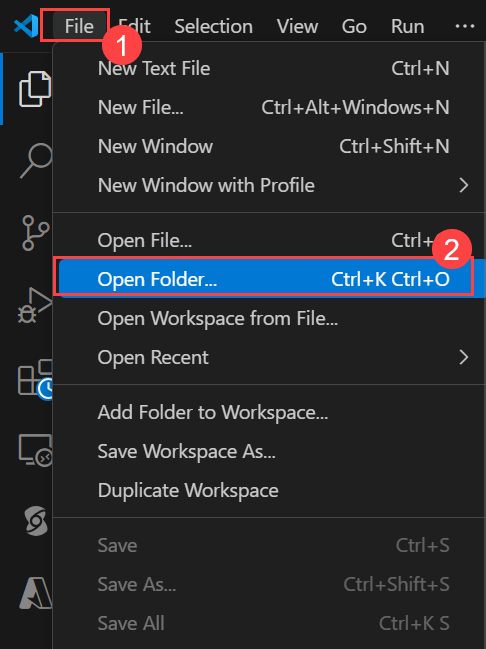

1. Navigate to **C:\Users\demouser\Downloads (1),** press **Enter**, select **ContosoTrek (2),** and then click on **Select Folder (3)**.

    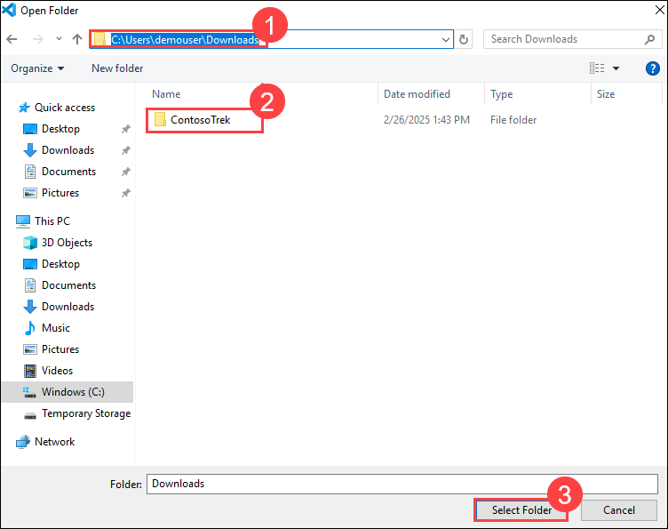

1. Click on **Yes, I trust the author**.

    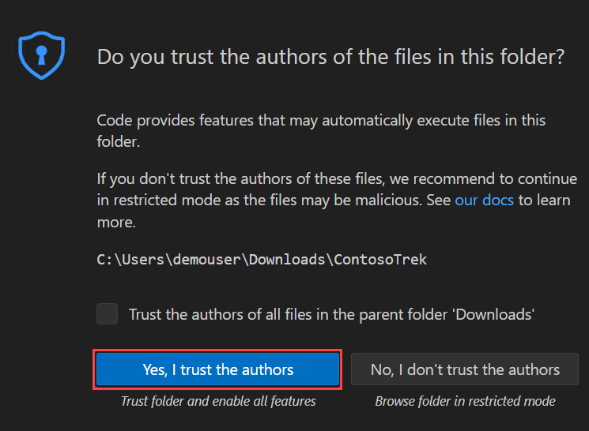

1. Expand **scenarios (1)**, expand **rag\custom-rag-app (2)**, and then select **requirements.txt (3)** to review the required Microsoft Foundry SDK packages **(4)**.

    > [!NOTE]
    > This file contains the required packages for building and managing an AI-powered application using the Microsoft Foundry SDK, including authentication, AI inference, search, data processing, and telemetry logging.

    

1. Right-click on the **rag/custom-rag-app (1)** folder, then select **Open in Integrated Terminal (2)**.

    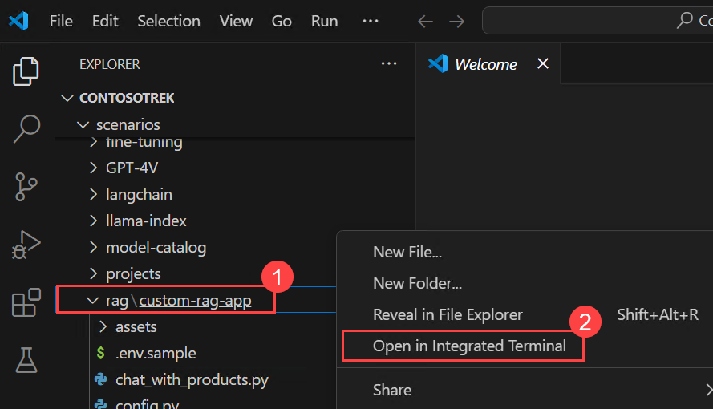
   
1. Install the required dependencies by running:

    ```
    pip install -r requirements.txt
    ```

    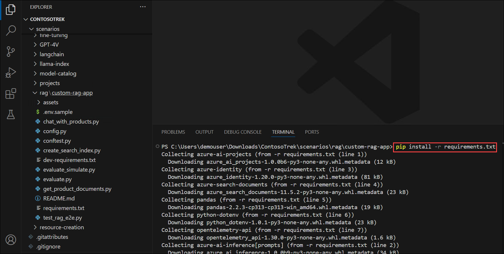

1. Install the required Microsoft Foundry SDK packages:

    ```
    pip install azure-ai-projects==1.0.0b11 azure-ai-inference[prompts]==1.0.0b9
    ```

   > **Note:** This lab pins **azure-ai-projects 1.0.0b11** — the version that supports the hub-less **project endpoint** while still providing the inference clients that the sample uses. Wait for the installation to complete. It might take some time.

### Task 6: Configure Environment Variables

In this task, you will configure the environment variables that connect your RAG application to your Microsoft Foundry project using the project endpoint.

1. Navigate back to the **Visual Studio Code**.

1. Right-click on **.env.sample (1)** and select **Rename (2)**.

    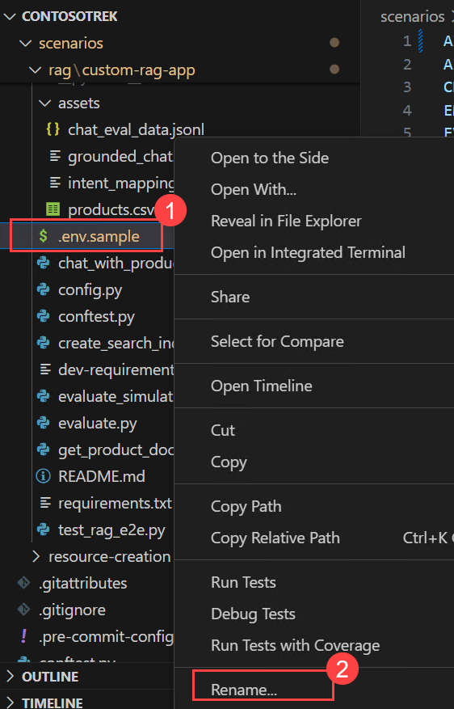

1. Rename the file to `.env`.

1. Select the **.env (1)** file, update the environment variables using the **Project endpoint**, **SEARCH_ENDPOINT**, and **SEARCH_KEY** values you copied earlier, verify that **CHAT_MODEL**, **EMBEDDING_MODEL**, **EVALUATION_MODEL**, and **INTENT_MAPPING_MODEL** are set as shown **(2)**, and then save the file.

    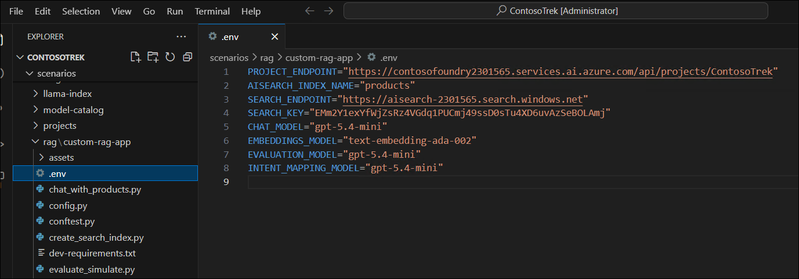

1. Press **Ctrl+S** to save the file.

## 🧾 Summary

In this exercise, you have successfully:

- Created a hub-less project in the new Microsoft Foundry portal and copied its project endpoint.
- Deployed the gpt-5-mini model for chat-based interactions and the text-embedding-ada-002 model for generating embeddings.
- Provisioned an Azure AI Search service in Microsoft Azure.
- Connected the Azure AI Search service to your project to enable retrieval capabilities.
- Cloned the GitHub repository to access the required code and resources for building the chat application.
- Configured the necessary environment variables in the `.env` file to integrate your application with the Microsoft Foundry project and deployed models.

### You have successfully completed the exercise. Click **Next >>** to continue to the next exercise.
